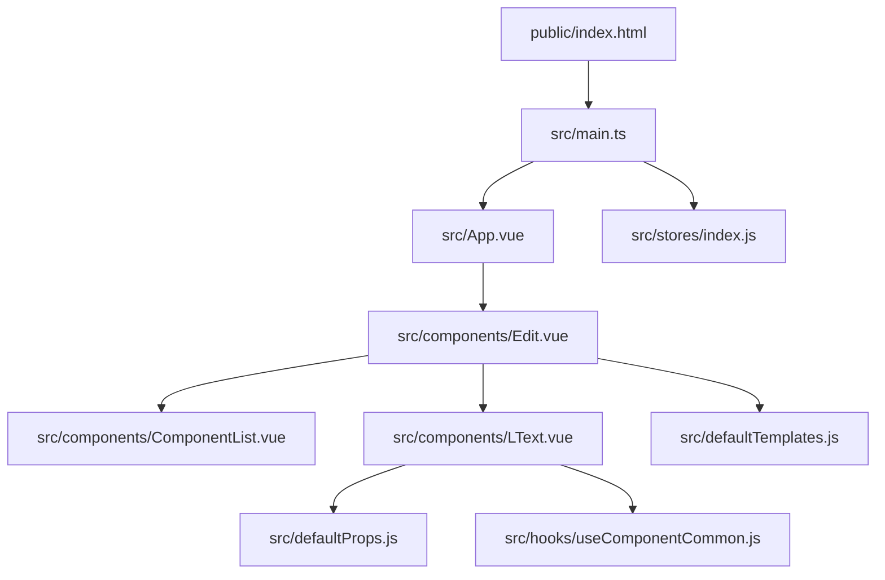
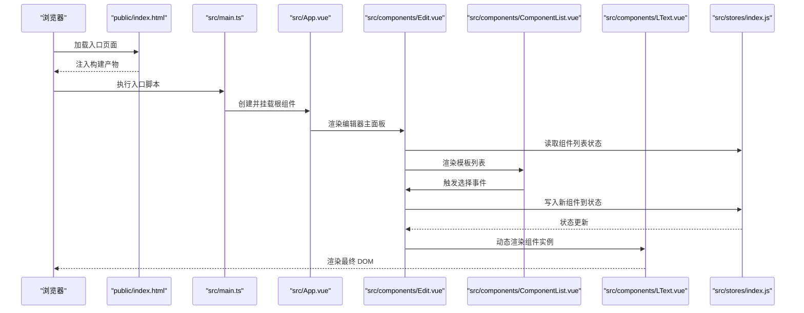
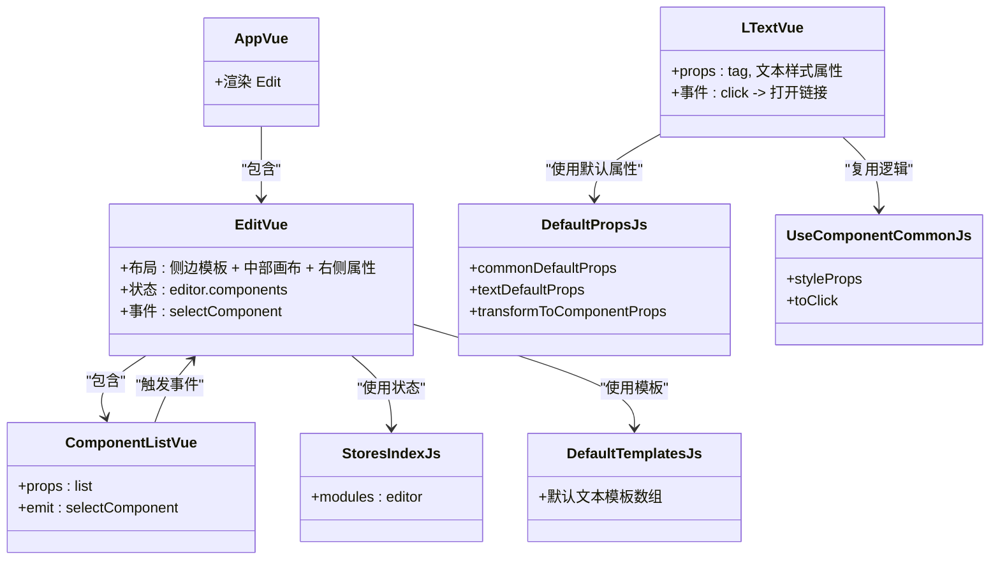
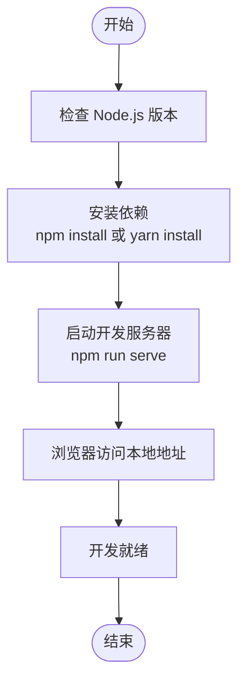

# 快速开始

<cite>
**本文引用的文件**
- [package.json](file://package.json)
- [tsconfig.json](file://tsconfig.json)
- [babel.config.js](file://babel.config.js)
- [.browserslistrc](file://.browserslistrc)
- [public/index.html](file://public/index.html)
- [src/main.ts](file://src/main.ts)
- [src/App.vue](file://src/App.vue)
- [src/components/Edit.vue](file://src/components/Edit.vue)
- [src/components/LText.vue](file://src/components/LText.vue)
- [src/components/ComponentList.vue](file://src/components/ComponentList.vue)
- [src/stores/index.js](file://src/stores/index.js)
- [src/defaultProps.js](file://src/defaultProps.js)
- [src/defaultTemplates.js](file://src/defaultTemplates.js)
- [src/hooks/useComponentCommon.js](file://src/hooks/useComponentCommon.js)
</cite>

## 目录
1. [简介](#简介)
2. [项目结构](#项目结构)
3. [核心组件](#核心组件)
4. [架构总览](#架构总览)
5. [详细组件分析](#详细组件分析)
6. [依赖分析](#依赖分析)
7. [性能考虑](#性能考虑)
8. [故障排除指南](#故障排除指南)
9. [结论](#结论)
10. [附录](#附录)

## 简介
本指南面向新手开发者，帮助你在最短时间内完成 wy_poster 项目的环境准备、依赖安装、开发服务器启动与基础项目结构认知。项目基于 Vue 3 + TypeScript + Vuex 构建，采用 Ant Design Vue 组件库，提供一个可视化海报编辑器的基础骨架。

## 项目结构
项目采用典型的 Vue CLI + TypeScript 结构，核心目录与职责如下：
- public：静态资源与入口 HTML 模板
- src：源代码
  - assets：静态资源（图片等）
  - components：可复用组件（如编辑器主面板、文本组件、组件列表等）
  - hooks：可复用逻辑钩子（如通用组件行为）
  - stores：状态管理（Vuex 模块）
  - views：页面视图（当前仓库中未实际提供该目录）
  - 其他入口与配置文件：App.vue、main.ts、defaultProps.js、defaultTemplates.js、shims-vue.d.ts 等
- 配置文件：package.json、tsconfig.json、babel.config.js、.browserslistrc

**图表来源**
- [public/index.html:1-18](file://public/index.html#L1-L18)
- [src/main.ts:1-9](file://src/main.ts#L1-L9)
- [src/App.vue:1-24](file://src/App.vue#L1-L24)
- [src/components/Edit.vue:1-91](file://src/components/Edit.vue#L1-L91)
- [src/components/ComponentList.vue:1-55](file://src/components/ComponentList.vue#L1-L55)
- [src/components/LText.vue:1-44](file://src/components/LText.vue#L1-L44)
- [src/stores/index.js:1-11](file://src/stores/index.js#L1-L11)
- [src/defaultProps.js:1-57](file://src/defaultProps.js#L1-L57)
- [src/defaultTemplates.js:1-41](file://src/defaultTemplates.js#L1-L41)
- [src/hooks/useComponentCommon.js:1-18](file://src/hooks/useComponentCommon.js#L1-L18)

**章节来源**
- [package.json:1-25](file://package.json#L1-L25)
- [tsconfig.json:1-40](file://tsconfig.json#L1-L40)
- [babel.config.js:1-6](file://babel.config.js#L1-L6)
- [public/index.html:1-18](file://public/index.html#L1-L18)
- [src/main.ts:1-9](file://src/main.ts#L1-L9)
- [src/App.vue:1-24](file://src/App.vue#L1-L24)
- [src/components/Edit.vue:1-91](file://src/components/Edit.vue#L1-L91)
- [src/components/ComponentList.vue:1-55](file://src/components/ComponentList.vue#L1-L55)
- [src/components/LText.vue:1-44](file://src/components/LText.vue#L1-L44)
- [src/stores/index.js:1-11](file://src/stores/index.js#L1-L11)
- [src/defaultProps.js:1-57](file://src/defaultProps.js#L1-L57)
- [src/defaultTemplates.js:1-41](file://src/defaultTemplates.js#L1-L41)
- [src/hooks/useComponentCommon.js:1-18](file://src/hooks/useComponentCommon.js#L1-L18)

## 核心组件
- 应用入口与挂载：应用通过 main.ts 创建 Vue 实例，注册 Ant Design Vue 插件与 Vuex Store，挂载到 public/index.html 的 #app 容器。
- 根组件：App.vue 渲染编辑器主组件 Edit.vue。
- 编辑器主面板：Edit.vue 使用 Ant Design Vue 布局，左侧为组件模板列表，中间为画布区域，右侧为属性或预览区域。
- 可复用组件：LText.vue 提供富文本/按钮等文本类组件，支持样式属性透传与点击跳转。
- 组件列表：ComponentList.vue 展示默认模板，点击后向父组件发送选中事件。
- 状态管理：stores/index.js 注册 editor 模块，用于维护画布中的组件列表等状态。
- 默认属性与模板：defaultProps.js 定义通用与文本组件的默认属性；defaultTemplates.js 提供初始模板数据。
- 通用逻辑钩子：useComponentCommon.js 封装组件通用交互（如点击打开链接）。

**章节来源**
- [src/main.ts:1-9](file://src/main.ts#L1-L9)
- [src/App.vue:1-24](file://src/App.vue#L1-L24)
- [src/components/Edit.vue:1-91](file://src/components/Edit.vue#L1-L91)
- [src/components/LText.vue:1-44](file://src/components/LText.vue#L1-L44)
- [src/components/ComponentList.vue:1-55](file://src/components/ComponentList.vue#L1-L55)
- [src/stores/index.js:1-11](file://src/stores/index.js#L1-L11)
- [src/defaultProps.js:1-57](file://src/defaultProps.js#L1-L57)
- [src/defaultTemplates.js:1-41](file://src/defaultTemplates.js#L1-L41)
- [src/hooks/useComponentCommon.js:1-18](file://src/hooks/useComponentCommon.js#L1-L18)

## 架构总览
下图展示了从浏览器加载到组件渲染的关键流程，以及组件间的数据流与交互。

**图表来源**
- [public/index.html:1-18](file://public/index.html#L1-L18)
- [src/main.ts:1-9](file://src/main.ts#L1-L9)
- [src/App.vue:1-24](file://src/App.vue#L1-L24)
- [src/components/Edit.vue:1-91](file://src/components/Edit.vue#L1-L91)
- [src/components/ComponentList.vue:1-55](file://src/components/ComponentList.vue#L1-L55)
- [src/components/LText.vue:1-44](file://src/components/LText.vue#L1-L44)
- [src/stores/index.js:1-11](file://src/stores/index.js#L1-L11)

## 详细组件分析

### 组件关系类图

**图表来源**
- [src/App.vue:1-24](file://src/App.vue#L1-L24)
- [src/components/Edit.vue:1-91](file://src/components/Edit.vue#L1-L91)
- [src/components/ComponentList.vue:1-55](file://src/components/ComponentList.vue#L1-L55)
- [src/components/LText.vue:1-44](file://src/components/LText.vue#L1-L44)
- [src/stores/index.js:1-11](file://src/stores/index.js#L1-L11)
- [src/defaultProps.js:1-57](file://src/defaultProps.js#L1-L57)
- [src/defaultTemplates.js:1-41](file://src/defaultTemplates.js#L1-L41)
- [src/hooks/useComponentCommon.js:1-18](file://src/hooks/useComponentCommon.js#L1-L18)

**章节来源**
- [src/App.vue:1-24](file://src/App.vue#L1-L24)
- [src/components/Edit.vue:1-91](file://src/components/Edit.vue#L1-L91)
- [src/components/ComponentList.vue:1-55](file://src/components/ComponentList.vue#L1-L55)
- [src/components/LText.vue:1-44](file://src/components/LText.vue#L1-L44)
- [src/stores/index.js:1-11](file://src/stores/index.js#L1-L11)
- [src/defaultProps.js:1-57](file://src/defaultProps.js#L1-L57)
- [src/defaultTemplates.js:1-41](file://src/defaultTemplates.js#L1-L41)
- [src/hooks/useComponentCommon.js:1-18](file://src/hooks/useComponentCommon.js#L1-L18)

### 开发服务器启动流程

[此图为概念性流程图，不直接映射具体源码文件]

## 依赖分析
- 运行时依赖
  - Vue 3：框架核心
  - Vuex：状态管理
  - Ant Design Vue：UI 组件库
  - lodash-es：工具函数
  - uuid：唯一标识生成
  - core-js：ES 能力 polyfill
- 开发依赖
  - @vue/cli-service：构建与开发服务器
  - @vue/cli-plugin-babel / @vue/cli-plugin-typescript：构建插件
  - @vue/compiler-sfc：单文件组件编译
  - typescript：类型支持

**章节来源**
- [package.json:9-23](file://package.json#L9-L23)

## 性能考虑
- 启动阶段
  - 使用 TypeScript 与 Babel 预设，确保兼容性与构建效率
  - 配置了 browserslist，按需引入 polyfill，避免不必要的体积
- 运行阶段
  - 组件按需渲染，仅在状态变更时更新
  - 使用 computed 与响应式数据，减少重复计算
- 构建阶段
  - 生产构建建议开启压缩与 Tree Shaking（由 CLI 默认启用）

**章节来源**
- [babel.config.js:1-6](file://babel.config.js#L1-L6)
- [.browserslistrc:1-4](file://.browserslistrc#L1-L4)
- [tsconfig.json:1-40](file://tsconfig.json#L1-L40)

## 故障排除指南
- Node.js 版本不匹配
  - 现象：安装或启动时报错
  - 处理：确保使用稳定版 Node.js，版本需求以项目配置为准
- 依赖安装失败
  - 现象：npm/yarn 安装卡住或报错
  - 处理：清理缓存后重试；更换镜像源；确认网络与权限
- 开发服务器端口占用
  - 现象：启动失败提示端口被占用
  - 处理：修改 CLI 端口或释放占用进程
- TypeScript 类型错误
  - 现象：TS 类型检查报错
  - 处理：根据提示修复类型；必要时调整 tsconfig 或忽略特定文件类型（仅临时方案）
- 浏览器无显示或空白页
  - 现象：页面空白
  - 处理：确认 public/index.html 中 #app 容器存在；检查控制台错误；确保构建产物已注入

**章节来源**
- [package.json:5-8](file://package.json#L5-L8)
- [public/index.html:10-16](file://public/index.html#L10-L16)
- [src/main.ts:1-9](file://src/main.ts#L1-L9)

## 结论
通过本指南，你可以在本地快速搭建 wy_poster 的开发环境，启动开发服务器并理解项目的核心结构与组件关系。建议先完成依赖安装与启动，再逐步阅读各组件与状态管理实现，以加深对编辑器工作流的理解。

## 附录

### 环境要求与推荐工具
- Node.js：建议使用长期支持（LTS）版本
- 包管理器：npm 或 yarn（二选一）
- 开发工具：推荐 VS Code，配合 Vue/TypeScript 相关扩展
- 浏览器：现代浏览器（受 browserslist 影响）

**章节来源**
- [.browserslistrc:1-4](file://.browserslistrc#L1-L4)

### 依赖安装步骤
- 在项目根目录执行安装命令（任选其一）
  - npm install
  - yarn install
- 安装完成后，项目会生成 node_modules 并写入 package-lock.json 或 yarn.lock

**章节来源**
- [package.json:5-8](file://package.json#L5-L8)

### 启动开发服务器
- 在项目根目录执行
  - npm run serve
- 启动成功后，CLI 会输出本地访问地址（通常为本地 IP 或 localhost），在浏览器中打开即可

**章节来源**
- [package.json:5-8](file://package.json#L5-L8)

### 项目结构认知要点
- public/index.html：应用入口模板，包含 #app 容器
- src/main.ts：应用入口，创建并挂载 Vue 实例，注册插件与状态
- src/App.vue：根组件，渲染编辑器主面板
- src/components：可复用组件集合（编辑器面板、组件列表、文本组件等）
- src/stores：状态管理（Vuex 模块）
- src/defaultProps.js 与 src/defaultTemplates.js：组件默认属性与模板数据
- src/hooks/useComponentCommon.js：通用逻辑复用

**章节来源**
- [public/index.html:1-18](file://public/index.html#L1-L18)
- [src/main.ts:1-9](file://src/main.ts#L1-L9)
- [src/App.vue:1-24](file://src/App.vue#L1-L24)
- [src/components/Edit.vue:1-91](file://src/components/Edit.vue#L1-L91)
- [src/components/ComponentList.vue:1-55](file://src/components/ComponentList.vue#L1-L55)
- [src/components/LText.vue:1-44](file://src/components/LText.vue#L1-L44)
- [src/stores/index.js:1-11](file://src/stores/index.js#L1-L11)
- [src/defaultProps.js:1-57](file://src/defaultProps.js#L1-L57)
- [src/defaultTemplates.js:1-41](file://src/defaultTemplates.js#L1-L41)
- [src/hooks/useComponentCommon.js:1-18](file://src/hooks/useComponentCommon.js#L1-L18)