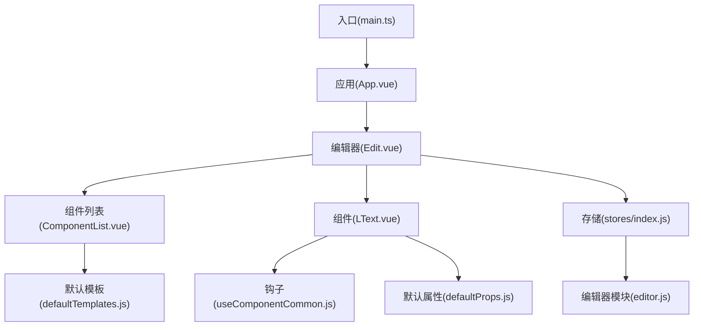
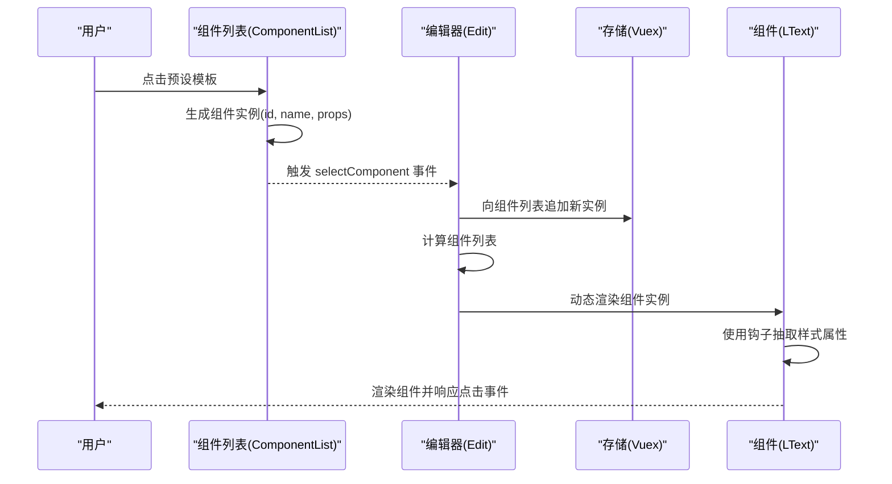
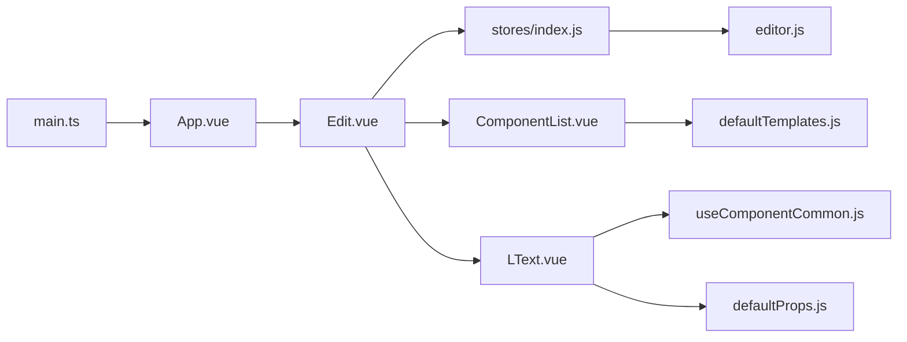

# 扩展开发指南

<cite>
**本文档引用的文件**
- [src/App.vue](file://src/App.vue)
- [src/main.ts](file://src/main.ts)
- [src/defaultProps.js](file://src/defaultProps.js)
- [src/defaultTemplates.js](file://src/defaultTemplates.js)
- [src/components/LText.vue](file://src/components/LText.vue)
- [src/components/Edit.vue](file://src/components/Edit.vue)
- [src/components/ComponentList.vue](file://src/components/ComponentList.vue)
- [src/hooks/useComponentCommon.js](file://src/hooks/useComponentCommon.js)
- [src/stores/editor.js](file://src/stores/editor.js)
- [src/stores/index.js](file://src/stores/index.js)
- [package.json](file://package.json)
</cite>

## 目录
1. [简介](#简介)
2. [项目结构](#项目结构)
3. [核心组件](#核心组件)
4. [架构总览](#架构总览)
5. [详细组件分析](#详细组件分析)
6. [依赖关系分析](#依赖关系分析)
7. [性能考虑](#性能考虑)
8. [故障排除指南](#故障排除指南)
9. [结论](#结论)
10. [附录](#附录)

## 简介
本指南面向希望为 wy_poster 项目扩展新组件类型的开发者，涵盖组件设计规范、属性定义与事件处理、模板系统扩展（预设模板与自定义模板格式）、样式系统扩展策略，以及从需求分析到测试验证的完整开发流程。通过遵循本文档的最佳实践与规范，开发者可以快速上手并贡献高质量的功能特性。

## 项目结构
项目采用基于功能分层的组织方式：
- 入口与应用根组件：入口文件负责挂载应用，根组件负责渲染编辑器主界面。
- 组件层：包含可复用的业务组件（如文本组件、组件列表等）。
- 钩子层：封装通用逻辑（如组件样式抽取与点击行为）。
- 存储层：使用 Vuex 管理编辑器状态（组件列表、画布尺寸等）。
- 默认配置：集中管理默认属性与默认模板，便于统一扩展。

图表来源
- [src/main.ts:1-9](file://src/main.ts#L1-L9)
- [src/App.vue:1-24](file://src/App.vue#L1-L24)
- [src/components/Edit.vue:1-91](file://src/components/Edit.vue#L1-L91)
- [src/components/ComponentList.vue:1-55](file://src/components/ComponentList.vue#L1-L55)
- [src/components/LText.vue:1-44](file://src/components/LText.vue#L1-L44)
- [src/stores/index.js:1-11](file://src/stores/index.js#L1-L11)
- [src/stores/editor.js:1-52](file://src/stores/editor.js#L1-L52)
- [src/hooks/useComponentCommon.js:1-18](file://src/hooks/useComponentCommon.js#L1-L18)
- [src/defaultProps.js:1-57](file://src/defaultProps.js#L1-L57)
- [src/defaultTemplates.js:1-41](file://src/defaultTemplates.js#L1-L41)

章节来源
- [src/main.ts:1-9](file://src/main.ts#L1-L9)
- [src/App.vue:1-24](file://src/App.vue#L1-L24)
- [src/components/Edit.vue:1-91](file://src/components/Edit.vue#L1-L91)
- [src/stores/index.js:1-11](file://src/stores/index.js#L1-L11)

## 核心组件
本节聚焦于组件系统的核心组成与交互关系，帮助开发者理解如何扩展新组件类型。

- 应用入口与根组件
  - 入口文件负责创建应用实例、引入 UI 库与全局状态，并挂载根组件。
  - 根组件负责渲染编辑器主界面，作为所有业务组件的容器。

- 编辑器组件
  - 负责布局与状态展示，渲染中心画布区域，并通过 Store 获取当前组件列表。
  - 提供选择组件回调，用于向 Store 添加新组件实例。

- 组件列表组件
  - 展示预设模板，点击后将模板转换为组件实例并触发选择事件。
  - 使用唯一标识符为每个模板生成组件实例，确保可追踪性。

- 文本组件（LText）
  - 基于默认属性与样式抽取钩子，动态生成内联样式并绑定点击事件。
  - 支持多种标签类型（如 div、p、button），通过运行时组件切换实现灵活渲染。

- 通用钩子
  - 将传入的属性按白名单筛选为样式属性，计算出可用于内联样式的对象。
  - 统一处理点击事件，支持跳转到外部链接等动作。

- 存储模块
  - 维护画布尺寸、背景色与组件列表等状态。
  - 提供组件实例的结构化数据（id、name、props），便于渲染与持久化。

章节来源
- [src/main.ts:1-9](file://src/main.ts#L1-L9)
- [src/App.vue:1-24](file://src/App.vue#L1-L24)
- [src/components/Edit.vue:1-91](file://src/components/Edit.vue#L1-L91)
- [src/components/ComponentList.vue:1-55](file://src/components/ComponentList.vue#L1-L55)
- [src/components/LText.vue:1-44](file://src/components/LText.vue#L1-L44)
- [src/hooks/useComponentCommon.js:1-18](file://src/hooks/useComponentCommon.js#L1-L18)
- [src/stores/editor.js:1-52](file://src/stores/editor.js#L1-L52)

## 架构总览
下图展示了从用户交互到组件渲染与状态更新的端到端流程。

图表来源
- [src/components/ComponentList.vue:18-28](file://src/components/ComponentList.vue#L18-L28)
- [src/components/Edit.vue:44-49](file://src/components/Edit.vue#L44-L49)
- [src/stores/editor.js:9-44](file://src/stores/editor.js#L9-L44)
- [src/components/LText.vue:22-34](file://src/components/LText.vue#L22-L34)
- [src/hooks/useComponentCommon.js:4-15](file://src/hooks/useComponentCommon.js#L4-L15)

## 详细组件分析

### 组件设计规范
- 组件命名与注册
  - 新组件建议采用 kebab-case 命名并在父组件中注册，保持一致的导入与使用风格。
  - 在编辑器中通过动态组件渲染，需保证组件名称与 Store 中的 name 字段一致。

- 属性设计原则
  - 使用统一的默认属性集合，避免硬编码样式值。
  - 对于需要参与样式计算的属性，纳入样式属性白名单；对于交互类属性（如链接跳转），在钩子中统一处理。

- 事件处理
  - 优先使用钩子封装通用事件逻辑，减少重复代码。
  - 对于点击事件，支持根据 actionType 与 url 执行不同行为。

章节来源
- [src/components/LText.vue:13-34](file://src/components/LText.vue#L13-L34)
- [src/hooks/useComponentCommon.js:4-15](file://src/hooks/useComponentCommon.js#L4-L15)

### 属性定义与默认值
- 默认属性集合
  - 通用属性：包含尺寸、边框、阴影、透明度、定位等基础样式。
  - 文本属性：包含字体大小、颜色、对齐、行高、字重等文本样式。
  - 通过映射函数将默认值转换为 Vue 组件的 props 定义，确保类型安全与默认值生效。

- 样式属性白名单
  - 仅将参与内联样式的属性加入白名单，避免将交互或非样式属性混入样式对象。
  - 白名单由默认属性集合中剔除交互相关字段得到。

- 属性转换工具
  - 将默认属性对象转换为 Vue props 的标准形式，自动推断类型并设置默认值。

章节来源
- [src/defaultProps.js:1-57](file://src/defaultProps.js#L1-L57)

### 事件处理机制
- 点击事件统一处理
  - 钩子根据 actionType 与 url 判断是否执行外部链接跳转。
  - 可扩展为支持更多动作类型（如复制、分享、打开模态框等）。

- 组件间通信
  - 组件列表通过事件向上抛出新组件实例，编辑器接收后写入 Store。
  - Store 状态变化驱动视图更新，实现无侵入的状态驱动渲染。

章节来源
- [src/hooks/useComponentCommon.js:6-10](file://src/hooks/useComponentCommon.js#L6-L10)
- [src/components/ComponentList.vue:18-28](file://src/components/ComponentList.vue#L18-L28)
- [src/components/Edit.vue:44-49](file://src/components/Edit.vue#L44-L49)

### 模板系统扩展
- 预设模板
  - 预设模板以数组形式存在，每项包含一组默认属性，用于快速生成组件实例。
  - 新增模板时，建议遵循现有字段命名与取值范围，确保与默认属性体系兼容。

- 自定义模板格式
  - 模板项应包含组件名称与初始 props，以便编辑器直接渲染。
  - 可扩展为支持更复杂的模板元信息（如标签、类别、图标等）。

- 模板渲染与实例化
  - 组件列表点击模板后，生成带唯一 id 的组件实例并触发选择事件。
  - 编辑器将实例写入 Store，随后在画布中渲染。

章节来源
- [src/defaultTemplates.js:1-41](file://src/defaultTemplates.js#L1-L41)
- [src/components/ComponentList.vue:18-28](file://src/components/ComponentList.vue#L18-L28)
- [src/components/Edit.vue:44-49](file://src/components/Edit.vue#L44-L49)

### 样式系统扩展策略
- 样式属性抽取
  - 通过钩子将白名单内的属性抽取为样式对象，避免将交互属性混入样式。
  - 可根据需要扩展白名单，新增样式属性时同步更新默认属性与白名单。

- 样式优先级与覆盖
  - 组件内联样式具有较高优先级，可通过 props 动态调整。
  - 若需全局样式，可在组件作用域内添加样式块或引入外部样式文件。

- 样式属性命名约定
  - 建议采用与 CSS 属性一致的命名，便于直观理解与维护。
  - 对于复合属性（如阴影、边框），建议拆分为多个简单属性，提升灵活性。

章节来源
- [src/hooks/useComponentCommon.js:4-5](file://src/hooks/useComponentCommon.js#L4-L5)
- [src/defaultProps.js:42-47](file://src/defaultProps.js#L42-L47)

### 开发流程示例
以下为从需求分析到测试验证的完整流程，以新增一个图片组件为例：

1. 需求分析
   - 明确组件用途（如插入图片、设置尺寸与边框、支持点击跳转等）。
   - 确定需要的默认属性与交互行为。

2. 设计默认属性与样式白名单
   - 在默认属性文件中新增图片组件的默认属性集合。
   - 更新样式属性白名单，确保参与内联样式的属性被正确抽取。

3. 实现组件
   - 创建组件文件，定义 props 并使用默认属性转换工具生成标准 props。
   - 在 setup 中调用通用钩子，返回样式属性与事件处理函数。
   - 在模板中使用动态组件渲染，并绑定样式与事件。

4. 注册与集成
   - 在父组件中注册新组件。
   - 在编辑器中通过动态组件渲染新组件实例。

5. 扩展模板系统
   - 在默认模板中添加图片模板项，包含初始 props。
   - 在组件列表中触发选择事件，将模板转换为组件实例。

6. 测试验证
   - 在编辑器中拖拽模板，确认组件渲染正确。
   - 调整 props 验证样式与交互效果。
   - 检查点击事件与链接跳转是否按预期工作。

章节来源
- [src/defaultProps.js:1-57](file://src/defaultProps.js#L1-L57)
- [src/components/LText.vue:13-34](file://src/components/LText.vue#L13-L34)
- [src/components/ComponentList.vue:18-28](file://src/components/ComponentList.vue#L18-L28)
- [src/components/Edit.vue:44-49](file://src/components/Edit.vue#L44-L49)

## 依赖关系分析
项目依赖关系清晰，模块职责明确：
- 入口文件依赖 UI 库与全局存储，负责应用初始化。
- 根组件依赖编辑器组件，作为页面容器。
- 编辑器组件依赖组件列表与存储模块，负责渲染与状态管理。
- 组件依赖钩子与默认属性，实现样式抽取与事件处理。
- 存储模块提供全局状态，驱动视图更新。

图表来源
- [src/main.ts:1-9](file://src/main.ts#L1-L9)
- [src/App.vue:1-24](file://src/App.vue#L1-L24)
- [src/components/Edit.vue:1-91](file://src/components/Edit.vue#L1-L91)
- [src/components/ComponentList.vue:1-55](file://src/components/ComponentList.vue#L1-L55)
- [src/components/LText.vue:1-44](file://src/components/LText.vue#L1-L44)
- [src/hooks/useComponentCommon.js:1-18](file://src/hooks/useComponentCommon.js#L1-L18)
- [src/defaultProps.js:1-57](file://src/defaultProps.js#L1-L57)
- [src/defaultTemplates.js:1-41](file://src/defaultTemplates.js#L1-L41)
- [src/stores/index.js:1-11](file://src/stores/index.js#L1-L11)
- [src/stores/editor.js:1-52](file://src/stores/editor.js#L1-L52)

章节来源
- [src/main.ts:1-9](file://src/main.ts#L1-L9)
- [src/stores/index.js:1-11](file://src/stores/index.js#L1-L11)
- [src/stores/editor.js:1-52](file://src/stores/editor.js#L1-L52)

## 性能考虑
- 样式计算优化
  - 使用计算属性抽取样式属性，避免重复计算与不必要的重渲染。
  - 控制样式属性数量，减少内联样式的复杂度。

- 组件渲染优化
  - 使用动态组件渲染，按需加载组件，降低初始包体积。
  - 为列表项提供稳定 key，提升列表更新效率。

- 状态管理优化
  - 将组件列表与画布状态分离，避免无关状态变更导致的重渲染。
  - 合理拆分模块，减少全局状态的耦合度。

## 故障排除指南
- 组件不显示或样式异常
  - 检查默认属性是否正确转换为 props，确认类型与默认值设置。
  - 确认样式属性白名单包含所需属性，避免遗漏导致样式失效。

- 点击事件无效
  - 检查 actionType 与 url 是否正确设置，确保钩子逻辑被触发。
  - 确认组件是否正确绑定点击事件处理器。

- 模板无法添加到画布
  - 检查组件列表是否正确生成组件实例并触发选择事件。
  - 确认编辑器是否正确接收事件并将实例写入 Store。

章节来源
- [src/hooks/useComponentCommon.js:4-15](file://src/hooks/useComponentCommon.js#L4-L15)
- [src/components/ComponentList.vue:18-28](file://src/components/ComponentList.vue#L18-L28)
- [src/components/Edit.vue:44-49](file://src/components/Edit.vue#L44-L49)

## 结论
通过统一的默认属性体系、样式抽取钩子与模板系统，wy_poster 提供了清晰的扩展路径。开发者只需遵循既定规范，即可快速实现新组件类型，并将其无缝集成到编辑器中。建议在扩展过程中持续关注性能与可维护性，确保新增功能与现有架构保持一致。

## 附录
- 代码规范与最佳实践
  - 组件命名采用 kebab-case，保持一致性。
  - props 定义使用默认属性转换工具，确保类型与默认值正确。
  - 样式属性严格遵循白名单，避免污染。
  - 事件处理统一通过钩子封装，减少重复逻辑。
  - 模板项结构清晰，包含必要的初始 props。

- 常见问题与解决方案
  - 样式不生效：检查样式属性是否在白名单中。
  - 点击无反应：确认 actionType 与 url 设置正确。
  - 模板未添加：检查事件触发与 Store 写入逻辑。

章节来源
- [src/defaultProps.js:1-57](file://src/defaultProps.js#L1-L57)
- [src/hooks/useComponentCommon.js:1-18](file://src/hooks/useComponentCommon.js#L1-L18)
- [src/components/ComponentList.vue:1-55](file://src/components/ComponentList.vue#L1-L55)
- [src/components/Edit.vue:1-91](file://src/components/Edit.vue#L1-L91)