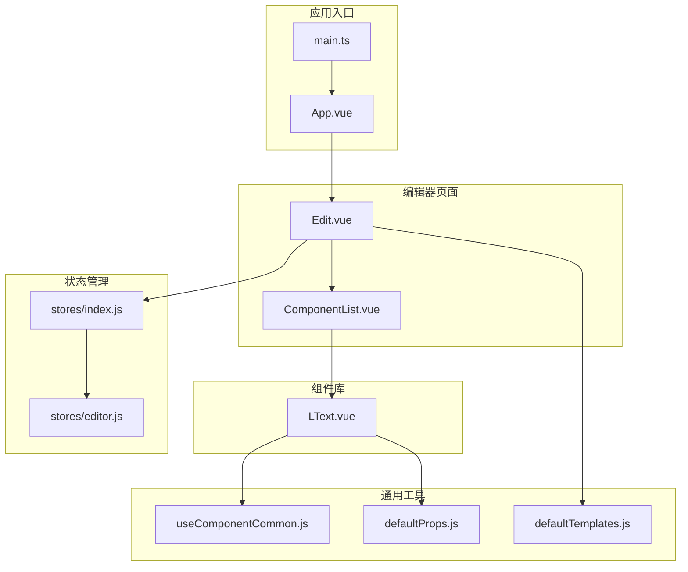
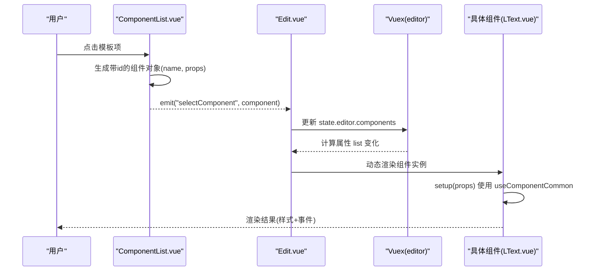
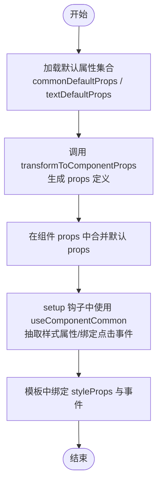
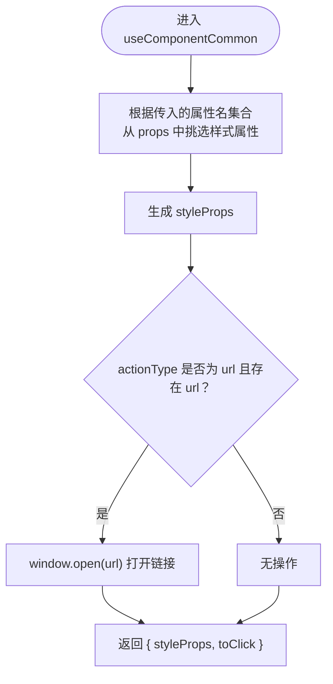
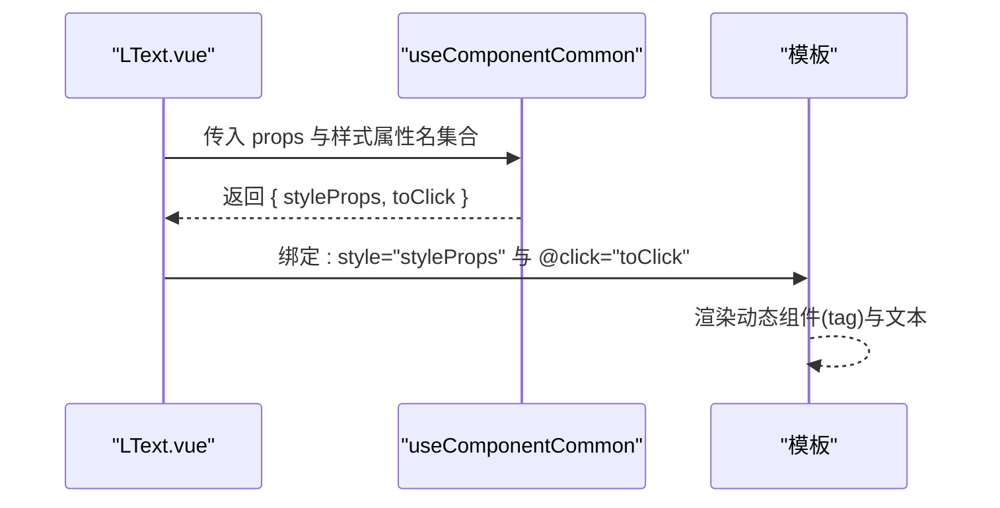
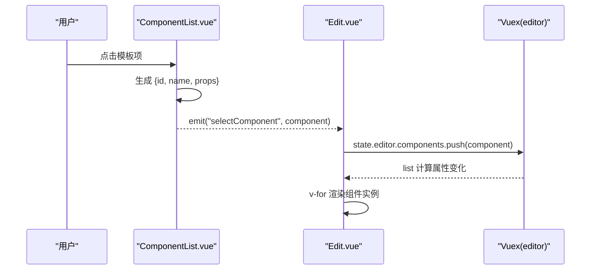
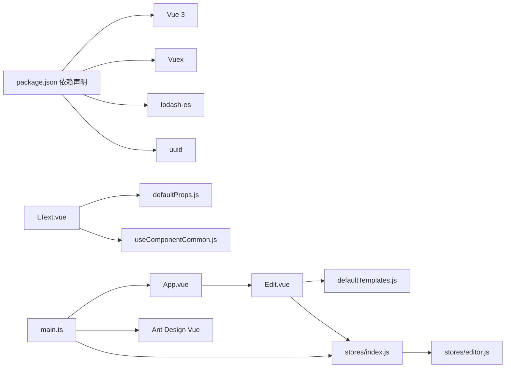

# 新组件开发

<cite>
**本文引用的文件**
- [defaultProps.js](file://src/defaultProps.js)
- [useComponentCommon.js](file://src/hooks/useComponentCommon.js)
- [LText.vue](file://src/components/LText.vue)
- [Edit.vue](file://src/components/Edit.vue)
- [ComponentList.vue](file://src/components/ComponentList.vue)
- [defaultTemplates.js](file://src/defaultTemplates.js)
- [editor.js](file://src/stores/editor.js)
- [index.js](file://src/stores/index.js)
- [main.ts](file://src/main.ts)
- [App.vue](file://src/App.vue)
- [package.json](file://package.json)
</cite>

## 目录
1. [简介](#简介)
2. [项目结构](#项目结构)
3. [核心组件](#核心组件)
4. [架构总览](#架构总览)
5. [详细组件分析](#详细组件分析)
6. [依赖关系分析](#依赖关系分析)
7. [性能考虑](#性能考虑)
8. [故障排查指南](#故障排查指南)
9. [结论](#结论)
10. [附录](#附录)

## 简介
本指南面向希望为 wy_poster 项目新增组件的开发者，目标是帮助你基于现有组件架构快速掌握“如何设计、定义属性、绑定事件与样式、以及通过生命周期钩子完成组件初始化”的完整流程。文档将重点解释：
- 组件属性系统的设计与工作原理
- 如何使用 transformToComponentProps 将默认属性转换为 Vue 组件的 props 定义
- 组件生命周期钩子（setup）中的逻辑组织方式
- 从需求分析到代码实现再到测试验证的完整开发流程
- 命名规范、属性类型定义、事件处理与样式绑定的最佳实践

## 项目结构
该项目采用基于功能分层的组织方式：组件层（components）、通用逻辑钩子（hooks）、状态管理（stores）、全局默认配置（defaultProps、defaultTemplates）等。编辑器页面负责渲染组件列表与画布区域，通过 Vuex 状态驱动组件实例的增删改。

图表来源
- [App.vue:1-24](file://src/App.vue#L1-L24)
- [main.ts:1-9](file://src/main.ts#L1-L9)
- [Edit.vue:1-91](file://src/components/Edit.vue#L1-L91)
- [ComponentList.vue:1-55](file://src/components/ComponentList.vue#L1-L55)
- [LText.vue:1-44](file://src/components/LText.vue#L1-L44)
- [useComponentCommon.js:1-18](file://src/hooks/useComponentCommon.js#L1-L18)
- [defaultProps.js:1-57](file://src/defaultProps.js#L1-L57)
- [defaultTemplates.js:1-41](file://src/defaultTemplates.js#L1-L41)
- [index.js:1-11](file://src/stores/index.js#L1-L11)
- [editor.js:1-52](file://src/stores/editor.js#L1-L52)

章节来源
- [App.vue:1-24](file://src/App.vue#L1-L24)
- [main.ts:1-9](file://src/main.ts#L1-L9)
- [Edit.vue:1-91](file://src/components/Edit.vue#L1-L91)
- [ComponentList.vue:1-55](file://src/components/ComponentList.vue#L1-L55)
- [LText.vue:1-44](file://src/components/LText.vue#L1-L44)
- [useComponentCommon.js:1-18](file://src/hooks/useComponentCommon.js#L1-L18)
- [defaultProps.js:1-57](file://src/defaultProps.js#L1-L57)
- [defaultTemplates.js:1-41](file://src/defaultTemplates.js#L1-L41)
- [index.js:1-11](file://src/stores/index.js#L1-L11)
- [editor.js:1-52](file://src/stores/editor.js#L1-L52)

## 核心组件
- defaultProps.js：集中定义通用默认属性、文本默认属性、样式属性名集合，以及 transformToComponentProps 转换函数。该文件是所有组件属性系统的“根”，确保属性类型与默认值的一致性与可复用性。
- useComponentCommon.js：封装通用交互逻辑（如点击跳转），并抽取需要绑定到 DOM 的样式属性集合，供各组件在 setup 钩子中复用。
- LText.vue：典型组件实现范式，展示如何使用 defaultProps 与 useComponentCommon，如何在模板中绑定样式与事件。
- ComponentList.vue：组件选择面板，负责将模板数据转换为组件实例并触发父级选择事件。
- Edit.vue：编辑器主页面，负责渲染组件列表与画布区域，连接模板数据与状态管理。
- stores/editor.js：编辑器状态，包含组件列表等数据，用于驱动画布渲染。
- stores/index.js：Vuex 根模块，注册 editor 子模块。
- main.ts：应用入口，挂载 Ant Design Vue 与 Vuex。

章节来源
- [defaultProps.js:1-57](file://src/defaultProps.js#L1-L57)
- [useComponentCommon.js:1-18](file://src/hooks/useComponentCommon.js#L1-L18)
- [LText.vue:1-44](file://src/components/LText.vue#L1-L44)
- [ComponentList.vue:1-55](file://src/components/ComponentList.vue#L1-L55)
- [Edit.vue:1-91](file://src/components/Edit.vue#L1-L91)
- [editor.js:1-52](file://src/stores/editor.js#L1-L52)
- [index.js:1-11](file://src/stores/index.js#L1-L11)
- [main.ts:1-9](file://src/main.ts#L1-L9)

## 架构总览
组件开发遵循“默认属性定义 -> 属性转换 -> 通用逻辑注入 -> 模板绑定”的标准流程。编辑器通过模板数据与状态管理生成组件实例，再由组件渲染到画布。

图表来源
- [ComponentList.vue:18-28](file://src/components/ComponentList.vue#L18-L28)
- [Edit.vue:39-56](file://src/components/Edit.vue#L39-L56)
- [editor.js:1-52](file://src/stores/editor.js#L1-L52)
- [LText.vue:22-34](file://src/components/LText.vue#L22-L34)

## 详细组件分析

### 组件属性系统与 transformToComponentProps
- 设计思想
  - defaultProps.js 提供统一的默认属性集合（通用属性、文本属性），并通过 transformToComponentProps 将这些默认值转换为 Vue 组件的 props 定义格式（含类型与默认值）。这样可以保证组件属性的类型安全与一致性。
  - textStylePropNames 从文本默认属性中剔除“动作类”属性（如 actionType、url、text），仅保留样式相关属性，便于在通用 hook 中抽取样式集合。
- 使用方式
  - 在组件中引入 textDefaultProps 与 transformToComponentProps，调用后者得到 props 定义，再通过扩展运算符合并到组件 props 中。
  - 在 setup 钩子中，将 props 与样式属性名集合传入 useComponentCommon，即可获得 styleProps 与 toClick 等通用能力。

图表来源
- [defaultProps.js:27-57](file://src/defaultProps.js#L27-L57)
- [LText.vue:11-34](file://src/components/LText.vue#L11-L34)

章节来源
- [defaultProps.js:1-57](file://src/defaultProps.js#L1-L57)
- [LText.vue:1-44](file://src/components/LText.vue#L1-L44)

### 通用交互与样式抽取：useComponentCommon
- 职责
  - 从 props 中挑选出样式相关属性，形成 styleProps，供模板直接绑定。
  - 处理点击事件：当 actionType 为 url 且存在 url 时，打开外部链接。
- 适用范围
  - 适用于所有具备“样式属性 + 点击动作”的组件，无需重复编写样板代码。

图表来源
- [useComponentCommon.js:4-15](file://src/hooks/useComponentCommon.js#L4-L15)

章节来源
- [useComponentCommon.js:1-18](file://src/hooks/useComponentCommon.js#L1-L18)

### 典型组件实现：LText
- 组件名称与 props
  - 组件名为 LText，除通用默认属性外，还定义了一个 tag 字段作为动态标签渲染的基础。
- 生命周期与逻辑
  - 在 setup 中调用 useComponentCommon，传入样式属性名集合，得到 styleProps 与 toClick。
  - 返回的对象在模板中直接可用，实现样式绑定与点击事件处理。
- 模板与样式
  - 使用动态组件渲染，支持 tag 自定义；内部文本来自 text 属性；点击事件绑定到 toClick。

图表来源
- [LText.vue:13-34](file://src/components/LText.vue#L13-L34)

章节来源
- [LText.vue:1-44](file://src/components/LText.vue#L1-L44)

### 组件选择与状态驱动：ComponentList 与 Edit
- ComponentList
  - 接收模板数组，为每个模板生成带唯一 id 的组件对象（name 为组件标识，props 为模板属性），并通过事件 selectComponent 通知父组件。
- Edit
  - 通过计算属性读取 store.state.editor.components，遍历渲染组件实例。
  - 当用户在左侧模板面板选择某一项时，将其转换为组件实例并推送到组件列表中，从而驱动画布更新。

图表来源
- [ComponentList.vue:18-28](file://src/components/ComponentList.vue#L18-L28)
- [Edit.vue:42-56](file://src/components/Edit.vue#L42-L56)
- [editor.js:9-44](file://src/stores/editor.js#L9-L44)

章节来源
- [ComponentList.vue:1-55](file://src/components/ComponentList.vue#L1-L55)
- [Edit.vue:1-91](file://src/components/Edit.vue#L1-L91)
- [editor.js:1-52](file://src/stores/editor.js#L1-L52)

### 默认模板与样式属性集合
- defaultTemplates.js 提供一组预设模板，覆盖标题、正文、链接、按钮等场景，便于快速选择与演示。
- defaultProps.js 中的 textStylePropNames 用于限定样式属性集合，避免将动作类属性误绑定到 DOM 样式上。

章节来源
- [defaultTemplates.js:1-41](file://src/defaultTemplates.js#L1-L41)
- [defaultProps.js:42-47](file://src/defaultProps.js#L42-L47)

## 依赖关系分析
- 外部依赖
  - Vue 3、Ant Design Vue、Vuex、lodash-es、uuid 等。
- 内部依赖
  - 组件依赖 defaultProps.js 与 useComponentCommon.js；编辑器页面依赖模板数据与状态管理；入口文件负责挂载 UI 库与状态管理。

图表来源
- [package.json:9-23](file://package.json#L9-L23)
- [LText.vue:1-44](file://src/components/LText.vue#L1-L44)
- [defaultProps.js:1-57](file://src/defaultProps.js#L1-L57)
- [useComponentCommon.js:1-18](file://src/hooks/useComponentCommon.js#L1-L18)
- [Edit.vue:1-91](file://src/components/Edit.vue#L1-L91)
- [defaultTemplates.js:1-41](file://src/defaultTemplates.js#L1-L41)
- [index.js:1-11](file://src/stores/index.js#L1-L11)
- [editor.js:1-52](file://src/stores/editor.js#L1-L52)
- [App.vue:1-24](file://src/App.vue#L1-L24)
- [main.ts:1-9](file://src/main.ts#L1-L9)

章节来源
- [package.json:1-25](file://package.json#L1-L25)
- [main.ts:1-9](file://src/main.ts#L1-L9)

## 性能考虑
- 属性转换与计算
  - transformToComponentProps 与 pick 在 setup 中执行，建议保持默认属性集合稳定，避免频繁重建 props 定义。
- 样式属性抽取
  - 使用 computed 包裹 pick 结果，可利用 Vue 的响应式优化，减少不必要的重渲染。
- 组件渲染
  - Edit.vue 中通过 v-for 渲染组件列表，注意为每个元素提供稳定的 key（如 id），以提升列表更新性能。
- 状态更新
  - 在 Edit.vue 中向 store.state.editor.components 直接 push 新组件，属于就地修改。若后续需要更严格的不可变更新策略，可改为替换数组或使用 Vuex mutation。

## 故障排查指南
- 组件未显示或样式异常
  - 检查是否正确传入样式属性名集合给 useComponentCommon，确保 textDefaultProps 已被转换并合并到组件 props。
  - 确认模板中是否正确绑定 :style="styleProps" 与 @click="toClick"。
- 点击无反应
  - 确认 props 中 actionType 为 url 且 url 存在；检查 useComponentCommon 的点击分支逻辑。
- 组件实例未出现在画布
  - 检查 Edit.vue 中是否正确订阅 store.state.editor.components 的变化，并在模板中使用 v-for 渲染。
  - 确认 ComponentList.vue 发出的事件 selectComponent 是否被父组件接收并写入 store。
- 类型或默认值不生效
  - 确认已调用 transformToComponentProps 并将返回值与组件 props 合并。
  - 检查默认属性集合是否包含所需字段，必要时在 defaultProps.js 中补充。

章节来源
- [LText.vue:22-34](file://src/components/LText.vue#L22-L34)
- [useComponentCommon.js:6-10](file://src/hooks/useComponentCommon.js#L6-L10)
- [Edit.vue:42-56](file://src/components/Edit.vue#L42-L56)
- [ComponentList.vue:18-28](file://src/components/ComponentList.vue#L18-L28)
- [defaultProps.js:49-57](file://src/defaultProps.js#L49-L57)

## 结论
通过 defaultProps.js 的统一属性定义、transformToComponentProps 的类型与默认值转换、useComponentCommon 的通用交互与样式抽取，以及 Edit.vue 与 Vuex 的状态驱动，wy_poster 形成了清晰、可扩展的组件开发模式。遵循本文档的流程与最佳实践，你可以快速新增符合项目规范的组件，并确保其在编辑器中正确渲染与交互。

## 附录

### 开发流程示例（从需求到测试）
- 需求分析
  - 明确组件用途（如图片、二维码、徽章等），确定需要的属性（如尺寸、颜色、链接等）。
- 属性定义
  - 在 defaultProps.js 中新增默认属性集合，或复用现有集合并扩展。
  - 使用 transformToComponentProps 生成 props 定义，并在组件中合并。
- 通用逻辑与样式
  - 若涉及点击跳转或样式绑定，调用 useComponentCommon 注入通用能力。
- 模板与事件
  - 在模板中绑定 :style="styleProps" 与 @click="toClick"，并根据需要使用动态组件渲染。
- 状态集成
  - 在 Edit.vue 中通过模板数据或用户选择生成组件实例，写入 store.state.editor.components。
- 测试验证
  - 手动验证：在编辑器中选择模板或拖拽组件，确认渲染与交互正常。
  - 单元测试（可选）：针对组件 props、事件与样式绑定进行断言，确保行为符合预期。

章节来源
- [defaultProps.js:1-57](file://src/defaultProps.js#L1-L57)
- [LText.vue:1-44](file://src/components/LText.vue#L1-L44)
- [useComponentCommon.js:1-18](file://src/hooks/useComponentCommon.js#L1-L18)
- [Edit.vue:1-91](file://src/components/Edit.vue#L1-L91)
- [ComponentList.vue:1-55](file://src/components/ComponentList.vue#L1-L55)
- [editor.js:1-52](file://src/stores/editor.js#L1-L52)

### 命名规范与最佳实践
- 组件命名
  - 使用语义化前缀（如 LText）区分业务组件与通用组件，保持一致的大小写风格。
- 属性类型与默认值
  - 优先使用 defaultProps.js 中的默认集合，通过 transformToComponentProps 自动生成类型与默认值。
- 事件处理
  - 对于点击跳转等通用行为，统一使用 useComponentCommon 的 toClick，避免重复逻辑。
- 样式绑定
  - 仅将样式相关属性绑定到 DOM，避免将动作类属性（如 actionType、url）直接绑定到 style。
- 状态管理
  - 通过 Vuex 集中管理组件列表，避免在组件内维护复杂的状态逻辑。

章节来源
- [LText.vue:13-34](file://src/components/LText.vue#L13-L34)
- [useComponentCommon.js:4-15](file://src/hooks/useComponentCommon.js#L4-L15)
- [defaultProps.js:49-57](file://src/defaultProps.js#L49-L57)
- [Edit.vue:42-56](file://src/components/Edit.vue#L42-L56)