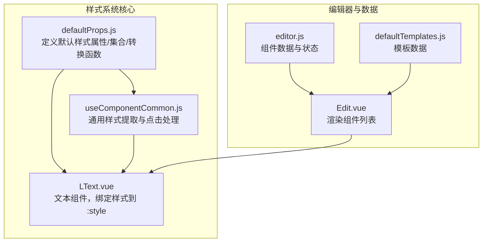
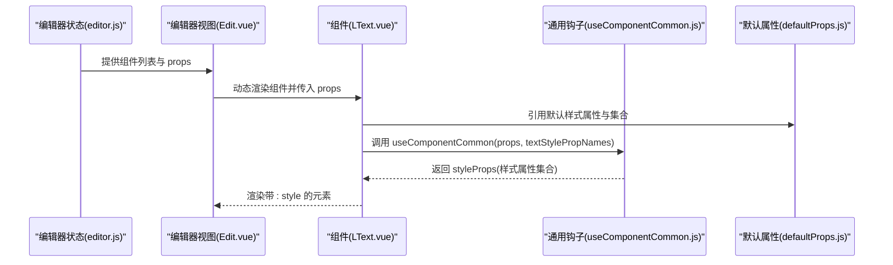
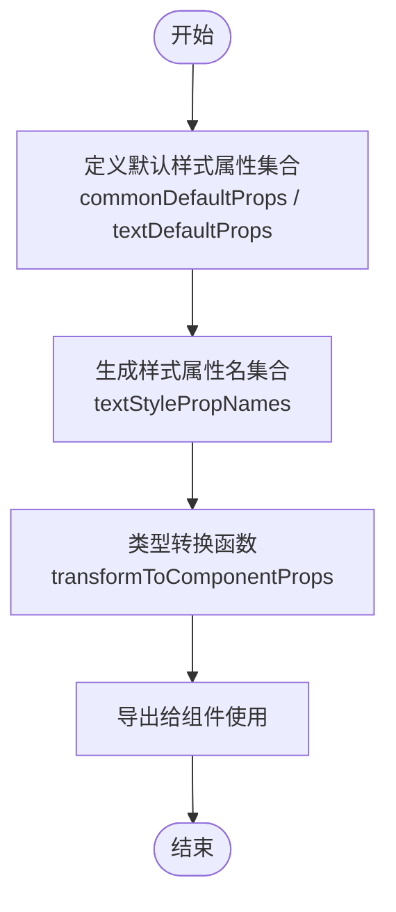
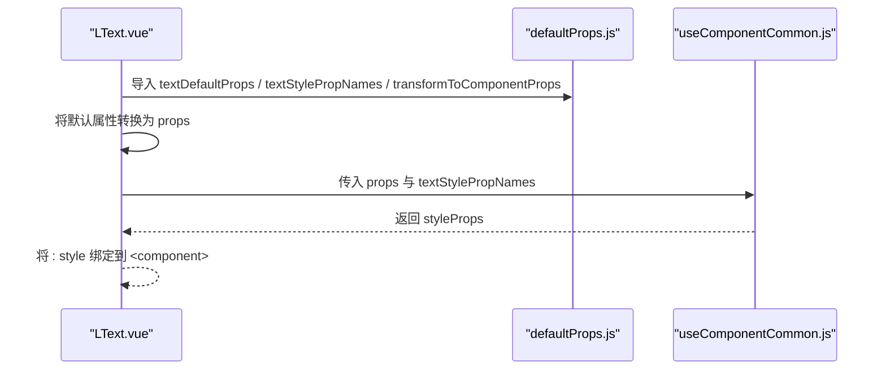
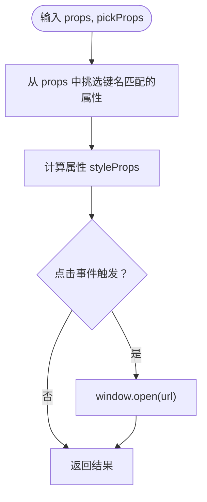
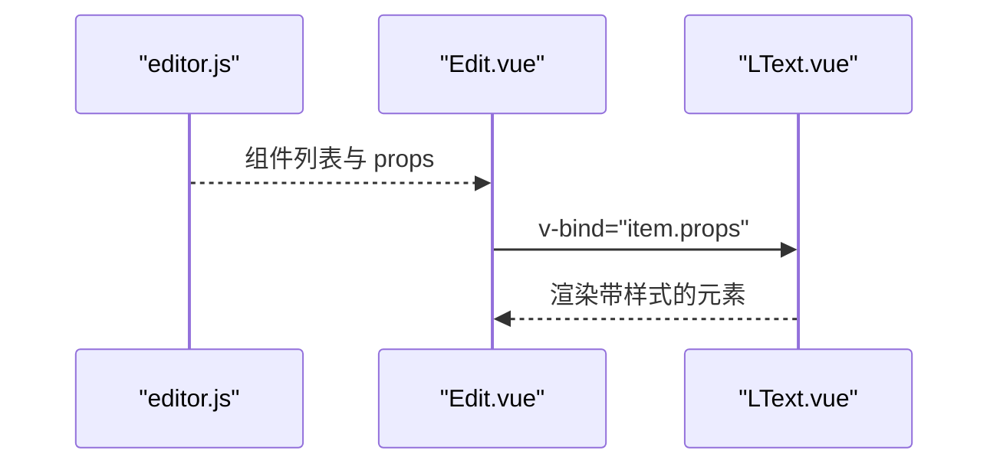
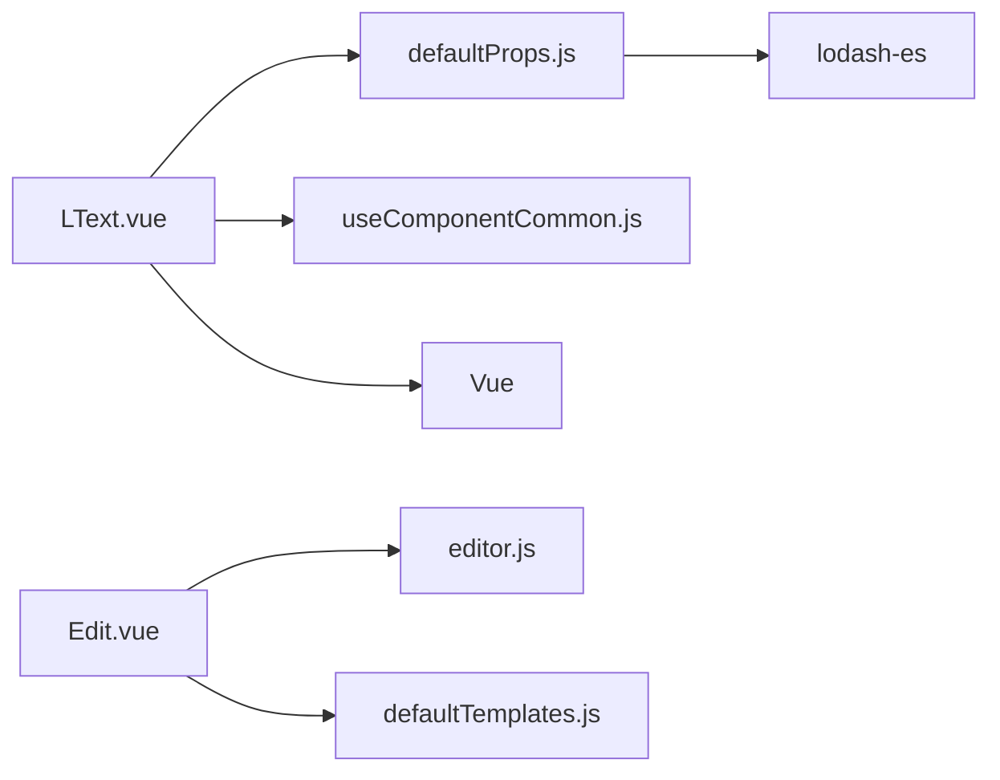
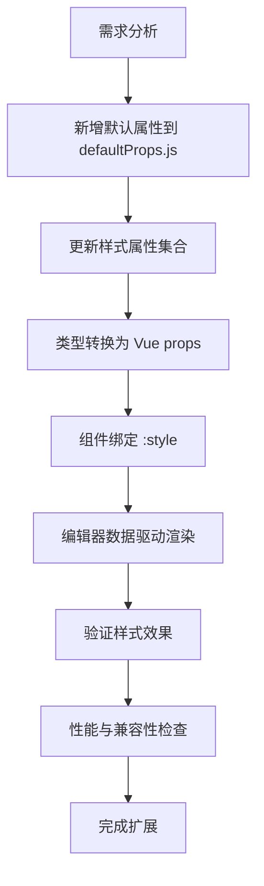

# 样式系统扩展

<cite>
**本文引用的文件**
- [defaultProps.js](file://src/defaultProps.js)
- [LText.vue](file://src/components/LText.vue)
- [useComponentCommon.js](file://src/hooks/useComponentCommon.js)
- [editor.js](file://src/stores/editor.js)
- [Edit.vue](file://src/components/Edit.vue)
- [defaultTemplates.js](file://src/defaultTemplates.js)
- [.browserslistrc](file://.browserslistrc)
- [package.json](file://package.json)
</cite>

## 目录
1. [简介](#简介)
2. [项目结构](#项目结构)
3. [核心组件](#核心组件)
4. [架构总览](#架构总览)
5. [详细组件分析](#详细组件分析)
6. [依赖关系分析](#依赖关系分析)
7. [性能考量](#性能考量)
8. [故障排查指南](#故障排查指南)
9. [结论](#结论)
10. [附录：样式属性扩展完整流程](#附录样式属性扩展完整流程)

## 简介
本指南面向希望为 wy_poster 项目扩展样式的开发者，围绕 defaultProps.js 的样式属性定义与绑定机制展开，系统讲解：
- 如何在 defaultProps.js 中新增样式属性（属性定义、默认值设置、类型约束）
- 样式属性的绑定机制：如何将属性值转换为 CSS 样式并应用到组件上
- 样式系统的架构设计：textStylePropNames 数组的作用与 transformToComponentProps 的工作原理
- 完整的样式属性开发流程：从需求分析到代码实现再到样式渲染验证
- 兼容性、性能优化与浏览器适配建议

## 项目结构
与样式系统直接相关的核心文件如下：
- defaultProps.js：集中定义通用样式属性、文本样式属性、样式属性名集合与类型转换函数
- LText.vue：文本组件，使用 defaultProps.js 的属性集合与钩子进行样式绑定
- useComponentCommon.js：通用组件逻辑钩子，负责从 props 中挑选样式属性并生成可响应的 styleProps
- editor.js：编辑器状态与组件数据，驱动 LText 渲染
- Edit.vue：编辑器页面，动态渲染多个组件实例
- defaultTemplates.js：预设模板，展示如何通过 props 配置样式
- .browserslistrc：浏览器兼容目标
- package.json：运行时依赖（含 lodash-es）

图表来源
- [defaultProps.js:1-57](file://src/defaultProps.js#L1-L57)
- [LText.vue:1-44](file://src/components/LText.vue#L1-L44)
- [useComponentCommon.js:1-18](file://src/hooks/useComponentCommon.js#L1-L18)
- [Edit.vue:1-91](file://src/components/Edit.vue#L1-L91)
- [editor.js:1-52](file://src/stores/editor.js#L1-L52)
- [defaultTemplates.js:1-41](file://src/defaultTemplates.js#L1-L41)

章节来源
- [defaultProps.js:1-57](file://src/defaultProps.js#L1-L57)
- [LText.vue:1-44](file://src/components/LText.vue#L1-L44)
- [useComponentCommon.js:1-18](file://src/hooks/useComponentCommon.js#L1-L18)
- [Edit.vue:1-91](file://src/components/Edit.vue#L1-L91)
- [editor.js:1-52](file://src/stores/editor.js#L1-L52)
- [defaultTemplates.js:1-41](file://src/defaultTemplates.js#L1-L41)

## 核心组件
- defaultProps.js
  - 定义通用样式属性与文本样式属性
  - 提供样式属性名集合（排除非样式属性）
  - 提供 transformToComponentProps 将默认值映射为 Vue props 类型与默认值
- LText.vue
  - 使用 defaultProps.js 的默认样式属性集合
  - 通过 useComponentCommon 抽取样式属性并绑定到组件的 :style
- useComponentCommon.js
  - 基于 pickProps 从 props 中挑选样式属性，生成响应式 styleProps
  - 处理点击行为（根据 actionType/url 打开链接）
- editor.js 与 Edit.vue
  - 编辑器状态驱动组件渲染，LText 接收 props 并应用样式
- defaultTemplates.js
  - 展示如何通过 props 快速配置文本样式与布局

章节来源
- [defaultProps.js:27-47](file://src/defaultProps.js#L27-L47)
- [LText.vue:11-34](file://src/components/LText.vue#L11-L34)
- [useComponentCommon.js:4-15](file://src/hooks/useComponentCommon.js#L4-L15)
- [editor.js:9-44](file://src/stores/editor.js#L9-L44)
- [Edit.vue:12-16](file://src/components/Edit.vue#L12-L16)
- [defaultTemplates.js:1-41](file://src/defaultTemplates.js#L1-L41)

## 架构总览
样式系统采用“默认属性定义 + 属性集合 + 类型转换 + 通用抽取”的分层设计：
- 默认属性层：集中定义所有可配置样式项及其默认值
- 属性集合层：明确哪些属性属于样式范畴（用于抽取）
- 类型转换层：将默认值转换为 Vue 组件的 props 规范（含类型与默认值）
- 通用抽取层：从传入 props 中挑选样式属性，生成响应式 style 对象
- 组件绑定层：将 style 对象绑定到 DOM 元素的 :style，完成最终渲染

图表来源
- [editor.js:42-44](file://src/stores/editor.js#L42-L44)
- [Edit.vue:12-16](file://src/components/Edit.vue#L12-L16)
- [LText.vue:22-34](file://src/components/LText.vue#L22-L34)
- [useComponentCommon.js:4-15](file://src/hooks/useComponentCommon.js#L4-L15)
- [defaultProps.js:42-47](file://src/defaultProps.js#L42-L47)

## 详细组件分析

### defaultProps.js：样式属性定义与转换
- 通用样式属性（commonDefaultProps）：包含尺寸、边框、阴影、透明度、定位等
- 文本样式属性（textDefaultProps）：在通用属性基础上叠加字体、颜色、对齐、行高等文本相关样式
- 样式属性名集合（textStylePropNames）：基于 textDefaultProps 键名，排除 actionType、url、text，确保仅抽取样式相关属性
- 类型转换函数（transformToComponentProps）：将默认值映射为 Vue props 的类型与默认值对象，便于组件声明

图表来源
- [defaultProps.js:27-47](file://src/defaultProps.js#L27-L47)
- [defaultProps.js:49-56](file://src/defaultProps.js#L49-L56)

章节来源
- [defaultProps.js:27-47](file://src/defaultProps.js#L27-L47)
- [defaultProps.js:49-56](file://src/defaultProps.js#L49-L56)

### LText.vue：样式绑定与渲染
- 通过 transformToComponentProps 将默认样式属性转为组件 props
- 在 setup 中调用 useComponentCommon，传入 props 与 textStylePropNames，得到 styleProps
- 将 styleProps 绑定到组件的 :style，从而将样式应用到 DOM
- 支持 tag 自定义标签名，便于语义化渲染

图表来源
- [LText.vue:3-9](file://src/components/LText.vue#L3-L9)
- [LText.vue:11-34](file://src/components/LText.vue#L11-L34)
- [useComponentCommon.js:4-15](file://src/hooks/useComponentCommon.js#L4-L15)
- [defaultProps.js:42-47](file://src/defaultProps.js#L42-L47)

章节来源
- [LText.vue:11-34](file://src/components/LText.vue#L11-L34)
- [useComponentCommon.js:4-15](file://src/hooks/useComponentCommon.js#L4-L15)
- [defaultProps.js:42-47](file://src/defaultProps.js#L42-L47)

### useComponentCommon.js：样式抽取与交互
- 从 props 中按 pickProps 抽取样式属性，生成响应式 styleProps
- 处理点击事件：当 actionType 为 url 且存在 url 时，打开外部链接
- 返回值包含 styleProps 与 toClick，供组件在模板中使用

图表来源
- [useComponentCommon.js:4-15](file://src/hooks/useComponentCommon.js#L4-L15)

章节来源
- [useComponentCommon.js:4-15](file://src/hooks/useComponentCommon.js#L4-L15)

### 编辑器与模板：驱动样式渲染
- editor.js 提供组件列表与初始 props（如 text、fontSize、color、top 等）
- Edit.vue 动态渲染每个组件，LText 接收 props 并应用样式
- defaultTemplates.js 提供多种文本样式模板，展示如何通过 props 配置样式

图表来源
- [editor.js:42-44](file://src/stores/editor.js#L42-L44)
- [Edit.vue:12-16](file://src/components/Edit.vue#L12-L16)
- [LText.vue:37-41](file://src/components/LText.vue#L37-L41)
- [defaultTemplates.js:1-41](file://src/defaultTemplates.js#L1-L41)

章节来源
- [editor.js:9-44](file://src/stores/editor.js#L9-L44)
- [Edit.vue:12-16](file://src/components/Edit.vue#L12-L16)
- [defaultTemplates.js:1-41](file://src/defaultTemplates.js#L1-L41)

## 依赖关系分析
- LText.vue 依赖 defaultProps.js（默认属性、集合、转换函数）与 useComponentCommon.js（样式抽取与交互）
- Edit.vue 依赖 editor.js（组件数据）与 defaultTemplates.js（模板数据）
- 通用依赖：lodash-es（pick/mapValues）、Vue（computed、defineComponent）

图表来源
- [LText.vue:3-9](file://src/components/LText.vue#L3-L9)
- [defaultProps.js:1](file://src/defaultProps.js#L1)
- [useComponentCommon.js:1](file://src/hooks/useComponentCommon.js#L1)
- [Edit.vue:24-28](file://src/components/Edit.vue#L24-L28)
- [editor.js:24-28](file://src/stores/editor.js#L24-L28)
- [defaultTemplates.js:28](file://src/defaultTemplates.js#L28)

章节来源
- [LText.vue:3-9](file://src/components/LText.vue#L3-L9)
- [defaultProps.js:1](file://src/defaultProps.js#L1)
- [useComponentCommon.js:1](file://src/hooks/useComponentCommon.js#L1)
- [Edit.vue:24-28](file://src/components/Edit.vue#L24-L28)
- [editor.js:24-28](file://src/stores/editor.js#L24-L28)
- [defaultTemplates.js:28](file://src/defaultTemplates.js#L28)

## 性能考量
- 响应式样式抽取：通过 computed 包裹 pick(props, pickProps)，避免不必要的重算
- 属性集合最小化：textStylePropNames 明确限定样式属性范围，减少 pick 的键数量
- 依赖库选择：lodash-es 的 pick 与 mapValues 已按需引入，避免全量导入
- 浏览器兼容：.browserslistrc 指定现代浏览器目标，结合构建工具自动 polyfill

章节来源
- [useComponentCommon.js:5](file://src/hooks/useComponentCommon.js#L5)
- [defaultProps.js:42-47](file://src/defaultProps.js#L42-L47)
- [.browserslistrc:1-4](file://.browserslistrc#L1-L4)

## 故障排查指南
- 样式不生效
  - 检查是否将属性加入 textDefaultProps 与 textStylePropNames
  - 确认 LText.vue 是否正确传入 textStylePropNames 到 useComponentCommon
  - 确认 props 是否传递到 LText（Edit.vue 的 v-bind="item.props"）
- 类型错误或默认值异常
  - 检查 transformToComponentProps 的默认值类型是否符合预期
  - 确认 props 的类型声明与默认值一致
- 点击无反应
  - 检查 actionType 与 url 是否同时满足条件
  - 确认 useComponentCommon 的 toClick 分支逻辑

章节来源
- [LText.vue:22-34](file://src/components/LText.vue#L22-L34)
- [useComponentCommon.js:6-10](file://src/hooks/useComponentCommon.js#L6-L10)
- [defaultProps.js:49-56](file://src/defaultProps.js#L49-L56)

## 结论
wy_poster 的样式系统通过“默认属性 + 属性集合 + 类型转换 + 通用抽取”的模式，实现了高内聚、低耦合的样式管理。开发者只需在 defaultProps.js 中定义新属性，即可自动纳入样式系统，无需修改组件内部逻辑。该设计易于扩展更多文本样式选项，同时保持渲染性能与可维护性。

## 附录：样式属性扩展完整流程
以下流程从需求分析到样式渲染验证，帮助你系统地扩展样式属性：

- 需求分析
  - 明确要支持的新样式属性（如字体族、字间距、文本装饰等）
  - 确定默认值与适用场景
- 新增默认属性
  - 在 commonDefaultProps 或 textDefaultProps 中添加新键值对
  - 保证默认值类型与 CSS 值格式一致（如 px/em/%/颜色值等）
- 更新样式属性集合
  - 确保新属性出现在 textDefaultProps 的键集合中
  - 若为非样式属性（如 actionType/url），需将其从 textStylePropNames 中排除
- 类型转换与组件声明
  - 使用 transformToComponentProps 将默认值映射为 Vue props 的 type 与 default
  - 在组件 props 中展开该默认属性集合
- 样式绑定与渲染
  - 在组件 setup 中调用 useComponentCommon，传入 props 与 textStylePropNames
  - 将返回的 styleProps 绑定到元素的 :style
- 数据驱动验证
  - 在 editor.js 的组件列表中为 LText 添加新属性
  - 在 Edit.vue 中渲染组件，观察样式是否生效
  - 参考 defaultTemplates.js 的模板，快速对比不同属性组合的效果
- 兼容性与性能
  - 使用 .browserslistrc 指定目标浏览器，确保 CSS 值被正确转译
  - 保持 textStylePropNames 的最小化，避免不必要的 pick 开销
  - 如需复杂样式（如渐变、多阴影），优先以字符串形式存储并在组件中直接透传

图表来源
- [defaultProps.js:27-47](file://src/defaultProps.js#L27-L47)
- [defaultProps.js:49-56](file://src/defaultProps.js#L49-L56)
- [LText.vue:11-34](file://src/components/LText.vue#L11-L34)
- [useComponentCommon.js:4-15](file://src/hooks/useComponentCommon.js#L4-L15)
- [editor.js:42-44](file://src/stores/editor.js#L42-L44)
- [Edit.vue:12-16](file://src/components/Edit.vue#L12-L16)
- [defaultTemplates.js:1-41](file://src/defaultTemplates.js#L1-L41)

章节来源
- [defaultProps.js:27-47](file://src/defaultProps.js#L27-L47)
- [defaultProps.js:49-56](file://src/defaultProps.js#L49-L56)
- [LText.vue:11-34](file://src/components/LText.vue#L11-L34)
- [useComponentCommon.js:4-15](file://src/hooks/useComponentCommon.js#L4-L15)
- [editor.js:42-44](file://src/stores/editor.js#L42-L44)
- [Edit.vue:12-16](file://src/components/Edit.vue#L12-L16)
- [defaultTemplates.js:1-41](file://src/defaultTemplates.js#L1-L41)