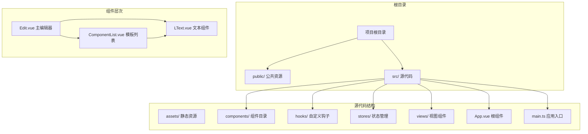
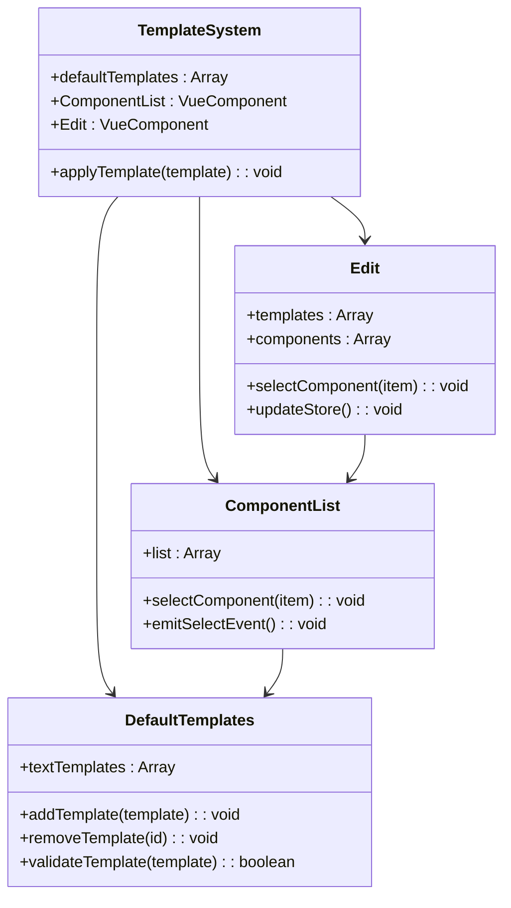
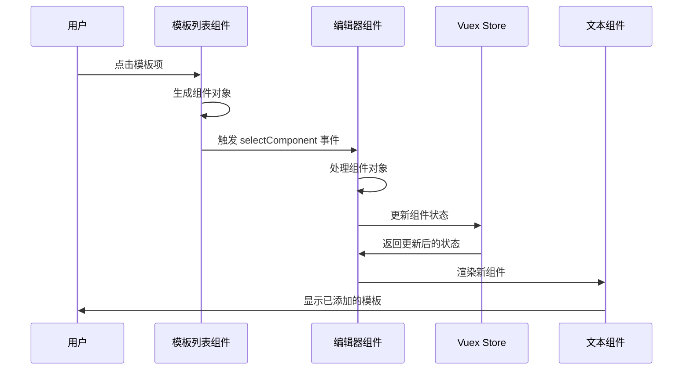
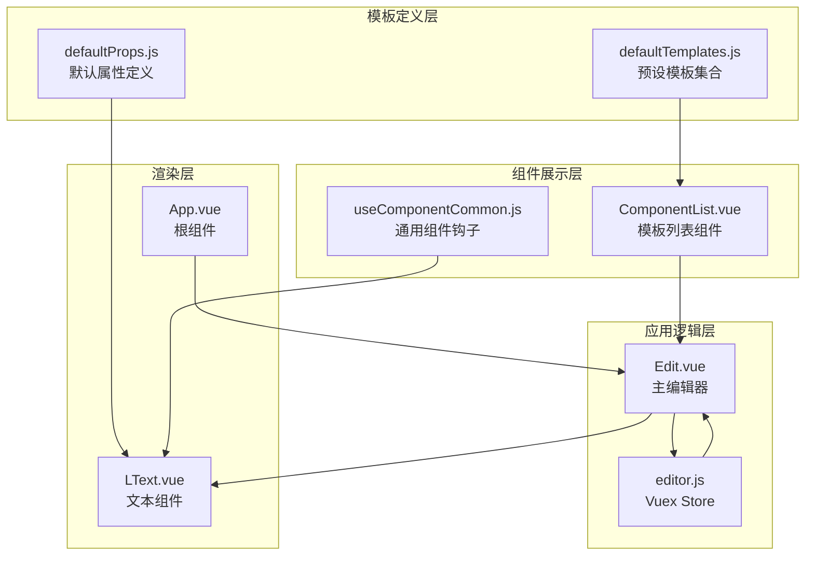
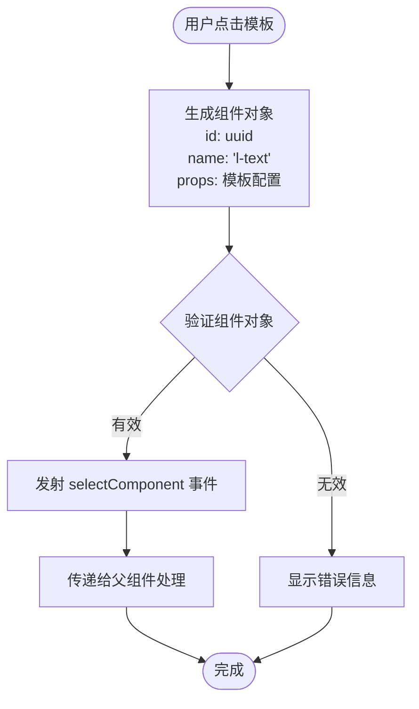
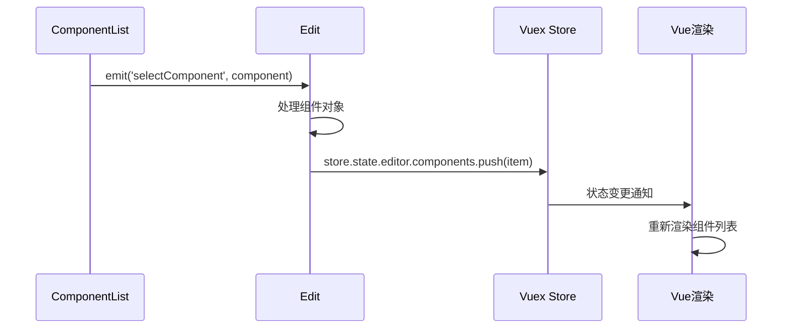
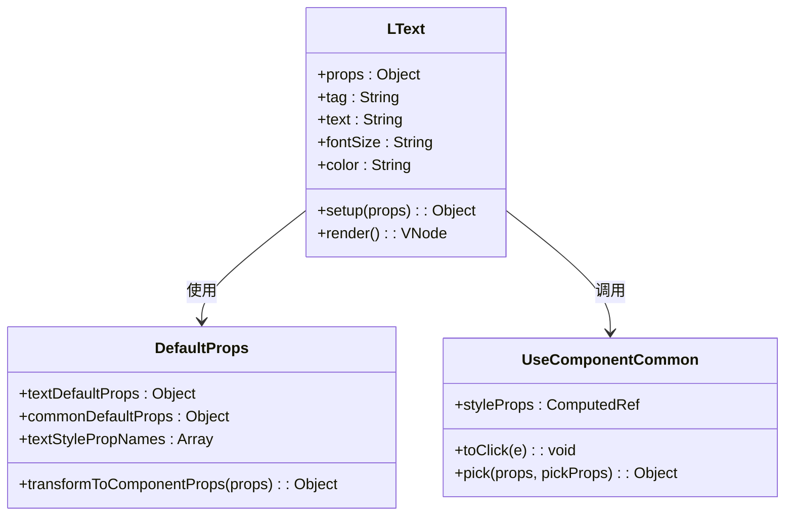
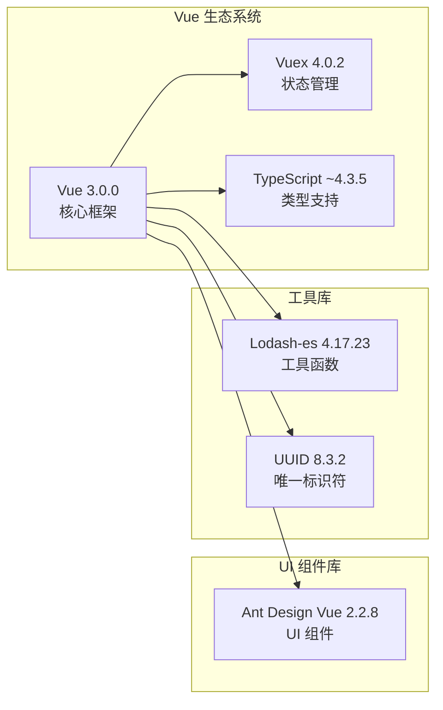
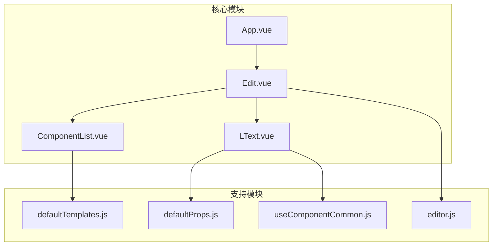

# 模板系统扩展

<cite>
**本文档引用的文件**
- [defaultTemplates.js](file://src/defaultTemplates.js)
- [ComponentList.vue](file://src/components/ComponentList.vue)
- [Edit.vue](file://src/components/Edit.vue)
- [LText.vue](file://src/components/LText.vue)
- [defaultProps.js](file://src/defaultProps.js)
- [useComponentCommon.js](file://src/hooks/useComponentCommon.js)
- [editor.js](file://src/stores/editor.js)
- [App.vue](file://src/App.vue)
- [package.json](file://package.json)
</cite>

## 目录
1. [简介](#简介)
2. [项目结构](#项目结构)
3. [核心组件](#核心组件)
4. [架构概览](#架构概览)
5. [详细组件分析](#详细组件分析)
6. [依赖分析](#依赖分析)
7. [性能考虑](#性能考虑)
8. [故障排除指南](#故障排除指南)
9. [结论](#结论)
10. [附录](#附录)

## 简介

wy_poster 是一个基于 Vue 3 的海报生成编辑器，采用模块化架构设计。该项目的核心功能是提供一个可视化的模板系统，允许用户通过拖拽和点击的方式快速添加预设模板到海报编辑区域。

本指南专注于模板系统的扩展机制，详细说明如何向 `defaultTemplates.js` 文件添加新的预设模板，包括模板结构定义、组件配置和样式设置。同时阐述模板选择界面的实现机制，模板应用的触发流程，以及模板开发的最佳实践。

## 项目结构

项目采用典型的 Vue 3 单页应用架构，主要目录结构如下：

**图表来源**
- [App.vue:1-24](file://src/App.vue#L1-L24)
- [Edit.vue:1-91](file://src/components/Edit.vue#L1-L91)

**章节来源**
- [App.vue:1-24](file://src/App.vue#L1-L24)
- [package.json:1-25](file://package.json#L1-L25)

## 核心组件

### 模板系统架构

模板系统由三个核心部分组成：

1. **模板定义层** (`defaultTemplates.js`)
2. **模板展示层** (`ComponentList.vue`)
3. **模板应用层** (`Edit.vue`)

**图表来源**
- [defaultTemplates.js:1-41](file://src/defaultTemplates.js#L1-L41)
- [ComponentList.vue:1-55](file://src/components/ComponentList.vue#L1-L55)
- [Edit.vue:1-91](file://src/components/Edit.vue#L1-L91)

### 数据流架构

模板系统遵循单向数据流原则：

**图表来源**
- [ComponentList.vue:19-24](file://src/components/ComponentList.vue#L19-L24)
- [Edit.vue:44-49](file://src/components/Edit.vue#L44-L49)

**章节来源**
- [defaultTemplates.js:1-41](file://src/defaultTemplates.js#L1-L41)
- [ComponentList.vue:1-55](file://src/components/ComponentList.vue#L1-L55)
- [Edit.vue:1-91](file://src/components/Edit.vue#L1-L91)

## 架构概览

### 模板系统整体架构

**图表来源**
- [defaultTemplates.js:1-41](file://src/defaultTemplates.js#L1-L41)
- [ComponentList.vue:1-55](file://src/components/ComponentList.vue#L1-L55)
- [Edit.vue:1-91](file://src/components/Edit.vue#L1-L91)
- [LText.vue:1-44](file://src/components/LText.vue#L1-L44)
- [defaultProps.js:1-57](file://src/defaultProps.js#L1-L57)
- [useComponentCommon.js:1-18](file://src/hooks/useComponentCommon.js#L1-L18)
- [editor.js:1-52](file://src/stores/editor.js#L1-L52)
- [App.vue:1-24](file://src/App.vue#L1-L24)

## 详细组件分析

### 模板定义系统

#### defaultTemplates.js 结构分析

模板定义文件采用数组结构存储预设模板，每个模板都是一个配置对象，包含以下关键属性：

| 属性名称 | 类型 | 必需 | 描述 |
|---------|------|------|------|
| text | string | 否 | 显示的文本内容 |
| fontSize | string | 否 | 字体大小，支持 px/em/rem |
| fontWeight | string | 否 | 字体粗细，如 normal/bold |
| tag | string | 否 | HTML标签类型，默认div |
| width | string | 否 | 元素宽度 |
| color | string | 否 | 文字颜色 |
| backgroundColor | string | 否 | 背景颜色 |
| borderWidth | string | 否 | 边框宽度 |
| borderColor | string | 否 | 边框颜色 |
| borderStyle | string | 否 | 边框样式 |
| borderRadius | string | 否 | 圆角半径 |
| textAlign | string | 否 | 文本对齐方式 |
| position | string | 否 | 定位方式 |

**章节来源**
- [defaultTemplates.js:1-41](file://src/defaultTemplates.js#L1-L41)

### 模板选择界面

#### ComponentList.vue 实现机制

模板选择界面通过以下机制实现：

1. **模板渲染**：使用 v-for 指令遍历模板数组
2. **事件绑定**：为每个模板项绑定点击事件
3. **组件生成**：点击时生成标准组件对象格式
4. **事件发射**：通过自定义事件向上层传递

**图表来源**
- [ComponentList.vue:19-24](file://src/components/ComponentList.vue#L19-L24)

**章节来源**
- [ComponentList.vue:1-55](file://src/components/ComponentList.vue#L1-L55)

### 模板应用流程

#### Edit.vue 集成机制

模板应用采用事件驱动的方式：

1. **事件监听**：父组件监听子组件的 selectComponent 事件
2. **组件创建**：接收模板配置并创建标准组件对象
3. **状态更新**：将新组件添加到 Vuex Store 中
4. **自动渲染**：Vuex Store 状态变化触发重新渲染

**图表来源**
- [Edit.vue:44-49](file://src/components/Edit.vue#L44-L49)

**章节来源**
- [Edit.vue:1-91](file://src/components/Edit.vue#L1-L91)

### 组件系统架构

#### LText.vue 组件设计

LText 组件采用组合式 API 设计，结合了默认属性系统和通用钩子：

**图表来源**
- [LText.vue:11-34](file://src/components/LText.vue#L11-L34)
- [defaultProps.js:27-57](file://src/defaultProps.js#L27-L57)
- [useComponentCommon.js:4-15](file://src/hooks/useComponentCommon.js#L4-L15)

**章节来源**
- [LText.vue:1-44](file://src/components/LText.vue#L1-L44)
- [defaultProps.js:1-57](file://src/defaultProps.js#L1-L57)
- [useComponentCommon.js:1-18](file://src/hooks/useComponentCommon.js#L1-L18)

## 依赖分析

### 外部依赖关系

项目使用的主要外部依赖及其作用：

**图表来源**
- [package.json:9-23](file://package.json#L9-L23)

### 内部模块依赖

**图表来源**
- [App.vue:1-24](file://src/App.vue#L1-L24)
- [Edit.vue:26-28](file://src/components/Edit.vue#L26-L28)
- [ComponentList.vue:3](file://src/components/ComponentList.vue#L3)
- [LText.vue:3-7](file://src/components/LText.vue#L3-L7)

**章节来源**
- [package.json:1-25](file://package.json#L1-L25)

## 性能考虑

### 模板渲染优化

1. **虚拟滚动**：对于大量模板的情况，可考虑实现虚拟滚动以提升渲染性能
2. **懒加载**：模板图片等资源可采用懒加载策略
3. **缓存机制**：已渲染的组件可加入缓存避免重复创建

### 内存管理

1. **组件销毁**：确保组件正确销毁，释放内存资源
2. **事件监听**：及时移除不必要的事件监听器
3. **定时器清理**：清理可能存在的定时器

## 故障排除指南

### 常见问题及解决方案

#### 模板无法显示

**问题症状**：点击模板后无响应或模板不显示

**可能原因**：
1. 模板配置缺少必需属性
2. 组件名称不匹配
3. Vuex Store 状态未正确更新

**解决步骤**：
1. 检查模板对象结构是否符合标准格式
2. 确认组件名称与实际组件一致
3. 验证 Vuex Store 的状态更新逻辑

#### 样式显示异常

**问题症状**：模板样式不符合预期

**可能原因**：
1. CSS 属性值格式不正确
2. 样式优先级冲突
3. 组件样式作用域问题

**解决步骤**：
1. 检查 CSS 属性值的单位和格式
2. 验证样式优先级和继承关系
3. 确认 scoped 样式的作用范围

**章节来源**
- [ComponentList.vue:19-24](file://src/components/ComponentList.vue#L19-L24)
- [Edit.vue:44-49](file://src/components/Edit.vue#L44-L49)

## 结论

wy_poster 的模板系统采用简洁而高效的架构设计，通过模块化的方式实现了模板的定义、展示和应用。该系统具有以下特点：

1. **模块化设计**：清晰的职责分离，便于维护和扩展
2. **标准化接口**：统一的组件对象格式，简化了集成过程
3. **事件驱动**：基于事件的通信机制，提高了系统的灵活性
4. **类型安全**：结合 TypeScript 提供了良好的类型安全保障

通过本指南，开发者可以快速理解和扩展模板系统，为项目添加更多样化的预设模板，满足不同场景的设计需求。

## 附录

### 模板开发最佳实践

#### 模板命名规范

1. **语义化命名**：模板名称应清晰表达其用途和风格
2. **一致性**：保持模板命名风格的一致性
3. **可读性**：避免使用缩写，确保名称易于理解

#### 组件层级关系

1. **单一职责**：每个模板应专注于特定的功能或样式
2. **可复用性**：设计通用性强的模板，提高复用率
3. **层次清晰**：避免过深的嵌套结构

#### 样式一致性要求

1. **设计系统**：建立统一的设计系统和样式规范
2. **响应式设计**：确保模板在不同尺寸下都能正常显示
3. **无障碍访问**：考虑颜色对比度和可访问性要求

#### 模板测试方法

1. **单元测试**：为模板配置进行单元测试
2. **集成测试**：测试模板与组件系统的集成效果
3. **用户验收测试**：收集用户反馈，验证实用性

#### 质量检查标准

1. **功能完整性**：确保模板的所有功能正常工作
2. **性能指标**：监控模板的渲染性能和内存使用
3. **兼容性测试**：验证在不同浏览器和设备上的表现
4. **可维护性**：确保代码结构清晰，易于维护和扩展