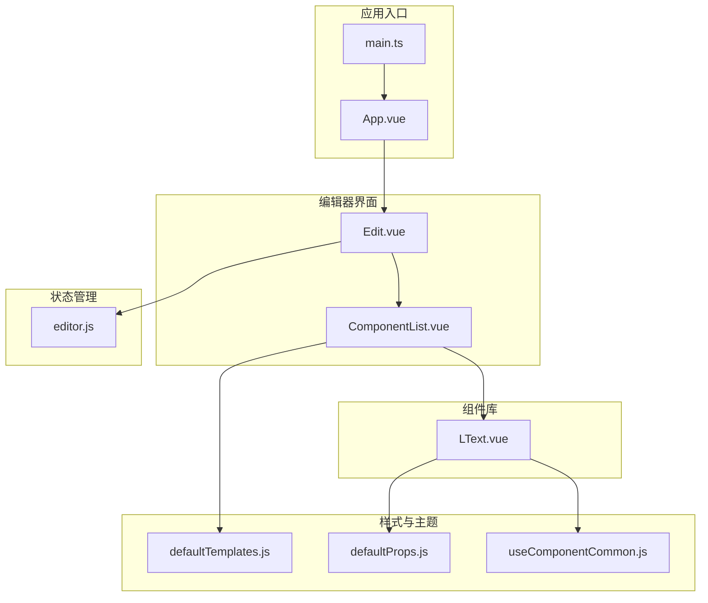
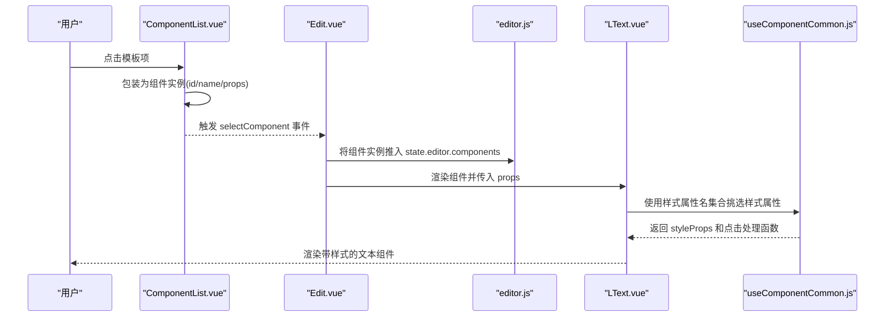
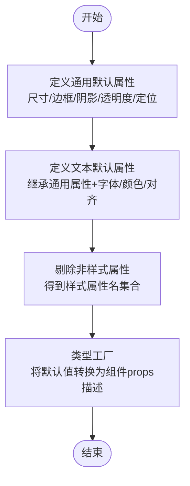
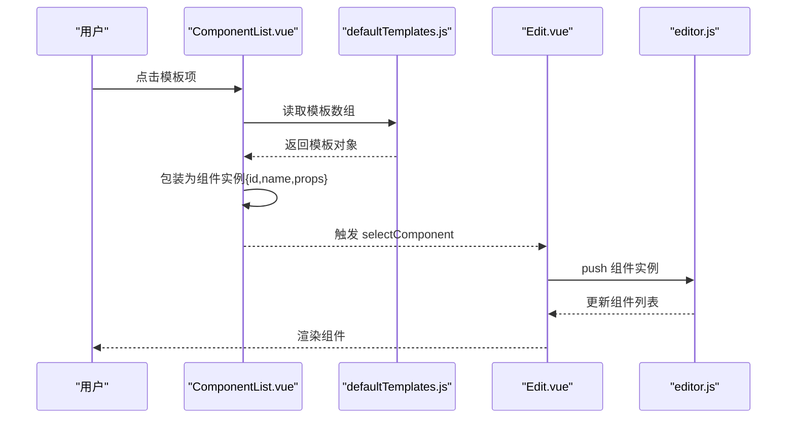
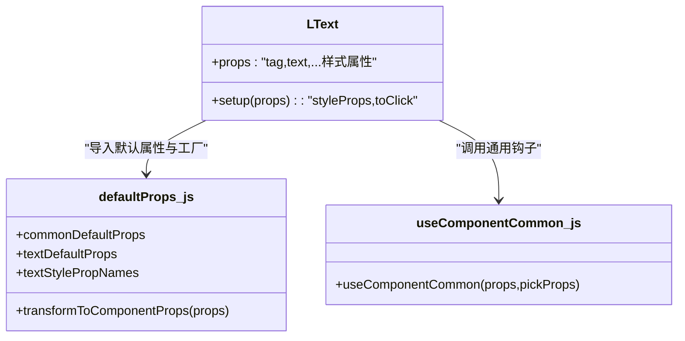
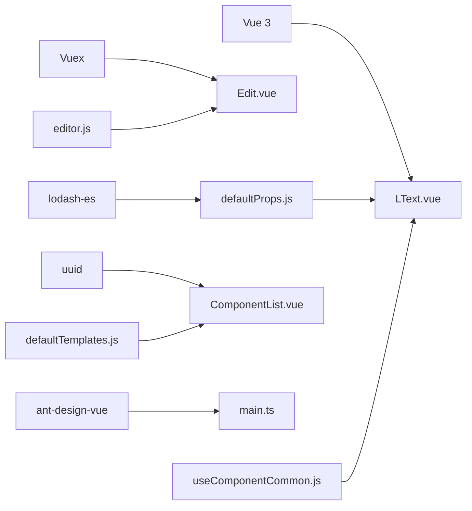

# 样式与主题系统

<cite>
**本文档引用的文件**
- [defaultProps.js](file://src/defaultProps.js)
- [defaultTemplates.js](file://src/defaultTemplates.js)
- [LText.vue](file://src/components/LText.vue)
- [Edit.vue](file://src/components/Edit.vue)
- [ComponentList.vue](file://src/components/ComponentList.vue)
- [useComponentCommon.js](file://src/hooks/useComponentCommon.js)
- [editor.js](file://src/stores/editor.js)
- [main.ts](file://src/main.ts)
- [App.vue](file://src/App.vue)
- [package.json](file://package.json)
</cite>

## 目录
1. [简介](#简介)
2. [项目结构](#项目结构)
3. [核心组件](#核心组件)
4. [架构总览](#架构总览)
5. [详细组件分析](#详细组件分析)
6. [依赖关系分析](#依赖关系分析)
7. [性能考虑](#性能考虑)
8. [故障排除指南](#故障排除指南)
9. [结论](#结论)
10. [附录](#附录)

## 简介
本文件聚焦于 wy_poster 项目的样式与主题系统，围绕以下目标展开：
- 解析 defaultProps.js 中默认属性配置的设计理念：属性类型定义、默认值管理、样式属性绑定机制
- 解释 defaultTemplates.js 中预设模板系统的工作原理：模板结构设计、模板应用逻辑、模板扩展机制
- 描述样式系统的灵活性与可定制性：如何添加新样式属性、创建自定义模板
- 提供使用示例与配置方法，帮助开发者理解并扩展样式系统功能

## 项目结构
该项目采用基于组件的组织方式，样式与主题系统主要由默认属性配置、模板预设、通用样式钩子以及编辑器组件构成。核心文件分布如下：
- 默认属性与模板：src/defaultProps.js、src/defaultTemplates.js
- 组件与编辑器：src/components/LText.vue、src/components/Edit.vue、src/components/ComponentList.vue
- 通用逻辑：src/hooks/useComponentCommon.js
- 状态管理：src/stores/editor.js
- 应用入口与依赖：src/main.ts、src/App.vue、package.json

图表来源
- [App.vue:1-24](file://src/App.vue#L1-L24)
- [main.ts:1-9](file://src/main.ts#L1-L9)
- [Edit.vue:1-91](file://src/components/Edit.vue#L1-L91)
- [ComponentList.vue:1-55](file://src/components/ComponentList.vue#L1-L55)
- [LText.vue:1-44](file://src/components/LText.vue#L1-L44)
- [defaultProps.js:1-57](file://src/defaultProps.js#L1-L57)
- [defaultTemplates.js:1-41](file://src/defaultTemplates.js#L1-L41)
- [useComponentCommon.js:1-18](file://src/hooks/useComponentCommon.js#L1-L18)
- [editor.js:1-52](file://src/stores/editor.js#L1-L52)

章节来源
- [App.vue:1-24](file://src/App.vue#L1-L24)
- [main.ts:1-9](file://src/main.ts#L1-L9)
- [Edit.vue:1-91](file://src/components/Edit.vue#L1-L91)
- [ComponentList.vue:1-55](file://src/components/ComponentList.vue#L1-L55)
- [LText.vue:1-44](file://src/components/LText.vue#L1-L44)
- [defaultProps.js:1-57](file://src/defaultProps.js#L1-L57)
- [defaultTemplates.js:1-41](file://src/defaultTemplates.js#L1-L41)
- [useComponentCommon.js:1-18](file://src/hooks/useComponentCommon.js#L1-L18)
- [editor.js:1-52](file://src/stores/editor.js#L1-L52)

## 核心组件
- defaultProps.js：集中定义通用默认属性、文本默认属性、样式属性名集合，以及将默认属性转换为组件 props 的工厂函数
- defaultTemplates.js：提供一组文本类预设模板，包含文本内容、字号、颜色、边框、背景等样式属性
- LText.vue：文本组件，通过默认属性工厂与样式属性名集合，将 props 转换为内联样式并支持点击跳转
- ComponentList.vue：模板列表组件，负责将模板项包装为可选中的组件实例并触发选择事件
- useComponentCommon.js：通用样式与交互逻辑钩子，从 props 中挑选样式属性并处理点击行为
- editor.js：Vuex 状态管理，维护海报画布尺寸、背景及元素列表，提供计算属性

章节来源
- [defaultProps.js:1-57](file://src/defaultProps.js#L1-L57)
- [defaultTemplates.js:1-41](file://src/defaultTemplates.js#L1-L41)
- [LText.vue:1-44](file://src/components/LText.vue#L1-L44)
- [ComponentList.vue:1-55](file://src/components/ComponentList.vue#L1-L55)
- [useComponentCommon.js:1-18](file://src/hooks/useComponentCommon.js#L1-L18)
- [editor.js:1-52](file://src/stores/editor.js#L1-L52)

## 架构总览
样式与主题系统以“默认属性 + 模板预设 + 通用钩子”的组合实现：
- 默认属性工厂：统一管理所有组件的默认值与类型约束，确保组件在无显式传入时具备一致的初始状态
- 模板预设：提供常见文本样式的即用模板，降低用户配置成本
- 通用钩子：将 props 中的样式属性抽取为内联样式对象，同时处理交互（如点击跳转）
- 编辑器组件：负责渲染组件列表、承载模板选择、将模板映射为组件实例并注入到状态管理中

图表来源
- [ComponentList.vue:18-29](file://src/components/ComponentList.vue#L18-L29)
- [Edit.vue:44-56](file://src/components/Edit.vue#L44-L56)
- [editor.js:9-44](file://src/stores/editor.js#L9-L44)
- [LText.vue:22-34](file://src/components/LText.vue#L22-L34)
- [useComponentCommon.js:4-15](file://src/hooks/useComponentCommon.js#L4-L15)

## 详细组件分析

### defaultProps.js：默认属性与样式绑定机制
- 设计理念
  - 通用默认属性：统一管理尺寸、边框、阴影、透明度、定位等基础样式属性，作为其他组件的基础
  - 文本默认属性：在通用默认属性基础上叠加字体、颜色、对齐等文本相关属性
  - 样式属性名集合：通过剔除非样式属性（如动作类型、链接地址、文本内容）得到仅包含样式键的集合
  - 类型工厂：将默认属性值转换为组件 props 的类型与默认值描述，便于组件声明与校验
- 关键点
  - 通用默认属性覆盖尺寸、内边距、边框、阴影、透明度、定位等，保证组件在容器中具备合理的初始布局与外观
  - 文本默认属性继承通用默认属性并通过扩展键值实现文本样式初始化
  - 样式属性名集合用于精确挑选 props 中的样式键，避免将非样式属性混入内联样式
  - 类型工厂确保组件在未传入值时使用默认值，同时保持类型一致性

图表来源
- [defaultProps.js:2-26](file://src/defaultProps.js#L2-L26)
- [defaultProps.js:27-40](file://src/defaultProps.js#L27-L40)
- [defaultProps.js:42-47](file://src/defaultProps.js#L42-L47)
- [defaultProps.js:49-56](file://src/defaultProps.js#L49-L56)

章节来源
- [defaultProps.js:1-57](file://src/defaultProps.js#L1-L57)

### defaultTemplates.js：预设模板系统
- 模板结构设计
  - 每个模板是一个对象，包含文本内容、字号、颜色、对齐、宽度等样式属性，以及标签类型（如标题、段落、按钮）
  - 模板覆盖常见场景：标题、正文、链接、按钮，便于快速套用
- 模板应用逻辑
  - ComponentList.vue 将模板项包装为组件实例（含唯一 id、组件名称、props），并通过事件传递给编辑器
  - Edit.vue 接收模板实例并将其推入状态管理中的组件列表，随后在渲染区域动态挂载对应组件
- 模板扩展机制
  - 新增模板：在模板数组中追加对象，遵循现有键结构即可
  - 自定义样式：模板对象可覆盖默认属性工厂中的默认值，实现差异化样式
  - 复用与组合：模板可作为初始值，后续在编辑器中进一步调整

图表来源
- [ComponentList.vue:18-29](file://src/components/ComponentList.vue#L18-L29)
- [defaultTemplates.js:1-41](file://src/defaultTemplates.js#L1-L41)
- [Edit.vue:44-56](file://src/components/Edit.vue#L44-L56)
- [editor.js:9-44](file://src/stores/editor.js#L9-L44)

章节来源
- [defaultTemplates.js:1-41](file://src/defaultTemplates.js#L1-L41)
- [ComponentList.vue:1-55](file://src/components/ComponentList.vue#L1-L55)
- [Edit.vue:1-91](file://src/components/Edit.vue#L1-L91)
- [editor.js:1-52](file://src/stores/editor.js#L1-L52)

### LText.vue：样式属性绑定与交互
- 样式绑定机制
  - 通过默认属性工厂将默认属性转换为组件 props 的类型与默认值
  - 使用通用钩子从 props 中挑选样式属性，生成内联样式对象
  - 将内联样式直接绑定到模板中的动态组件，实现样式实时生效
- 交互处理
  - 当 actionType 为特定类型且存在有效链接时，点击组件触发外部跳转
- 可扩展性
  - 可通过新增默认属性与样式属性名集合扩展更多样式键
  - 可在通用钩子中增加更多交互行为或样式处理逻辑

图表来源
- [LText.vue:11-34](file://src/components/LText.vue#L11-L34)
- [defaultProps.js:27-56](file://src/defaultProps.js#L27-L56)
- [useComponentCommon.js:4-15](file://src/hooks/useComponentCommon.js#L4-L15)

章节来源
- [LText.vue:1-44](file://src/components/LText.vue#L1-L44)
- [defaultProps.js:1-57](file://src/defaultProps.js#L1-L57)
- [useComponentCommon.js:1-18](file://src/hooks/useComponentCommon.js#L1-L18)

### ComponentList.vue：模板选择与组件实例化
- 功能职责
  - 遍历模板数组，将每个模板渲染为可点击的缩略图
  - 将模板包装为组件实例（含唯一 id、组件名称、props），并通过事件向上抛出
- 交互细节
  - 点击模板项后，生成带唯一 id 的组件实例并触发选择事件
  - 子组件 LText 会接收模板 props 并渲染为可视元素

章节来源
- [ComponentList.vue:1-55](file://src/components/ComponentList.vue#L1-L55)

### useComponentCommon.js：通用样式与交互钩子
- 样式属性提取
  - 从传入的 props 中按指定键集合挑选样式属性，生成只包含样式键的对象
- 交互处理
  - 根据 actionType 与 url 判断是否触发外部链接打开
- 扩展建议
  - 可在此处增加更多交互行为（如复制、分享、跳转到内部路由等）

章节来源
- [useComponentCommon.js:1-18](file://src/hooks/useComponentCommon.js#L1-L18)

### editor.js：状态管理与组件列表
- 状态结构
  - 维护海报画布尺寸、背景与元素列表
  - 维护当前编辑器中的组件列表，每个组件包含 id、名称与 props
- 计算属性
  - 提供比例换算工具，便于根据百分比计算像素值
- 与编辑器组件协作
  - Edit.vue 通过状态管理读取组件列表并渲染
  - ComponentList.vue 通过事件向状态管理推送新组件

章节来源
- [editor.js:1-52](file://src/stores/editor.js#L1-L52)
- [Edit.vue:42-56](file://src/components/Edit.vue#L42-L56)

## 依赖关系分析
- 外部依赖
  - Vue 3：组件化与响应式系统
  - Vuex：状态管理
  - lodash-es：工具函数（pick、mapValues、without）
  - uuid：生成唯一 id
  - ant-design-vue：UI 组件库（样式与主题）
- 内部依赖
  - defaultProps.js 与 useComponentCommon.js 为 LText.vue 提供默认属性与样式提取能力
  - defaultTemplates.js 与 ComponentList.vue 协作完成模板选择与实例化
  - editor.js 为 Edit.vue 提供组件列表数据源

图表来源
- [package.json:9-23](file://package.json#L9-L23)
- [main.ts:1-9](file://src/main.ts#L1-L9)
- [LText.vue:11-34](file://src/components/LText.vue#L11-L34)
- [defaultProps.js:49-56](file://src/defaultProps.js#L49-L56)
- [useComponentCommon.js:4-15](file://src/hooks/useComponentCommon.js#L4-L15)
- [ComponentList.vue:18-29](file://src/components/ComponentList.vue#L18-L29)
- [defaultTemplates.js:1-41](file://src/defaultTemplates.js#L1-L41)
- [editor.js:1-52](file://src/stores/editor.js#L1-L52)

章节来源
- [package.json:1-25](file://package.json#L1-L25)
- [main.ts:1-9](file://src/main.ts#L1-L9)
- [LText.vue:1-44](file://src/components/LText.vue#L1-L44)
- [defaultProps.js:1-57](file://src/defaultProps.js#L1-L57)
- [useComponentCommon.js:1-18](file://src/hooks/useComponentCommon.js#L1-L18)
- [ComponentList.vue:1-55](file://src/components/ComponentList.vue#L1-L55)
- [defaultTemplates.js:1-41](file://src/defaultTemplates.js#L1-L41)
- [editor.js:1-52](file://src/stores/editor.js#L1-L52)

## 性能考虑
- 样式属性提取
  - 使用 computed 与 pick 对 props 进行样式属性筛选，避免不必要的重渲染
- 组件实例化
  - 模板选择时生成唯一 id，有助于 Vue 的 diff 优化
- 数据流
  - 通过状态管理集中维护组件列表，减少跨组件通信开销
- 建议
  - 在模板数量较多时，可考虑虚拟滚动或分页加载
  - 对频繁变更的样式属性进行防抖处理，减少样式计算频率

## 故障排除指南
- 样式不生效
  - 检查 props 中是否包含样式属性名集合内的键
  - 确认通用钩子是否正确挑选样式属性
- 点击无反应
  - 检查 actionType 与 url 是否满足触发条件
- 模板未显示
  - 确认模板对象是否包含必要的样式键
  - 检查 ComponentList.vue 是否正确包装为组件实例并触发事件
- 状态不同步
  - 确认 Edit.vue 是否正确将组件实例推入状态管理

章节来源
- [useComponentCommon.js:4-15](file://src/hooks/useComponentCommon.js#L4-L15)
- [ComponentList.vue:18-29](file://src/components/ComponentList.vue#L18-L29)
- [Edit.vue:44-56](file://src/components/Edit.vue#L44-L56)
- [editor.js:9-44](file://src/stores/editor.js#L9-L44)

## 结论
wy_poster 的样式与主题系统通过“默认属性工厂 + 模板预设 + 通用钩子”的组合实现了高内聚、低耦合的样式管理方案。该体系具备良好的可扩展性：既可通过默认属性工厂轻松添加新样式属性，也可通过模板预设快速复用常见样式；同时，通用钩子提供了统一的样式提取与交互处理机制，便于后续迭代与维护。

## 附录

### 如何添加新的样式属性
- 在默认属性工厂中新增键值对，确保类型与默认值合理
- 将新属性加入样式属性名集合，使其参与样式提取
- 在组件中使用默认属性工厂生成的 props 定义，确保类型与默认值一致

章节来源
- [defaultProps.js:27-47](file://src/defaultProps.js#L27-L47)
- [LText.vue:11-21](file://src/components/LText.vue#L11-L21)

### 如何创建自定义模板
- 在模板数组中新增对象，包含所需样式键与值
- 通过 ComponentList.vue 的事件机制将模板包装为组件实例并注入状态管理
- 在编辑器中查看效果并进一步微调

章节来源
- [defaultTemplates.js:1-41](file://src/defaultTemplates.js#L1-L41)
- [ComponentList.vue:18-29](file://src/components/ComponentList.vue#L18-L29)
- [Edit.vue:44-56](file://src/components/Edit.vue#L44-L56)