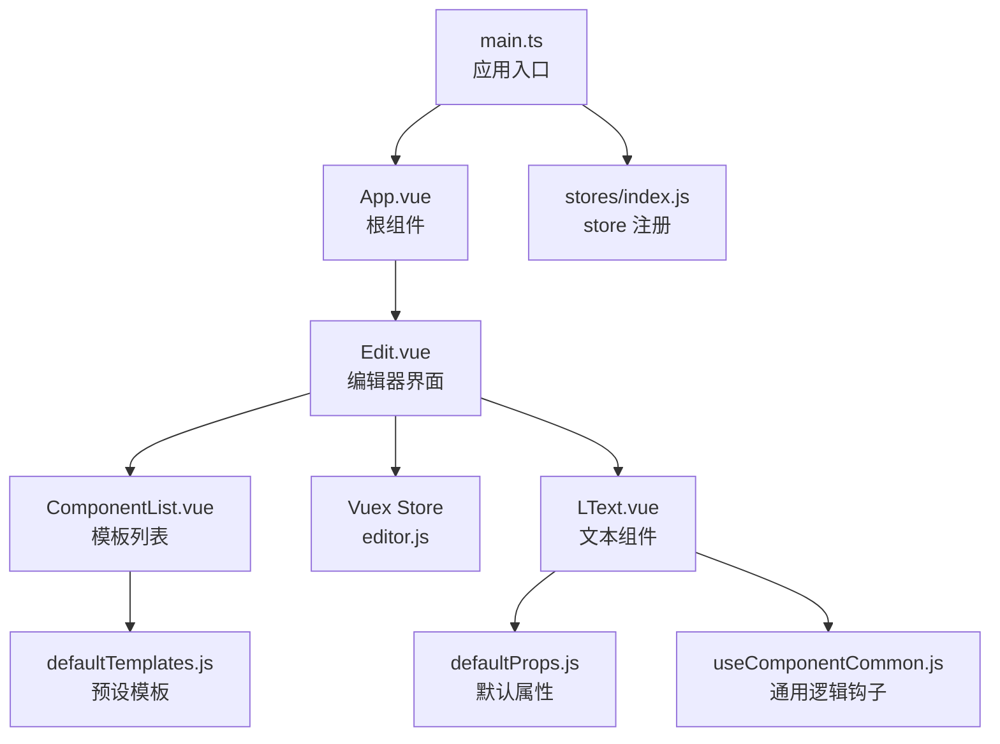
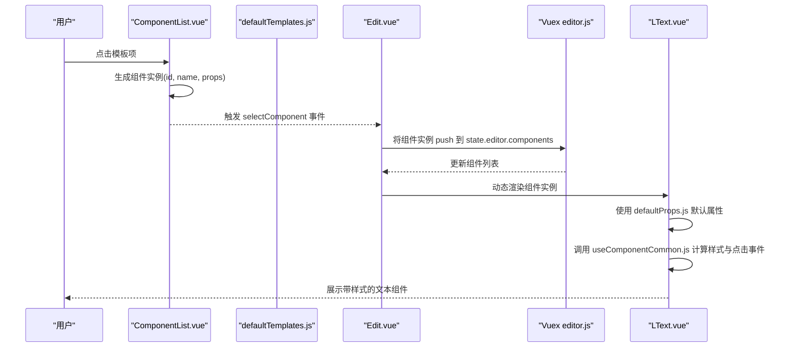
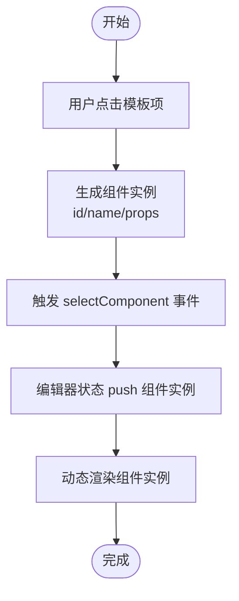
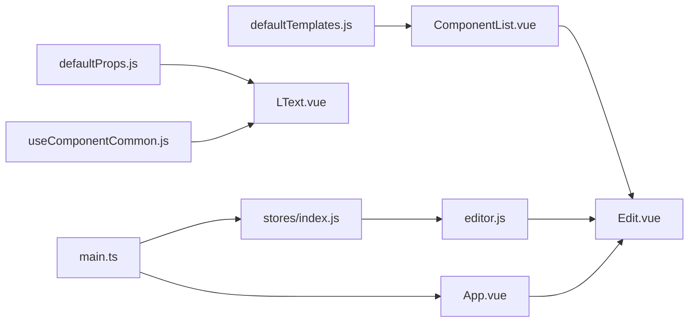

# 模板系统设计

<cite>
**本文档引用的文件**
- [defaultTemplates.js](file://src/defaultTemplates.js)
- [defaultProps.js](file://src/defaultProps.js)
- [useComponentCommon.js](file://src/hooks/useComponentCommon.js)
- [LText.vue](file://src/components/LText.vue)
- [ComponentList.vue](file://src/components/ComponentList.vue)
- [Edit.vue](file://src/components/Edit.vue)
- [editor.js](file://src/stores/editor.js)
- [index.js](file://src/stores/index.js)
- [main.ts](file://src/main.ts)
- [App.vue](file://src/App.vue)
- [package.json](file://package.json)
</cite>

## 目录
1. [简介](#简介)
2. [项目结构](#项目结构)
3. [核心组件](#核心组件)
4. [架构总览](#架构总览)
5. [详细组件分析](#详细组件分析)
6. [依赖分析](#依赖分析)
7. [性能考虑](#性能考虑)
8. [故障排除指南](#故障排除指南)
9. [结论](#结论)
10. [附录](#附录)

## 简介
本文件面向 wy_poster 项目的模板系统，重点解析 defaultTemplates.js 中预设模板的设计架构与实现原理。文档将从模板结构设计、组件配置与布局逻辑、模板应用机制（如何从模板创建新的海报实例）、模板与组件的映射关系、扩展性设计（新增模板、分类管理、自定义功能）等方面进行深入分析，并提供使用示例与开发指南，帮助开发者快速理解并扩展模板系统。

## 项目结构
项目采用 Vue 3 + Vuex 的前端架构，模板系统的核心由以下模块组成：
- defaultTemplates.js：预设文本模板集合，定义了不同类型的文本样式与行为参数
- defaultProps.js：通用与文本组件的默认属性定义及转换工具
- hooks/useComponentCommon.js：组件通用逻辑钩子，负责样式属性抽取与点击事件处理
- components/LText.vue：文本组件，基于默认属性生成可渲染的 DOM 元素
- components/ComponentList.vue：模板列表组件，负责展示模板并触发选择事件
- components/Edit.vue：编辑器主界面，负责渲染组件列表与接收模板选择事件
- stores/editor.js：Vuex 编辑器状态管理，维护海报画布与组件列表
- stores/index.js：Vuex 根 store，注册编辑器模块
- main.ts：应用入口，挂载 Ant Design Vue 与 Vuex
- App.vue：根组件，承载编辑器页面

图表来源
- [App.vue:1-24](file://src/App.vue#L1-L24)
- [Edit.vue:1-91](file://src/components/Edit.vue#L1-L91)
- [ComponentList.vue:1-55](file://src/components/ComponentList.vue#L1-L55)
- [defaultTemplates.js:1-41](file://src/defaultTemplates.js#L1-L41)
- [LText.vue:1-44](file://src/components/LText.vue#L1-L44)
- [defaultProps.js:1-57](file://src/defaultProps.js#L1-L57)
- [useComponentCommon.js:1-18](file://src/hooks/useComponentCommon.js#L1-L18)
- [editor.js:1-52](file://src/stores/editor.js#L1-L52)
- [index.js:1-11](file://src/stores/index.js#L1-L11)
- [main.ts:1-9](file://src/main.ts#L1-L9)

章节来源
- [App.vue:1-24](file://src/App.vue#L1-L24)
- [main.ts:1-9](file://src/main.ts#L1-L9)
- [package.json:1-25](file://package.json#L1-L25)

## 核心组件
本节聚焦模板系统的关键组件及其职责：
- 预设模板 defaultTemplates.js：提供一组文本模板对象，包含文本内容、字体、颜色、边框、定位等样式与行为参数
- 组件默认属性 defaultProps.js：定义通用与文本组件的默认属性集，并提供将默认值转换为 Vue 组件 props 的工具函数
- 通用逻辑钩子 useComponentCommon.js：抽取样式属性生成计算属性，统一处理点击事件（如打开链接）
- 文本组件 LText.vue：接收模板传入的 props，结合默认属性生成最终渲染样式
- 模板列表 ComponentList.vue：展示模板项，将模板转换为组件实例并发出选择事件
- 编辑器 Edit.vue：接收模板选择事件，将新组件加入编辑器状态中的组件列表
- Vuex 编辑器状态 editor.js：维护海报画布与组件列表，供编辑器渲染
- 应用入口 main.ts：初始化应用并注入 Ant Design Vue 与 Vuex

章节来源
- [defaultTemplates.js:1-41](file://src/defaultTemplates.js#L1-L41)
- [defaultProps.js:1-57](file://src/defaultProps.js#L1-L57)
- [useComponentCommon.js:1-18](file://src/hooks/useComponentCommon.js#L1-L18)
- [LText.vue:1-44](file://src/components/LText.vue#L1-L44)
- [ComponentList.vue:1-55](file://src/components/ComponentList.vue#L1-L55)
- [Edit.vue:1-91](file://src/components/Edit.vue#L1-L91)
- [editor.js:1-52](file://src/stores/editor.js#L1-L52)
- [index.js:1-11](file://src/stores/index.js#L1-L11)
- [main.ts:1-9](file://src/main.ts#L1-L9)

## 架构总览
模板系统遵循“模板 -> 组件实例 -> 状态管理 -> 渲染”的链路：
- 模板层：defaultTemplates.js 定义模板对象，包含文本内容与样式参数
- 组件层：ComponentList.vue 将模板转换为组件实例（含唯一 id、组件名、props），并通过事件传递给编辑器
- 状态层：Vuex editor.js 维护组件列表，Edit.vue 基于状态渲染组件
- 渲染层：LText.vue 接收 props，结合 defaultProps.js 的默认属性生成最终样式；useComponentCommon.js 提供点击与样式抽取能力

图表来源
- [ComponentList.vue:19-24](file://src/components/ComponentList.vue#L19-L24)
- [defaultTemplates.js:1-41](file://src/defaultTemplates.js#L1-L41)
- [Edit.vue:44-49](file://src/components/Edit.vue#L44-L49)
- [editor.js:9-44](file://src/stores/editor.js#L9-L44)
- [LText.vue:11-33](file://src/components/LText.vue#L11-L33)
- [defaultProps.js:49-56](file://src/defaultProps.js#L49-L56)
- [useComponentCommon.js:4-15](file://src/hooks/useComponentCommon.js#L4-L15)

## 详细组件分析

### 模板结构设计与实现原理
- 设计思路
  - 模板以“最小可用单元”形式存在，每个模板对象包含文本内容与样式参数，便于直接映射到组件 props
  - 模板不包含业务逻辑，仅承担“数据载体”的角色，确保可复用性与可扩展性
  - 通过 defaultProps.js 的默认属性体系，保证模板与组件之间的兼容性
- 数据结构
  - 模板对象字段涵盖文本、字号、字重、标签、宽度、颜色、背景、边框、圆角、内边距、定位等
  - 模板中还包含标签 tag 字段，用于决定最终渲染的 HTML 标签类型
- 复杂度与性能
  - 模板数组遍历与渲染为 O(n)，n 为模板数量
  - 模板到组件实例的转换为 O(1)，开销极低
- 扩展点
  - 可新增模板类型（如图片、二维码等），只需在模板数组中追加对象
  - 可通过 defaultProps.js 扩展默认属性，以支持更多样式参数

章节来源
- [defaultTemplates.js:1-41](file://src/defaultTemplates.js#L1-L41)
- [defaultProps.js:27-47](file://src/defaultProps.js#L27-L47)

### 组件配置与布局逻辑
- 组件配置
  - LText.vue 通过 transformToComponentProps 将默认属性转换为 Vue 组件 props，确保类型安全与默认值生效
  - useComponentCommon.js 抽取样式属性生成 styleProps，避免在模板中重复编写样式逻辑
- 布局逻辑
  - 模板中的 position、left、top 等参数控制组件在画布中的位置
  - 组件默认 position 为绝对定位，便于在画布中自由排版
  - 组件列表中的样式覆盖了静态定位，确保预览时显示正常

章节来源
- [LText.vue:11-33](file://src/components/LText.vue#L11-L33)
- [defaultProps.js:49-56](file://src/defaultProps.js#L49-L56)
- [useComponentCommon.js:4-15](file://src/hooks/useComponentCommon.js#L4-L15)
- [ComponentList.vue:45-54](file://src/components/ComponentList.vue#L45-L54)

### 模板应用机制与映射关系
- 从模板创建新海报实例
  - ComponentList.vue 在用户点击模板时，生成包含唯一 id、组件名（小写化）、props 的组件实例
  - 该实例通过事件传递给 Edit.vue，后者将其 push 到 Vuex 状态中的组件列表
- 模板与组件的映射
  - 模板对象的 props 直接作为组件实例的 props 传入
  - LText.vue 接收 props 并渲染对应标签与样式
- 状态驱动渲染
  - Edit.vue 基于 computed 计算属性读取 Vuex 状态中的组件列表
  - 通过动态组件渲染机制，将组件实例映射为具体组件并传入 props

图表来源
- [ComponentList.vue:19-24](file://src/components/ComponentList.vue#L19-L24)
- [Edit.vue:44-49](file://src/components/Edit.vue#L44-L49)
- [editor.js:9-44](file://src/stores/editor.js#L9-L44)

章节来源
- [ComponentList.vue:19-24](file://src/components/ComponentList.vue#L19-L24)
- [Edit.vue:44-49](file://src/components/Edit.vue#L44-L49)
- [editor.js:9-44](file://src/stores/editor.js#L9-L44)

### 模板系统的扩展性设计
- 新增预设模板
  - 在 defaultTemplates.js 中追加新的模板对象，字段与现有模板保持一致即可
  - 若需要新增样式参数，可在 defaultProps.js 中扩展默认属性集
- 模板分类管理
  - 当前模板未进行分类，可通过引入分类字段或拆分多个模板数组实现分类
  - 建议在模板对象中增加 category 字段，以便按类型筛选与展示
- 模板自定义功能
  - 用户可直接修改模板对象中的样式参数，实现快速定制
  - 对于复杂组件（如图片、二维码），可在模板中扩展更多字段（如 src、size、corner 等）

章节来源
- [defaultTemplates.js:1-41](file://src/defaultTemplates.js#L1-L41)
- [defaultProps.js:27-47](file://src/defaultProps.js#L27-L47)

### 模板使用示例与开发指南
- 使用示例
  - 在 ComponentList.vue 中展示模板列表，点击后生成组件实例并加入编辑器状态
  - Edit.vue 基于状态渲染组件，LText.vue 根据 props 渲染对应标签与样式
- 开发指南
  - 新增模板：在 defaultTemplates.js 追加对象，字段与 defaultProps.js 默认属性保持一致
  - 自定义样式：直接修改模板对象中的样式参数，或扩展 defaultProps.js 默认属性
  - 扩展组件：若需新增组件类型，参照 LText.vue 的模式，结合 defaultProps.js 与 useComponentCommon.js 实现

章节来源
- [ComponentList.vue:19-24](file://src/components/ComponentList.vue#L19-L24)
- [Edit.vue:44-49](file://src/components/Edit.vue#L44-L49)
- [LText.vue:11-33](file://src/components/LText.vue#L11-L33)
- [defaultProps.js:49-56](file://src/defaultProps.js#L49-L56)
- [useComponentCommon.js:4-15](file://src/hooks/useComponentCommon.js#L4-L15)

## 依赖分析
- 模块耦合
  - ComponentList.vue 依赖 defaultTemplates.js 与 uuid 生成唯一 id
  - LText.vue 依赖 defaultProps.js 与 useComponentCommon.js
  - Edit.vue 依赖 Vuex editor.js 与 ComponentList.vue
  - main.ts 依赖 App.vue、stores/index.js
- 外部依赖
  - Vue 3、Vuex、Ant Design Vue、Lodash、UUID

图表来源
- [defaultTemplates.js:1-41](file://src/defaultTemplates.js#L1-L41)
- [ComponentList.vue:1-55](file://src/components/ComponentList.vue#L1-L55)
- [defaultProps.js:1-57](file://src/defaultProps.js#L1-L57)
- [useComponentCommon.js:1-18](file://src/hooks/useComponentCommon.js#L1-L18)
- [LText.vue:1-44](file://src/components/LText.vue#L1-L44)
- [Edit.vue:1-91](file://src/components/Edit.vue#L1-L91)
- [editor.js:1-52](file://src/stores/editor.js#L1-L52)
- [index.js:1-11](file://src/stores/index.js#L1-L11)
- [main.ts:1-9](file://src/main.ts#L1-L9)
- [App.vue:1-24](file://src/App.vue#L1-L24)

章节来源
- [package.json:9-23](file://package.json#L9-L23)
- [main.ts:1-9](file://src/main.ts#L1-L9)

## 性能考虑
- 模板渲染性能
  - 模板数组规模较小，渲染与遍历成本低
  - 组件实例通过唯一 id 与动态组件渲染，避免不必要的重新渲染
- 状态更新
  - Vuex 状态更新为 O(1) 操作，组件列表 push 不会引发全量重渲染
- 样式计算
  - useComponentCommon.js 使用计算属性抽取样式，减少重复计算

## 故障排除指南
- 模板点击无响应
  - 检查 ComponentList.vue 是否正确生成组件实例并触发事件
  - 确认 Edit.vue 是否正确接收事件并将组件实例 push 到状态
- 样式不生效
  - 检查 defaultProps.js 默认属性是否覆盖模板中的样式字段
  - 确认 useComponentCommon.js 是否正确抽取样式属性
- 组件未渲染
  - 检查 Edit.vue 是否正确从 Vuex 读取组件列表
  - 确认组件名称大小写与注册一致（如 name 与 v-bind 的匹配）

章节来源
- [ComponentList.vue:19-24](file://src/components/ComponentList.vue#L19-L24)
- [Edit.vue:44-49](file://src/components/Edit.vue#L44-L49)
- [LText.vue:11-33](file://src/components/LText.vue#L11-L33)
- [defaultProps.js:49-56](file://src/defaultProps.js#L49-L56)
- [useComponentCommon.js:4-15](file://src/hooks/useComponentCommon.js#L4-L15)

## 结论
wy_poster 的模板系统以简洁的数据结构为核心，通过默认属性与通用逻辑钩子实现高复用与易扩展。defaultTemplates.js 提供了标准化的文本模板，配合 Vuex 状态管理与动态组件渲染，实现了从模板到海报实例的高效映射。未来可在模板分类、组件类型扩展与样式参数增强方面继续演进，以满足更复杂的海报生成需求。

## 附录
- 关键流程回顾
  - 模板 -> 组件实例 -> 状态更新 -> 动态渲染
- 最佳实践
  - 保持模板字段与默认属性一致
  - 使用 uuid 保证组件实例唯一性
  - 通过分类字段或模块拆分提升模板管理效率