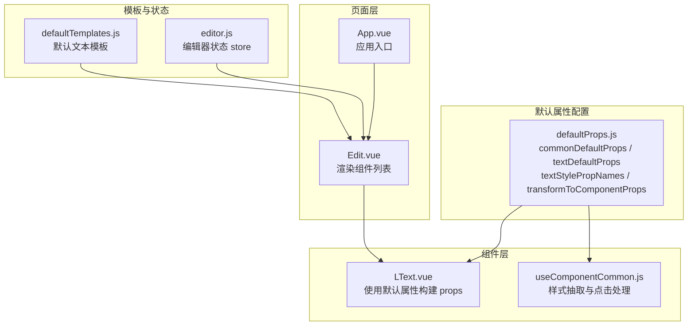
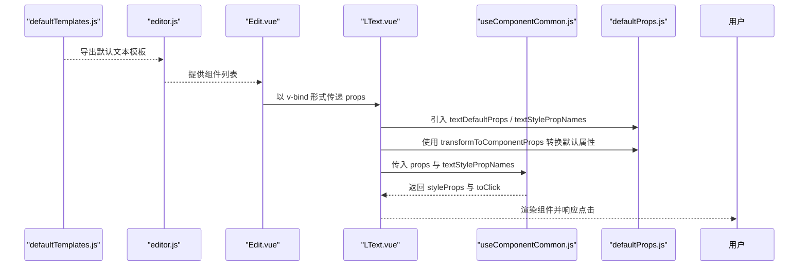
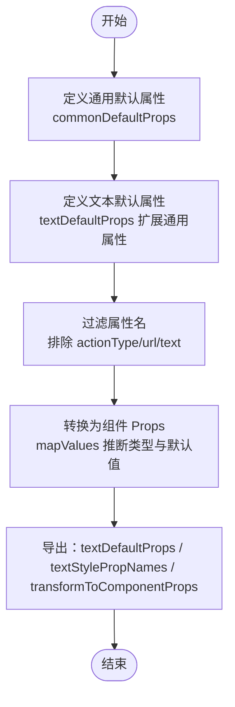
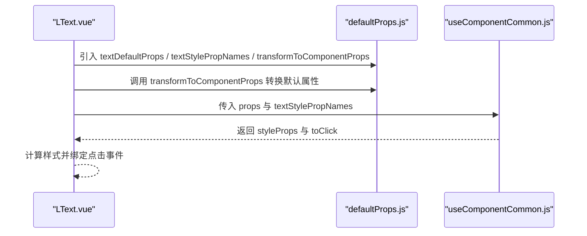
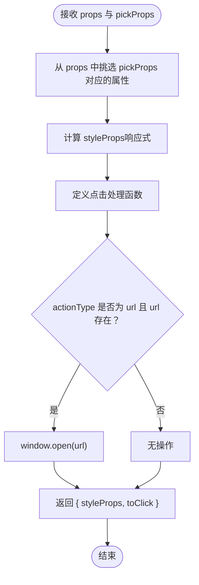
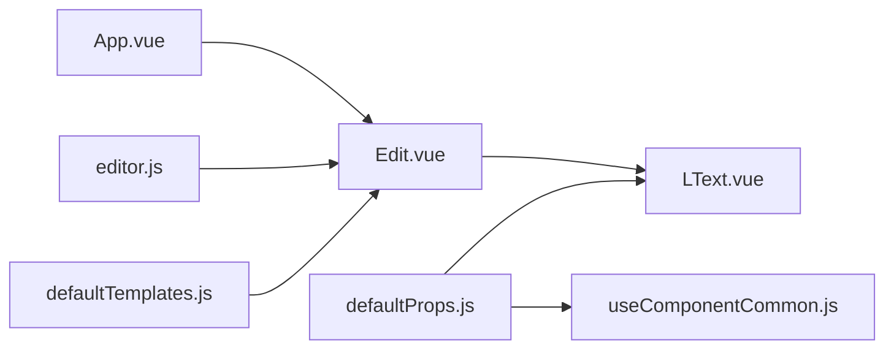

# 默认属性配置

<cite>
**本文档引用的文件**
- [defaultProps.js](file://src/defaultProps.js)
- [LText.vue](file://src/components/LText.vue)
- [useComponentCommon.js](file://src/hooks/useComponentCommon.js)
- [Edit.vue](file://src/components/Edit.vue)
- [defaultTemplates.js](file://src/defaultTemplates.js)
- [editor.js](file://src/stores/editor.js)
- [App.vue](file://src/App.vue)
</cite>

## 目录
1. [简介](#简介)
2. [项目结构](#项目结构)
3. [核心组件](#核心组件)
4. [架构总览](#架构总览)
5. [详细组件分析](#详细组件分析)
6. [依赖关系分析](#依赖关系分析)
7. [性能考虑](#性能考虑)
8. [故障排除指南](#故障排除指南)
9. [结论](#结论)
10. [附录](#附录)

## 简介
本文件聚焦于 wy_poster 项目的默认属性配置系统，深入解析 defaultProps.js 中的 commonDefaultProps 与 textDefaultProps 的设计架构，阐述属性分类体系（动作、尺寸、边框、阴影透明度、位置等）的设计理念；详解 transformToComponentProps 如何将原始属性转换为 Vue 组件的 Prop 定义；解释 textStylePropNames 的作用与过滤逻辑；并提供属性使用示例、扩展新属性配置的方法，以及属性继承机制（文本组件继承通用属性）的实现细节与最佳实践。

## 项目结构
默认属性配置系统主要由以下模块组成：
- defaultProps.js：定义通用与文本默认属性、属性名过滤集合、属性转换函数
- LText.vue：文本组件，消费默认属性并应用样式与交互
- useComponentCommon.js：通用组件行为钩子，负责样式抽取与点击事件处理
- defaultTemplates.js：默认文本模板集合，用于快速生成组件实例
- editor.js：编辑器状态管理，存储组件列表与海报数据
- Edit.vue：编辑器页面，渲染组件列表并绑定 props
- App.vue：根组件入口

图表来源
- [defaultProps.js:1-57](file://src/defaultProps.js#L1-L57)
- [LText.vue:1-44](file://src/components/LText.vue#L1-L44)
- [useComponentCommon.js:1-18](file://src/hooks/useComponentCommon.js#L1-L18)
- [defaultTemplates.js:1-41](file://src/defaultTemplates.js#L1-L41)
- [editor.js:1-52](file://src/stores/editor.js#L1-L52)
- [Edit.vue:1-91](file://src/components/Edit.vue#L1-L91)
- [App.vue:1-24](file://src/App.vue#L1-L24)

章节来源
- [defaultProps.js:1-57](file://src/defaultProps.js#L1-L57)
- [LText.vue:1-44](file://src/components/LText.vue#L1-L44)
- [useComponentCommon.js:1-18](file://src/hooks/useComponentCommon.js#L1-L18)
- [defaultTemplates.js:1-41](file://src/defaultTemplates.js#L1-L41)
- [editor.js:1-52](file://src/stores/editor.js#L1-L52)
- [Edit.vue:1-91](file://src/components/Edit.vue#L1-L91)
- [App.vue:1-24](file://src/App.vue#L1-L24)

## 核心组件
- commonDefaultProps：定义通用组件的默认属性，涵盖动作、尺寸、边框、阴影透明度、定位等类别，作为其他组件类型的基类属性集
- textDefaultProps：在通用属性基础上扩展文本组件特有的字体与排版属性，形成完整的文本组件默认属性集
- textStylePropNames：通过过滤排除“动作”和“文本内容”相关的属性，仅保留可用于样式计算的属性名集合
- transformToComponentProps：将原始默认属性对象转换为 Vue 组件的 Prop 定义，自动推断类型并设置默认值

章节来源
- [defaultProps.js:2-26](file://src/defaultProps.js#L2-L26)
- [defaultProps.js:27-40](file://src/defaultProps.js#L27-L40)
- [defaultProps.js:42-47](file://src/defaultProps.js#L42-L47)
- [defaultProps.js:49-56](file://src/defaultProps.js#L49-L56)

## 架构总览
默认属性配置系统采用“集中定义 + 动态转换 + 分离关注”的架构模式：
- 集中定义：commonDefaultProps 与 textDefaultProps 在 defaultProps.js 中统一维护，确保属性命名与取值的一致性
- 动态转换：transformToComponentProps 将默认属性映射为 Vue Props，避免重复手写类型与默认值
- 分离关注：useComponentCommon 聚焦于通用行为（样式抽取与点击跳转），LText.vue 负责具体渲染与交互
- 模板驱动：defaultTemplates.js 提供常用文本模板，编辑器通过 store 管理组件实例，实现所见即所得的属性配置

图表来源
- [defaultTemplates.js:1-41](file://src/defaultTemplates.js#L1-L41)
- [editor.js:1-52](file://src/stores/editor.js#L1-L52)
- [Edit.vue:12-14](file://src/components/Edit.vue#L12-L14)
- [LText.vue:11-27](file://src/components/LText.vue#L11-L27)
- [useComponentCommon.js:4-15](file://src/hooks/useComponentCommon.js#L4-L15)
- [defaultProps.js:27-40](file://src/defaultProps.js#L27-L40)

## 详细组件分析

### defaultProps.js：默认属性与转换机制
- 属性分类体系
  - 动作：actionType、url，用于控制点击行为（如打开链接）
  - 尺寸：height、width、paddingLeft、paddingRight、paddingTop、paddingBottom
  - 边框：borderStyle、borderColor、borderWidth、borderRadius
  - 阴影与透明度：boxShadow、opacity
  - 位置：position、left、top、right
- 文本组件扩展
  - textDefaultProps 在通用属性基础上新增文本样式相关属性，如 text、fontSize、fontFamily、fontWeight、fontStyle、textDecoration、lineHeight、textAlign、color、backgroundColor
  - 通过展开运算符继承 commonDefaultProps，实现属性继承机制
- 属性名过滤
  - textStylePropNames 基于 textDefaultProps 的键集合，排除 actionType、url、text，仅保留可用于样式计算的属性名
- 属性转换
  - transformToComponentProps 将每个默认值映射为 Vue Prop 定义，类型由默认值的构造函数推断，未提供默认值时回退为 String

图表来源
- [defaultProps.js:2-26](file://src/defaultProps.js#L2-L26)
- [defaultProps.js:27-40](file://src/defaultProps.js#L27-L40)
- [defaultProps.js:42-47](file://src/defaultProps.js#L42-L47)
- [defaultProps.js:49-56](file://src/defaultProps.js#L49-L56)

章节来源
- [defaultProps.js:2-26](file://src/defaultProps.js#L2-L26)
- [defaultProps.js:27-40](file://src/defaultProps.js#L27-L40)
- [defaultProps.js:42-47](file://src/defaultProps.js#L42-L47)
- [defaultProps.js:49-56](file://src/defaultProps.js#L49-L56)

### LText.vue：组件消费默认属性
- 默认属性注入
  - 通过 transformToComponentProps 将 textDefaultProps 转换为组件 Props，并与自定义 tag 属性合并
- 样式与交互
  - 使用 useComponentCommon 钩子，基于 textStylePropNames 抽取样式属性到 styleProps
  - toClick 处理点击事件，当 actionType 为 url 且存在 url 时执行窗口打开
- 渲染
  - 使用动态组件根据 tag 渲染，绑定 styleProps 并输出 text 内容

图表来源
- [LText.vue:11-27](file://src/components/LText.vue#L11-L27)
- [useComponentCommon.js:4-15](file://src/hooks/useComponentCommon.js#L4-L15)
- [defaultProps.js:27-40](file://src/defaultProps.js#L27-L40)

章节来源
- [LText.vue:1-44](file://src/components/LText.vue#L1-L44)
- [useComponentCommon.js:1-18](file://src/hooks/useComponentCommon.js#L1-L18)
- [defaultProps.js:42-47](file://src/defaultProps.js#L42-L47)

### useComponentCommon.js：通用行为钩子
- 样式抽取：使用 pick 从 props 中挑选指定属性名集合，生成可响应的 styleProps
- 点击处理：当 actionType 为 url 且 url 存在时，调用 window.open 打开链接
- 返回值：返回 styleProps 与 toClick，供组件在 setup 中使用

图表来源
- [useComponentCommon.js:4-15](file://src/hooks/useComponentCommon.js#L4-L15)

章节来源
- [useComponentCommon.js:1-18](file://src/hooks/useComponentCommon.js#L1-L18)

### defaultTemplates.js：默认模板与使用示例
- 默认文本模板包含多种场景：大标题、正文、链接、按钮等
- 每个模板提供必要的文本内容、样式与布局属性，便于快速生成组件实例
- 在编辑器中，模板通过 ComponentList 选择后，会生成带 id 的组件对象并加入 store 的组件列表

章节来源
- [defaultTemplates.js:1-41](file://src/defaultTemplates.js#L1-L41)
- [Edit.vue:19-24](file://src/components/Edit.vue#L19-L24)

### editor.js：编辑器状态与组件实例
- poster：海报画布的基本信息（宽高、背景、元素数组）
- components：组件列表，每个元素包含 id、name、props
- 示例：包含多个 LText 实例，分别设置 text、fontSize、color、top、actionType、url 等属性

章节来源
- [editor.js:1-52](file://src/stores/editor.js#L1-L52)

## 依赖关系分析
- defaultProps.js 为 LText.vue 与 useComponentCommon.js 提供默认属性与转换工具
- LText.vue 依赖 useComponentCommon.js 进行样式与交互处理
- Edit.vue 通过 store 获取组件列表并在页面中渲染
- defaultTemplates.js 为模板选择与组件实例化提供数据源

图表来源
- [defaultProps.js:1-57](file://src/defaultProps.js#L1-L57)
- [LText.vue:1-44](file://src/components/LText.vue#L1-L44)
- [useComponentCommon.js:1-18](file://src/hooks/useComponentCommon.js#L1-L18)
- [defaultTemplates.js:1-41](file://src/defaultTemplates.js#L1-L41)
- [editor.js:1-52](file://src/stores/editor.js#L1-L52)
- [Edit.vue:1-91](file://src/components/Edit.vue#L1-L91)
- [App.vue:1-24](file://src/App.vue#L1-L24)

## 性能考虑
- 属性转换：transformToComponentProps 使用 mapValues 对默认属性进行一次映射，复杂度 O(n)，n 为默认属性数量，通常较小，影响可忽略
- 样式抽取：useComponentCommon 使用 pick 与 computed，仅在被选中的属性变化时重新计算 styleProps，避免不必要的重渲染
- 模板渲染：Edit.vue 使用 v-for 渲染组件列表，建议为每个元素提供稳定 id，提升 Vue diff 效率

## 故障排除指南
- 属性类型不匹配
  - 现象：组件运行时报类型错误或样式异常
  - 排查：检查 defaultProps.js 中对应属性的默认值类型是否与预期一致，transformToComponentProps 会依据默认值推断类型
- 样式未生效
  - 现象：修改了文本样式但未体现
  - 排查：确认是否在 textStylePropNames 中包含该属性；若为动作或文本内容相关属性，会被过滤掉
- 点击无反应
  - 现象：设置了 actionType 为 url 但点击无效
  - 排查：确认 url 是否为空字符串；检查 useComponentCommon 的点击处理逻辑
- 组件渲染异常
  - 现象：组件未按预期显示或布局错乱
  - 排查：检查 LText.vue 中的 tag 与 styleProps 绑定；核对 editor.js 中组件 props 的取值

章节来源
- [defaultProps.js:49-56](file://src/defaultProps.js#L49-L56)
- [useComponentCommon.js:6-10](file://src/hooks/useComponentCommon.js#L6-L10)
- [LText.vue:24-32](file://src/components/LText.vue#L24-L32)

## 结论
默认属性配置系统通过集中定义、动态转换与职责分离，实现了属性的一致性与可维护性。commonDefaultProps 与 textDefaultProps 的继承机制确保了通用属性在不同组件类型间的复用；textStylePropNames 的过滤逻辑保证了样式计算的准确性；transformToComponentProps 则简化了 Vue 组件的 Props 定义。结合 defaultTemplates.js 与 editor.js，系统支持模板驱动与可视化编辑，满足海报编辑场景下的多样化需求。

## 附录

### 属性使用示例
- 在编辑器中添加文本组件
  - 通过 defaultTemplates.js 选择模板，生成带 id 的组件对象并加入 store 的组件列表
  - Edit.vue 渲染组件列表，将每个组件的 props 以 v-bind 形式传递给 LText.vue
- 在 LText.vue 中应用默认属性
  - 使用 transformToComponentProps 将 textDefaultProps 转换为组件 Props
  - 使用 useComponentCommon 基于 textStylePropNames 抽取样式并绑定点击事件
- 扩展新的属性配置
  - 在 defaultProps.js 中新增属性到 commonDefaultProps 或 textDefaultProps
  - 若为样式相关属性，确保包含在 textStylePropNames 中；若为动作或文本内容相关属性，则排除在外
  - 更新 LText.vue 或其他组件以消费新属性

章节来源
- [defaultTemplates.js:1-41](file://src/defaultTemplates.js#L1-L41)
- [Edit.vue:12-14](file://src/components/Edit.vue#L12-L14)
- [LText.vue:11-27](file://src/components/LText.vue#L11-L27)
- [defaultProps.js:27-40](file://src/defaultProps.js#L27-L40)