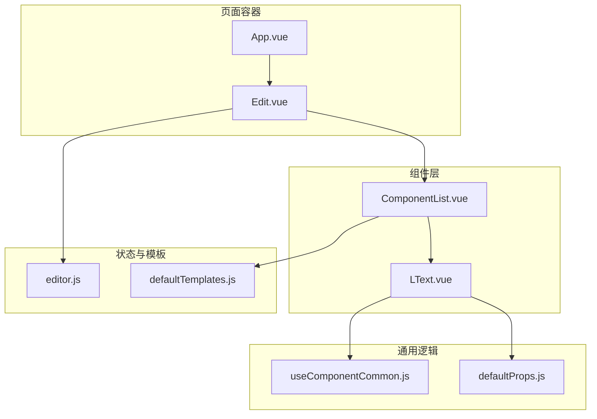
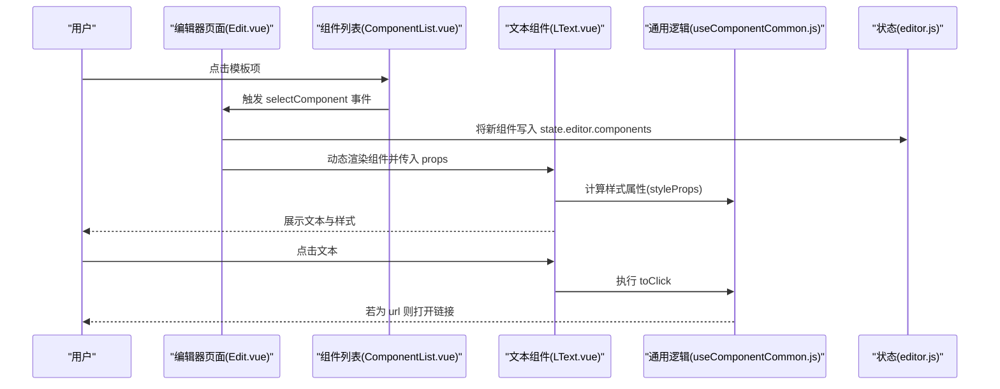
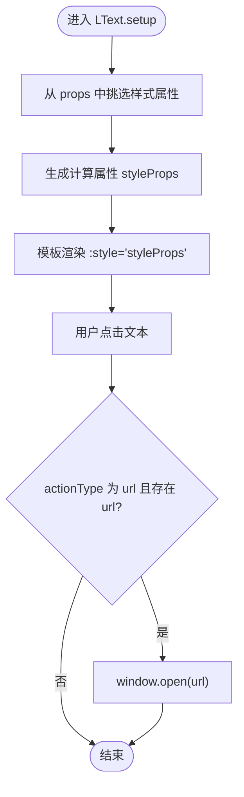
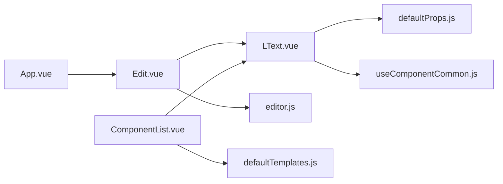

# 文本组件

<cite>
**本文引用的文件**
- [LText.vue](file://src/components/LText.vue)
- [useComponentCommon.js](file://src/hooks/useComponentCommon.js)
- [defaultProps.js](file://src/defaultProps.js)
- [editor.js](file://src/stores/editor.js)
- [Edit.vue](file://src/components/Edit.vue)
- [ComponentList.vue](file://src/components/ComponentList.vue)
- [defaultTemplates.js](file://src/defaultTemplates.js)
- [App.vue](file://src/App.vue)
</cite>

## 目录
1. [简介](#简介)
2. [项目结构](#项目结构)
3. [核心组件](#核心组件)
4. [架构总览](#架构总览)
5. [详细组件分析](#详细组件分析)
6. [依赖关系分析](#依赖关系分析)
7. [性能考虑](#性能考虑)
8. [故障排查指南](#故障排查指南)
9. [结论](#结论)
10. [附录](#附录)

## 简介
本文件为 LText.vue 文本组件的技术文档，围绕组件的 props 接口设计、响应式数据绑定机制、交互事件处理、样式系统、生命周期与组合式 API 使用进行深入解析，并提供可扩展的实践建议与使用示例路径，帮助开发者理解并定制文本组件行为。

## 项目结构
LText 组件位于组件目录中，通过通用 hook 提供样式与交互能力，其 props 来源于统一的默认配置模块；编辑器页面负责渲染组件列表并绑定 store 中的数据。

图表来源
- [LText.vue:1-44](file://src/components/LText.vue#L1-L44)
- [useComponentCommon.js:1-18](file://src/hooks/useComponentCommon.js#L1-L18)
- [defaultProps.js:1-57](file://src/defaultProps.js#L1-L57)
- [editor.js:1-52](file://src/stores/editor.js#L1-L52)
- [Edit.vue:1-91](file://src/components/Edit.vue#L1-L91)
- [ComponentList.vue:1-54](file://src/components/ComponentList.vue#L1-L54)
- [defaultTemplates.js:1-41](file://src/defaultTemplates.js#L1-L41)
- [App.vue:1-24](file://src/App.vue#L1-L24)

章节来源
- [LText.vue:1-44](file://src/components/LText.vue#L1-L44)
- [Edit.vue:1-91](file://src/components/Edit.vue#L1-L91)
- [App.vue:1-24](file://src/App.vue#L1-L24)

## 核心组件
- LText：文本渲染组件，支持自定义标签、文本内容与丰富的样式属性，内置点击跳转能力。
- useComponentCommon：通用样式与交互逻辑封装，抽取样式属性并提供点击处理。
- defaultProps：集中定义文本组件默认 props 与样式属性名集合，并提供类型转换工具。
- editor/store：编辑器状态管理，包含组件列表与默认模板数据。
- Edit/ComponentList：编辑器页面与组件列表，负责渲染与选择组件。

章节来源
- [LText.vue:1-44](file://src/components/LText.vue#L1-L44)
- [useComponentCommon.js:1-18](file://src/hooks/useComponentCommon.js#L1-L18)
- [defaultProps.js:1-57](file://src/defaultProps.js#L1-L57)
- [editor.js:1-52](file://src/stores/editor.js#L1-L52)
- [Edit.vue:1-91](file://src/components/Edit.vue#L1-L91)
- [ComponentList.vue:1-54](file://src/components/ComponentList.vue#L1-L54)

## 架构总览
LText 采用“配置驱动 + 通用 hook”的架构：
- 配置驱动：通过 defaultProps 将默认值映射为组件 props 的类型与默认值，确保类型安全与一致性。
- 通用 hook：useComponentCommon 抽取样式属性并生成计算属性，同时提供点击处理逻辑，降低重复代码。
- 渲染层：Edit/ComponentList 负责从 store 或模板中读取组件数据，使用动态组件渲染 LText。

图表来源
- [Edit.vue:12-14](file://src/components/Edit.vue#L12-L14)
- [ComponentList.vue:19-24](file://src/components/ComponentList.vue#L19-L24)
- [LText.vue:22-34](file://src/components/LText.vue#L22-L34)
- [useComponentCommon.js:4-15](file://src/hooks/useComponentCommon.js#L4-L15)
- [editor.js:9-44](file://src/stores/editor.js#L9-L44)

## 详细组件分析

### Props 接口设计
- 基础文本属性
  - text：文本内容，默认值来自文本默认配置。
  - fontSize、fontFamily、fontWeight、fontStyle、textDecoration、lineHeight、textAlign、color、backgroundColor：字体与排版相关样式属性。
- 定位与尺寸
  - position、left、top、right、width、height、paddingLeft、paddingRight、paddingTop、paddingBottom：布局与内边距。
- 边框与阴影
  - borderStyle、borderColor、borderWidth、borderRadius、boxShadow、opacity：边框与阴影效果。
- 行为控制
  - actionType、url：用于点击时触发外部链接跳转。
- 元素标签
  - tag：渲染为任意 HTML 标签，默认 div。

上述 props 的类型与默认值由 defaultProps 中的映射函数统一生成，保证组件接口的一致性与类型安全。

章节来源
- [defaultProps.js:27-47](file://src/defaultProps.js#L27-L47)
- [LText.vue:15-21](file://src/components/LText.vue#L15-L21)

### 响应式数据绑定机制
- 计算属性 styleProps
  - 通过 pick 从 props 中筛选出样式相关属性（排除 text、actionType、url），并以计算属性形式暴露给模板，实现响应式样式更新。
- 点击事件 toClick
  - 在点击时根据 actionType 与 url 判断是否打开外部链接，避免不必要的 DOM 事件处理开销。
- v-bind 动态绑定
  - Edit 页面通过 v-bind="item.props" 将 store 中的组件数据直接绑定到 LText，实现数据驱动渲染。

图表来源
- [useComponentCommon.js:4-15](file://src/hooks/useComponentCommon.js#L4-L15)
- [LText.vue:22-34](file://src/components/LText.vue#L22-L34)

章节来源
- [useComponentCommon.js:4-15](file://src/hooks/useComponentCommon.js#L4-L15)
- [LText.vue:22-34](file://src/components/LText.vue#L22-L34)
- [Edit.vue:12-14](file://src/components/Edit.vue#L12-L14)

### 交互事件处理
- 点击事件
  - 当 actionType 为 "url" 且 url 存在时，点击文本会打开外部链接；否则无任何副作用。
- 模板选择与动态渲染
  - ComponentList 将模板项包装为组件对象并发出事件；Edit 页面接收后写入 store，随后通过动态组件渲染 LText 并传入 props。

章节来源
- [useComponentCommon.js:6-10](file://src/hooks/useComponentCommon.js#L6-L10)
- [ComponentList.vue:19-24](file://src/components/ComponentList.vue#L19-L24)
- [Edit.vue:42-49](file://src/components/Edit.vue#L42-L49)

### 样式系统
- 默认样式继承
  - 通过 defaultProps 提供的默认值，LText 在未显式传入时自动具备合理的字体、尺寸与定位等基础样式。
- 动态样式应用
  - styleProps 仅包含样式相关属性，避免将非样式属性混入内联样式，减少不必要的重排与重绘。
- CSS 类名绑定
  - 模板中固定绑定 l-text 类名，便于全局或局部样式覆盖与主题化。

章节来源
- [defaultProps.js:27-47](file://src/defaultProps.js#L27-L47)
- [LText.vue:38](file://src/components/LText.vue#L38)

### 生命周期与组合式 API 使用
- 组合式 API
  - 在 setup 中调用 useComponentCommon 获取 styleProps 与 toClick，并返回给模板使用。
- 生命周期
  - 当前实现未显式声明生命周期钩子，主要依赖组合式 API 的响应式特性完成渲染与交互。

章节来源
- [LText.vue:22-34](file://src/components/LText.vue#L22-L34)

### 实际使用示例与扩展方法
- 示例一：基础文本渲染
  - 在 Edit 页面中，通过 store.state.editor.components 传入 props，即可渲染 LText。
  - 示例路径参考：[编辑器组件列表渲染:12-14](file://src/components/Edit.vue#L12-L14)，[组件数据结构:9-44](file://src/stores/editor.js#L9-L44)。
- 示例二：带链接的文本
  - 设置 actionType 为 "url" 并提供 url，点击文本即可打开链接。
  - 示例路径参考：[组件数据中的链接配置:37-39](file://src/stores/editor.js#L37-L39)。
- 示例三：自定义标签与样式
  - 通过 tag 与样式属性（如 fontSize、color、textAlign、width 等）自定义展示形态。
  - 示例路径参考：[默认模板中的标签与样式:1-41](file://src/defaultTemplates.js#L1-L41)。

扩展建议
- 自定义 v-model：若需要双向绑定文本内容，可在组件内部引入 modelValue 并在 update:modelValue 事件中同步；当前版本未实现该能力。
- 增强交互：可扩展 toClick 支持更多 actionType（如跳转至内部路由、打开弹窗等）。
- 主题化：结合 l-text 类名与 scoped 样式，按需覆盖组件默认样式。

章节来源
- [Edit.vue:12-14](file://src/components/Edit.vue#L12-L14)
- [editor.js:9-44](file://src/stores/editor.js#L9-L44)
- [defaultTemplates.js:1-41](file://src/defaultTemplates.js#L1-L41)

## 依赖关系分析
- LText 依赖 defaultProps 提供的默认值与样式属性名集合，并通过 transformToComponentProps 将默认值转换为 props 的类型与默认值描述。
- LText 依赖 useComponentCommon 提供的样式计算与点击处理逻辑。
- Edit 与 ComponentList 通过 store 与模板数据驱动 LText 的渲染。
- App 作为根组件挂载 Edit。

图表来源
- [LText.vue:3-9](file://src/components/LText.vue#L3-L9)
- [useComponentCommon.js:1-2](file://src/hooks/useComponentCommon.js#L1-L2)
- [Edit.vue:24-28](file://src/components/Edit.vue#L24-L28)
- [ComponentList.vue:1-4](file://src/components/ComponentList.vue#L1-L4)
- [App.vue:3](file://src/App.vue#L3)

章节来源
- [LText.vue:3-9](file://src/components/LText.vue#L3-L9)
- [useComponentCommon.js:1-2](file://src/hooks/useComponentCommon.js#L1-L2)
- [Edit.vue:24-28](file://src/components/Edit.vue#L24-L28)
- [ComponentList.vue:1-4](file://src/components/ComponentList.vue#L1-L4)
- [App.vue:3](file://src/App.vue#L3)

## 性能考虑
- 计算属性缓存：styleProps 为计算属性，基于 props 的样式属性进行 pick，避免每次渲染都重新构造样式对象，提升性能。
- 事件处理最小化：toClick 仅在满足条件时执行 window.open，减少不必要逻辑。
- 动态组件渲染：Edit 通过 v-for 与 v-bind 渲染组件，保持组件粒度清晰，便于 diff 优化。

## 故障排查指南
- 文本未显示或样式异常
  - 检查 props 是否正确传入，特别是 text、fontSize、color 等关键样式属性。
  - 确认样式属性是否被 pick 进 styleProps（排除非样式属性）。
- 点击无效
  - 确认 actionType 是否设置为 "url" 且 url 已填写。
- 标签渲染错误
  - 检查 tag 是否为有效 HTML 标签名，或是否存在拼写错误。

章节来源
- [useComponentCommon.js:6-10](file://src/hooks/useComponentCommon.js#L6-L10)
- [LText.vue:38](file://src/components/LText.vue#L38)

## 结论
LText 组件通过配置驱动与通用 hook 的方式，实现了简洁而强大的文本渲染能力。其 props 接口覆盖了字体、布局、定位与交互等关键维度，配合计算属性与动态渲染，既保证了性能也提升了可维护性。未来可进一步增强交互能力与双向绑定支持，以满足更复杂的编辑场景。

## 附录
- 关键实现路径
  - [LText 组件定义与导出:13-34](file://src/components/LText.vue#L13-L34)
  - [通用样式与交互逻辑:4-15](file://src/hooks/useComponentCommon.js#L4-L15)
  - [默认 props 与样式属性名:27-47](file://src/defaultProps.js#L27-L47)
  - [编辑器组件渲染与数据绑定:12-14](file://src/components/Edit.vue#L12-L14)
  - [模板数据示例:1-41](file://src/defaultTemplates.js#L1-L41)
  - [编辑器状态数据:9-44](file://src/stores/editor.js#L9-L44)