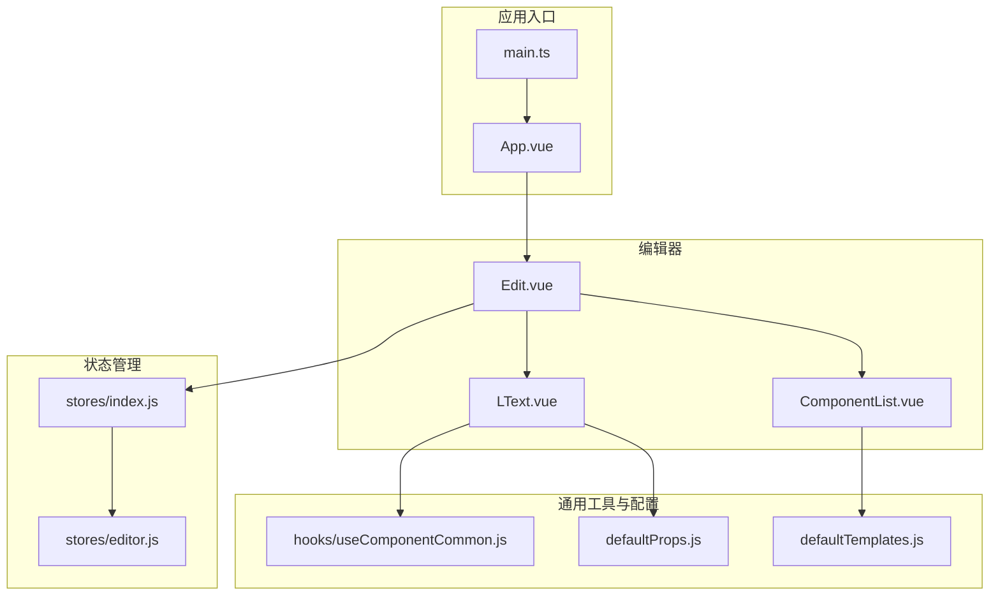
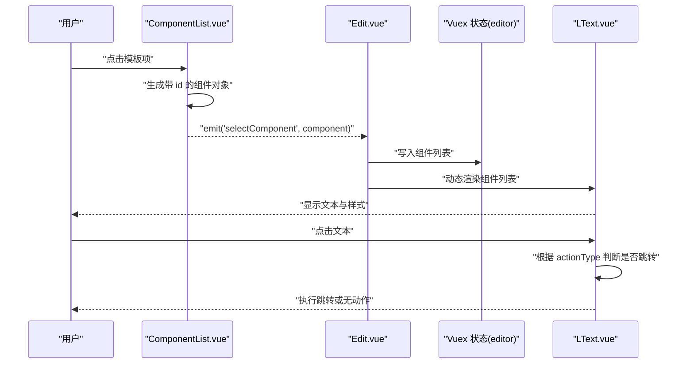
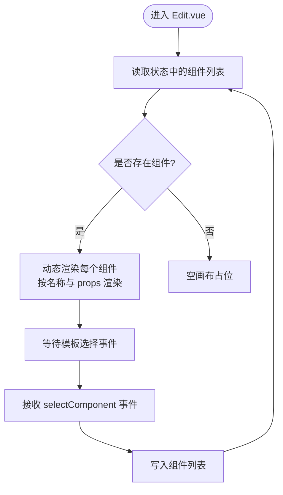
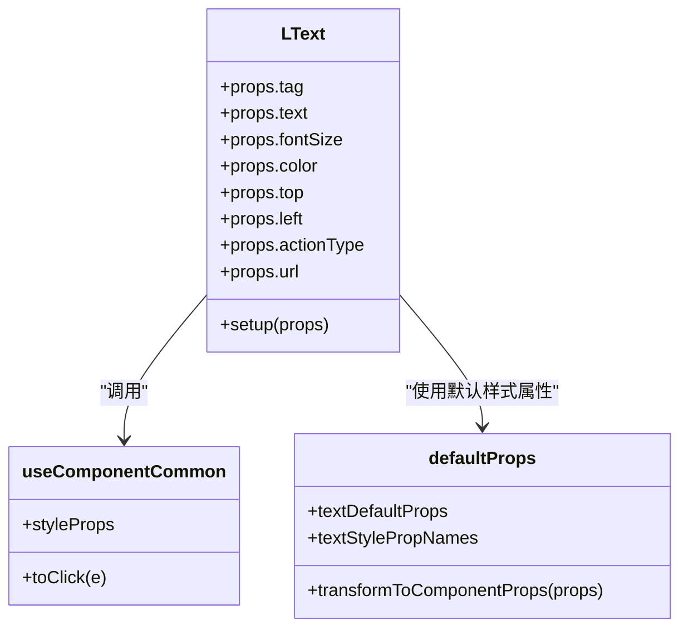
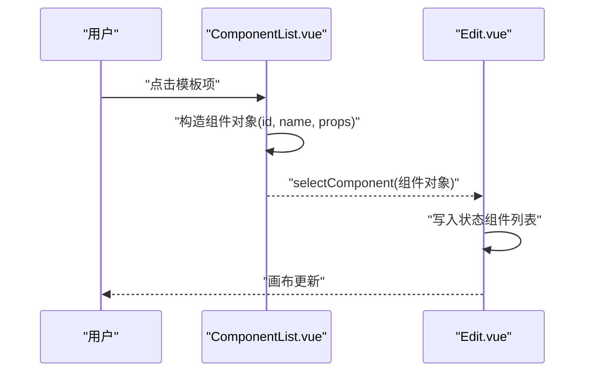
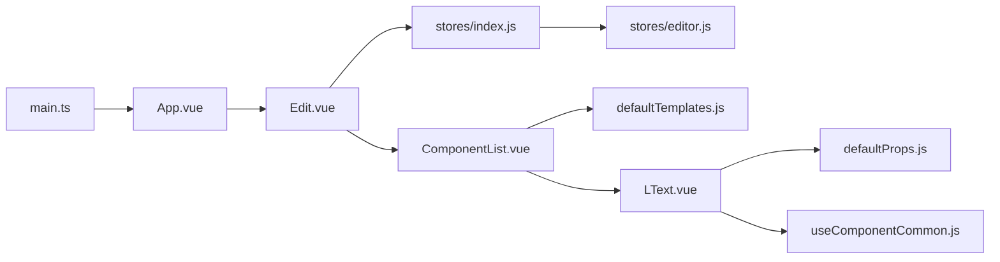

# 核心组件

<cite>
**本文引用的文件**
- [Edit.vue](file://src/components/Edit.vue)
- [LText.vue](file://src/components/LText.vue)
- [ComponentList.vue](file://src/components/ComponentList.vue)
- [useComponentCommon.js](file://src/hooks/useComponentCommon.js)
- [defaultProps.js](file://src/defaultProps.js)
- [defaultTemplates.js](file://src/defaultTemplates.js)
- [editor.js](file://src/stores/editor.js)
- [index.js](file://src/stores/index.js)
- [main.ts](file://src/main.ts)
- [App.vue](file://src/App.vue)
- [package.json](file://package.json)
</cite>

## 目录
1. [简介](#简介)
2. [项目结构](#项目结构)
3. [核心组件](#核心组件)
4. [架构总览](#架构总览)
5. [详细组件分析](#详细组件分析)
6. [依赖关系分析](#依赖关系分析)
7. [性能考量](#性能考量)
8. [故障排查指南](#故障排查指南)
9. [结论](#结论)
10. [附录](#附录)

## 简介
本文件聚焦 wy_poster 项目的“核心组件”系统，围绕编辑器主组件 Edit.vue、文本组件 LText.vue、组件列表组件 ComponentList.vue 的架构与实现进行深入解析。重点涵盖：
- 布局结构与渲染机制
- 状态管理与数据流
- 组件间通信与事件传递
- 样式属性绑定与交互行为
- 模板选择逻辑与组件添加流程
- 最佳实践与常见问题排查

## 项目结构
项目采用基于功能分层的组织方式：视图层（App.vue）承载根组件，编辑器主组件负责布局与状态驱动；组件层包含 Edit、LText、ComponentList；工具层包含通用 Hook 与默认配置；状态层通过 Vuex 模块化管理编辑器状态。

图表来源
- [main.ts:1-9](file://src/main.ts#L1-L9)
- [App.vue:1-24](file://src/App.vue#L1-L24)
- [Edit.vue:1-91](file://src/components/Edit.vue#L1-L91)
- [ComponentList.vue:1-55](file://src/components/ComponentList.vue#L1-L55)
- [LText.vue:1-44](file://src/components/LText.vue#L1-L44)
- [index.js:1-11](file://src/stores/index.js#L1-L11)
- [editor.js:1-52](file://src/stores/editor.js#L1-L52)
- [useComponentCommon.js:1-18](file://src/hooks/useComponentCommon.js#L1-L18)
- [defaultProps.js:1-57](file://src/defaultProps.js#L1-L57)
- [defaultTemplates.js:1-41](file://src/defaultTemplates.js#L1-L41)

章节来源
- [main.ts:1-9](file://src/main.ts#L1-L9)
- [App.vue:1-24](file://src/App.vue#L1-L24)
- [Edit.vue:1-91](file://src/components/Edit.vue#L1-L91)
- [ComponentList.vue:1-55](file://src/components/ComponentList.vue#L1-L55)
- [LText.vue:1-44](file://src/components/LText.vue#L1-L44)
- [index.js:1-11](file://src/stores/index.js#L1-L11)
- [editor.js:1-52](file://src/stores/editor.js#L1-L52)
- [useComponentCommon.js:1-18](file://src/hooks/useComponentCommon.js#L1-L18)
- [defaultProps.js:1-57](file://src/defaultProps.js#L1-L57)
- [defaultTemplates.js:1-41](file://src/defaultTemplates.js#L1-L41)

## 核心组件
本节从整体视角梳理三个核心组件的职责与协作关系：
- Edit.vue：编辑器主容器，负责布局、渲染动态组件列表、接收模板选择事件并写入状态。
- ComponentList.vue：模板选择面板，提供默认模板集合，封装组件实例化与事件发射。
- LText.vue：文本组件，基于通用 Hook 提供样式属性绑定与点击交互（如跳转链接）。

章节来源
- [Edit.vue:1-91](file://src/components/Edit.vue#L1-L91)
- [ComponentList.vue:1-55](file://src/components/ComponentList.vue#L1-L55)
- [LText.vue:1-44](file://src/components/LText.vue#L1-L44)

## 架构总览
编辑器采用“模板选择 -> 组件实例化 -> 动态渲染 -> 状态持久”的闭环：
- 模板来源：defaultTemplates.js 提供默认文本模板。
- 实例化：ComponentList.vue 将模板转换为带唯一 id 的组件对象并发出事件。
- 渲染：Edit.vue 读取状态中的组件数组，使用动态组件机制逐个渲染。
- 交互：LText.vue 通过通用 Hook 将样式属性映射到内联样式，并根据 actionType 执行点击行为。

图表来源
- [ComponentList.vue:17-28](file://src/components/ComponentList.vue#L17-L28)
- [Edit.vue:44-49](file://src/components/Edit.vue#L44-L49)
- [LText.vue:22-34](file://src/components/LText.vue#L22-L34)
- [useComponentCommon.js:4-15](file://src/hooks/useComponentCommon.js#L4-L15)

章节来源
- [ComponentList.vue:17-28](file://src/components/ComponentList.vue#L17-L28)
- [Edit.vue:44-49](file://src/components/Edit.vue#L44-L49)
- [LText.vue:22-34](file://src/components/LText.vue#L22-L34)
- [useComponentCommon.js:4-15](file://src/hooks/useComponentCommon.js#L4-L15)

## 详细组件分析

### Edit.vue 编辑器主组件
- 布局结构
  - 使用 Ant Design Vue 的布局组件构建三栏结构：左侧模板面板、中间画布区域、右侧侧边栏占位。
  - 中央画布区域通过相对定位的容器承载动态组件。
- 组件渲染机制
  - 通过计算属性读取状态中的组件数组，使用动态组件机制按名称渲染对应子组件。
  - 每个子组件以 props 形式注入，实现“所见即所得”的参数驱动渲染。
- 状态管理
  - 通过 Vuex 模块 editor 获取组件列表。
  - 接收来自模板面板的选择事件，将新组件追加到组件列表中。
- 事件与交互
  - 在模板面板选择时触发自定义事件，编辑器负责写入状态，从而驱动重新渲染。

图表来源
- [Edit.vue:12-14](file://src/components/Edit.vue#L12-L14)
- [Edit.vue:42-49](file://src/components/Edit.vue#L42-L49)
- [editor.js:9-44](file://src/stores/editor.js#L9-L44)

章节来源
- [Edit.vue:1-91](file://src/components/Edit.vue#L1-L91)
- [editor.js:1-52](file://src/stores/editor.js#L1-L52)

### LText.vue 文本组件
- 样式属性绑定
  - 从默认配置中提取文本样式属性名集合，借助通用 Hook 将这些属性映射为内联样式对象。
  - 支持字体、颜色、对齐、背景等基础样式，以及尺寸、边距、边框、阴影、透明度、定位等通用属性。
- 交互事件处理
  - 通过通用 Hook 注入点击回调，当 actionType 为“url”且存在 url 时，点击触发浏览器打开链接。
- 用户操作反馈
  - 文本内容直接展示，点击行为直观明确；样式变更即时生效。

图表来源
- [LText.vue:13-34](file://src/components/LText.vue#L13-L34)
- [useComponentCommon.js:4-15](file://src/hooks/useComponentCommon.js#L4-L15)
- [defaultProps.js:27-57](file://src/defaultProps.js#L27-L57)

章节来源
- [LText.vue:1-44](file://src/components/LText.vue#L1-L44)
- [useComponentCommon.js:1-18](file://src/hooks/useComponentCommon.js#L1-L18)
- [defaultProps.js:1-57](file://src/defaultProps.js#L1-L57)

### ComponentList.vue 组件列表管理
- 模板选择逻辑
  - 接收外部传入的模板数组，逐项渲染为可点击的预览项。
  - 点击后将模板转换为组件实例对象（含唯一 id、组件名、props），并通过自定义事件向外发射。
- 组件添加机制
  - 发射事件后由父组件（Edit.vue）接收并写入状态，从而驱动画布更新。
- 预览与交互
  - 外层容器用于捕获点击事件，内部使用 LText 进行模板预览，确保样式一致性。

图表来源
- [ComponentList.vue:17-28](file://src/components/ComponentList.vue#L17-L28)
- [Edit.vue:44-49](file://src/components/Edit.vue#L44-L49)

章节来源
- [ComponentList.vue:1-55](file://src/components/ComponentList.vue#L1-L55)
- [defaultTemplates.js:1-41](file://src/defaultTemplates.js#L1-L41)

## 依赖关系分析
- 应用启动与全局依赖
  - main.ts 引入 Ant Design Vue 与 Vuex，并挂载根组件。
  - package.json 明确了 Vue 3、Vuex、Lodash、UUID 等依赖。
- 组件间依赖
  - Edit.vue 依赖 Vuex 状态模块 editor，依赖 ComponentList 与 LText。
  - ComponentList.vue 依赖 defaultTemplates.js 与 LText。
  - LText.vue 依赖 defaultProps.js 与 useComponentCommon.js。
- 数据与事件流
  - 模板数据自 defaultTemplates.js 流向 ComponentList.vue。
  - ComponentList.vue 通过事件流向 Edit.vue。
  - Edit.vue 写入 Vuex 状态，驱动 LText 渲染。

图表来源
- [main.ts:1-9](file://src/main.ts#L1-L9)
- [App.vue:1-24](file://src/App.vue#L1-L24)
- [Edit.vue:24-28](file://src/components/Edit.vue#L24-L28)
- [ComponentList.vue:3-4](file://src/components/ComponentList.vue#L3-L4)
- [LText.vue:3-9](file://src/components/LText.vue#L3-L9)
- [index.js:1-11](file://src/stores/index.js#L1-L11)
- [editor.js:1-52](file://src/stores/editor.js#L1-L52)
- [defaultProps.js:1-57](file://src/defaultProps.js#L1-L57)
- [defaultTemplates.js:1-41](file://src/defaultTemplates.js#L1-L41)
- [useComponentCommon.js:1-18](file://src/hooks/useComponentCommon.js#L1-L18)

章节来源
- [main.ts:1-9](file://src/main.ts#L1-L9)
- [package.json:1-25](file://package.json#L1-L25)
- [Edit.vue:24-28](file://src/components/Edit.vue#L24-L28)
- [ComponentList.vue:3-4](file://src/components/ComponentList.vue#L3-L4)
- [LText.vue:3-9](file://src/components/LText.vue#L3-L9)
- [index.js:1-11](file://src/stores/index.js#L1-L11)
- [editor.js:1-52](file://src/stores/editor.js#L1-L52)
- [defaultProps.js:1-57](file://src/defaultProps.js#L1-L57)
- [defaultTemplates.js:1-41](file://src/defaultTemplates.js#L1-L41)
- [useComponentCommon.js:1-18](file://src/hooks/useComponentCommon.js#L1-L18)

## 性能考量
- 动态组件渲染
  - 使用动态组件按名称渲染，避免硬编码分支，利于扩展更多组件类型。
- 计算属性与响应式
  - Edit.vue 通过计算属性读取状态，减少不必要的重渲染。
- 属性选择与样式映射
  - 通过属性白名单映射样式，避免无关属性参与响应式追踪，降低开销。
- 事件冒泡与点击处理
  - LText.vue 的点击处理仅在满足条件时执行跳转，避免无效操作。

[本节为通用指导，不直接分析具体文件]

## 故障排查指南
- 点击无反应
  - 检查 LText.vue 的 actionType 与 url 是否正确设置。
  - 确认 useComponentCommon.js 的点击处理逻辑未被覆盖。
- 样式不生效
  - 确认 defaultProps.js 中的样式属性名集合是否包含目标属性。
  - 检查 LText.vue 是否正确使用 computed 将属性映射为内联样式。
- 组件未渲染
  - 检查 Edit.vue 的动态渲染循环是否正确遍历状态中的组件列表。
  - 确认组件名称与 props 结构一致。
- 模板点击无事件
  - 检查 ComponentList.vue 的事件发射是否正确，以及父组件是否监听并写入状态。

章节来源
- [LText.vue:22-34](file://src/components/LText.vue#L22-L34)
- [useComponentCommon.js:4-15](file://src/hooks/useComponentCommon.js#L4-L15)
- [defaultProps.js:42-57](file://src/defaultProps.js#L42-L57)
- [Edit.vue:12-14](file://src/components/Edit.vue#L12-L14)
- [ComponentList.vue:17-28](file://src/components/ComponentList.vue#L17-L28)

## 结论
本项目通过“模板 -> 实例 -> 渲染 -> 状态”的清晰路径实现了可扩展的编辑器组件体系。Edit.vue 负责布局与状态驱动，ComponentList.vue 提供模板选择与实例化，LText.vue 通过通用 Hook 实现样式与交互的一致性。该设计具备良好的可维护性与扩展性，便于后续引入更多组件类型与交互能力。

[本节为总结性内容，不直接分析具体文件]

## 附录
- 关键实现路径参考
  - Edit.vue 动态渲染与事件接收：[Edit.vue:12-14](file://src/components/Edit.vue#L12-L14)，[Edit.vue:44-49](file://src/components/Edit.vue#L44-L49)
  - LText.vue 样式映射与点击处理：[LText.vue:22-34](file://src/components/LText.vue#L22-L34)，[useComponentCommon.js:4-15](file://src/hooks/useComponentCommon.js#L4-L15)
  - ComponentList.vue 模板选择与事件发射：[ComponentList.vue:17-28](file://src/components/ComponentList.vue#L17-L28)
  - 默认模板与样式属性：[defaultTemplates.js:1-41](file://src/defaultTemplates.js#L1-L41)，[defaultProps.js:27-57](file://src/defaultProps.js#L27-L57)
  - 状态模块与入口集成：[editor.js:1-52](file://src/stores/editor.js#L1-L52)，[index.js:1-11](file://src/stores/index.js#L1-L11)，[main.ts:1-9](file://src/main.ts#L1-L9)

[本节为补充说明，不直接分析具体文件]