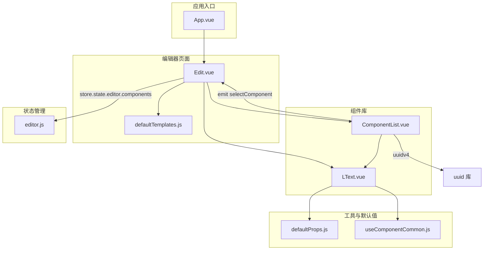
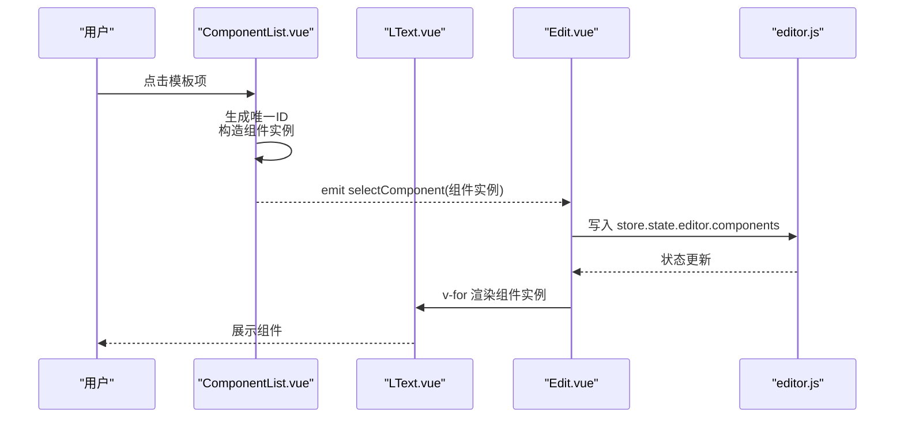
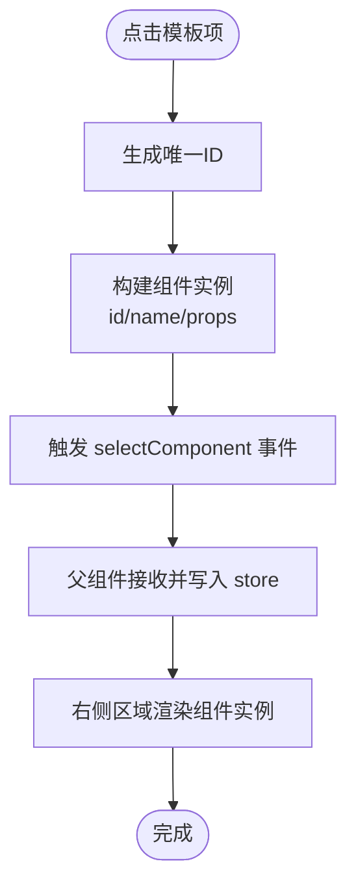
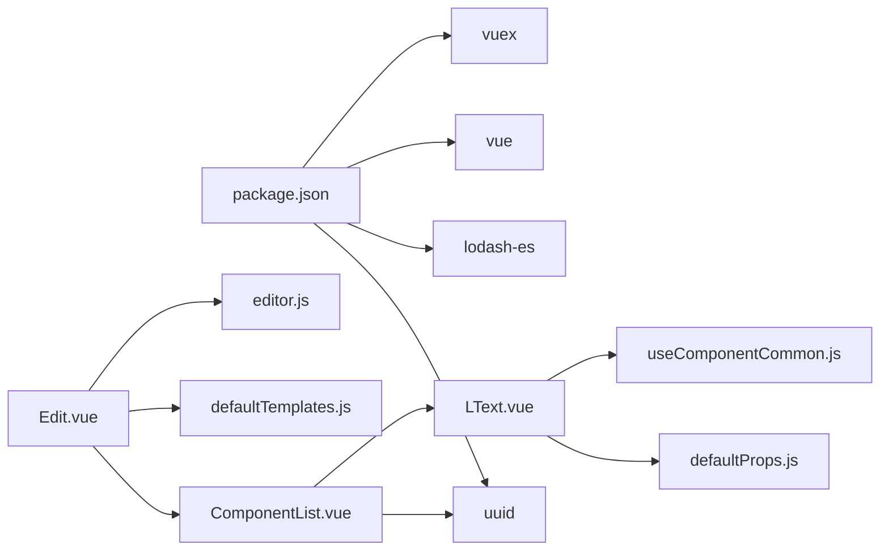

# 组件列表

<cite>
**本文引用的文件**
- [ComponentList.vue](file://src/components/ComponentList.vue)
- [LText.vue](file://src/components/LText.vue)
- [Edit.vue](file://src/components/Edit.vue)
- [defaultTemplates.js](file://src/defaultTemplates.js)
- [defaultProps.js](file://src/defaultProps.js)
- [useComponentCommon.js](file://src/hooks/useComponentCommon.js)
- [editor.js](file://src/stores/editor.js)
- [App.vue](file://src/App.vue)
- [package.json](file://package.json)
</cite>

## 目录
1. [简介](#简介)
2. [项目结构](#项目结构)
3. [核心组件](#核心组件)
4. [架构总览](#架构总览)
5. [详细组件分析](#详细组件分析)
6. [依赖关系分析](#依赖关系分析)
7. [性能考虑](#性能考虑)
8. [故障排查指南](#故障排查指南)
9. [结论](#结论)
10. [附录](#附录)

## 简介
本文件围绕 ComponentList.vue 组件列表组件进行技术文档化梳理，重点覆盖：
- 模板系统设计：模板数据结构、渲染逻辑与用户交互界面
- 模板选择机制：模板数据加载、过滤与排序能力现状与扩展建议
- 组件添加逻辑：模板转组件实例、ID 生成与初始属性设置
- 事件系统：selectComponent 的触发时机、参数传递与父组件响应
- UUID 集成：唯一标识符生成与管理策略
- 模板扩展指南：新增预设模板与自定义模板格式
- 样式设计与用户体验优化

## 项目结构
该仓库采用基于功能分层的组织方式，核心模块如下：
- 组件层：ComponentList.vue、LText.vue、Edit.vue
- 数据与默认值：defaultTemplates.js、defaultProps.js
- 工具与钩子：useComponentCommon.js
- 状态管理：editor.js（Vuex Store）
- 应用入口：App.vue
- 依赖声明：package.json



图表来源
- [App.vue:1-24](file://src/App.vue#L1-L24)
- [Edit.vue:1-91](file://src/components/Edit.vue#L1-L91)
- [ComponentList.vue:1-55](file://src/components/ComponentList.vue#L1-L55)
- [LText.vue:1-44](file://src/components/LText.vue#L1-L44)
- [defaultTemplates.js:1-41](file://src/defaultTemplates.js#L1-L41)
- [defaultProps.js:1-57](file://src/defaultProps.js#L1-L57)
- [useComponentCommon.js:1-18](file://src/hooks/useComponentCommon.js#L1-L18)
- [editor.js:1-52](file://src/stores/editor.js#L1-L52)

章节来源
- [App.vue:1-24](file://src/App.vue#L1-L24)
- [Edit.vue:1-91](file://src/components/Edit.vue#L1-L91)
- [ComponentList.vue:1-55](file://src/components/ComponentList.vue#L1-L55)
- [LText.vue:1-44](file://src/components/LText.vue#L1-L44)
- [defaultTemplates.js:1-41](file://src/defaultTemplates.js#L1-L41)
- [defaultProps.js:1-57](file://src/defaultProps.js#L1-L57)
- [useComponentCommon.js:1-18](file://src/hooks/useComponentCommon.js#L1-L18)
- [editor.js:1-52](file://src/stores/editor.js#L1-L52)

## 核心组件
- ComponentList.vue：负责展示模板列表并触发 selectComponent 事件，将模板转换为组件实例后传递给父组件。
- LText.vue：文本类组件，使用默认属性与通用点击处理钩子，支持动态标签渲染与样式绑定。
- Edit.vue：编辑器页面，承载左侧模板面板与右侧预览区域，负责接收并存储组件实例。
- defaultTemplates.js：提供一组预设模板数据，供 ComponentList 渲染。
- defaultProps.js：定义默认属性与转换函数，用于组件 props 的类型与默认值声明。
- useComponentCommon.js：通用组件行为钩子，抽取样式属性与统一点击处理。
- editor.js：Vuex Store 的编辑器状态，维护海报画布元素集合。

章节来源
- [ComponentList.vue:1-55](file://src/components/ComponentList.vue#L1-L55)
- [LText.vue:1-44](file://src/components/LText.vue#L1-L44)
- [Edit.vue:1-91](file://src/components/Edit.vue#L1-L91)
- [defaultTemplates.js:1-41](file://src/defaultTemplates.js#L1-L41)
- [defaultProps.js:1-57](file://src/defaultProps.js#L1-L57)
- [useComponentCommon.js:1-18](file://src/hooks/useComponentCommon.js#L1-L18)
- [editor.js:1-52](file://src/stores/editor.js#L1-L52)

## 架构总览
ComponentList 作为模板面板，通过 v-for 渲染模板项；点击模板项时，ComponentList 将模板数据转换为组件实例（含唯一 ID、组件名与 props），并通过 emit 触发 selectComponent 事件。父组件 Edit 接收事件并将新组件实例写入 store.state.editor.components，从而驱动右侧预览区域的渲染。



图表来源
- [ComponentList.vue:18-28](file://src/components/ComponentList.vue#L18-L28)
- [Edit.vue:44-49](file://src/components/Edit.vue#L44-L49)
- [LText.vue:37-41](file://src/components/LText.vue#L37-L41)
- [editor.js:1-52](file://src/stores/editor.js#L1-L52)

## 详细组件分析

### ComponentList.vue 组件分析
- 模板系统设计
  - 列表渲染：通过 v-for 遍历传入的 list（模板数组）。
  - 用户交互：每个模板项外层包裹可点击的容器，点击后触发 selectComponent。
  - 子组件：内部使用 LText 组件以 v-bind 形式绑定模板数据，实现所见即所得的预览效果。
- 模板选择机制
  - 当前实现：直接将传入的模板对象作为组件 props 使用，未包含过滤与排序逻辑。
  - 扩展建议：可在 setup 中引入计算属性或方法，对 list 进行过滤（如按类型、标签等）与排序（如按权重、创建时间）。
- 组件添加逻辑
  - 模板转实例：在 selectComponent 中，使用 uuidv4 生成唯一 ID，固定 name 为 "l-text"，并将模板对象作为 props。
  - 初始属性设置：当前未做额外的默认值合并或校验，建议结合 defaultProps.transformToComponentProps 与 textDefaultProps 做统一处理。
- 事件系统
  - 触发时机：点击模板项时。
  - 参数传递：传递包含 id、name、props 的组件实例对象。
  - 父组件响应：父组件 Edit 在 @selectComponent 回调中将实例 push 到 store.state.editor.components。
- UUID 集成
  - 引入方式：从 uuid 库导入 v4 方法生成唯一 ID。
  - 策略：每次选择模板时生成新 ID，确保组件实例唯一性。
- 样式与交互
  - 单项宽度与间距：通过 scoped 样式控制组件项尺寸与间距。
  - 容器点击：外层容器添加点击事件，便于在复杂布局中提升交互体验。



图表来源
- [ComponentList.vue:18-28](file://src/components/ComponentList.vue#L18-L28)
- [Edit.vue:44-49](file://src/components/Edit.vue#L44-L49)

章节来源
- [ComponentList.vue:1-55](file://src/components/ComponentList.vue#L1-L55)
- [Edit.vue:44-49](file://src/components/Edit.vue#L44-L49)

### LText.vue 组件分析
- 默认属性与类型声明
  - 使用 defaultProps.js 中的 transformToComponentProps 将默认属性转换为组件 props 的类型与默认值描述。
  - 提取 text 相关样式属性名，用于样式属性抽取。
- 通用行为钩子
  - 调用 useComponentCommon 钩子，抽取样式属性与统一点击处理逻辑。
  - 支持根据 actionType 与 url 打开外部链接。
- 动态标签渲染
  - 通过 <component :is="tag"> 实现不同 HTML 标签的渲染，增强灵活性。

```mermaid
classDiagram
class LText {
+props : "tag, 文本样式属性..."
+setup(props)
+template : "<component : is='tag' : style='styleProps' @click='toClick'>{{ text }}</component>"
}
class useComponentCommon {
+useComponentCommon(props, pickProps)
+styleProps : "抽取样式属性"
+toClick(e) : "根据 actionType/url 处理点击"
}
class defaultProps {
+textDefaultProps
+textStylePropNames
+transformToComponentProps(props)
}
LText --> useComponentCommon : "使用"
LText --> defaultProps : "使用"
```

图表来源
- [LText.vue:11-34](file://src/components/LText.vue#L11-L34)
- [useComponentCommon.js:1-18](file://src/hooks/useComponentCommon.js#L1-L18)
- [defaultProps.js:27-56](file://src/defaultProps.js#L27-L56)

章节来源
- [LText.vue:1-44](file://src/components/LText.vue#L1-L44)
- [useComponentCommon.js:1-18](file://src/hooks/useComponentCommon.js#L1-L18)
- [defaultProps.js:1-57](file://src/defaultProps.js#L1-L57)

### Edit.vue 页面分析
- 模板数据来源
  - 从 defaultTemplates.js 导入模板数组，传给 ComponentList 渲染。
- 组件实例管理
  - 通过 Vuex store.state.editor.components 获取已添加的组件列表。
  - selectComponent 回调将新组件实例写入 store，驱动视图更新。
- 布局与样式
  - 使用 Layout 组件划分头部、侧边栏与中心内容区域，中心区域居中展示组件预览。

章节来源
- [Edit.vue:1-91](file://src/components/Edit.vue#L1-L91)
- [defaultTemplates.js:1-41](file://src/defaultTemplates.js#L1-L41)
- [editor.js:1-52](file://src/stores/editor.js#L1-L52)

### 模板扩展指南
- 新增预设模板
  - 在 defaultTemplates.js 中追加新的模板对象，字段需与 LText 组件默认属性兼容（如 text、fontSize、color、width 等）。
  - 若需要新增组件类型，需在 ComponentList 中扩展 name 字段或增加映射规则。
- 自定义模板格式
  - 可在 defaultProps.js 中扩展新的默认属性集与样式属性名集合，再在 LText 或新组件中使用 transformToComponentProps 转换为 props 类型声明。
  - 对于更复杂的组件，建议在 defaultProps.js 中提供对应的默认值与属性名集合，保持一致的类型与默认值规范。

章节来源
- [defaultTemplates.js:1-41](file://src/defaultTemplates.js#L1-L41)
- [defaultProps.js:1-57](file://src/defaultProps.js#L1-L57)
- [LText.vue:11-21](file://src/components/LText.vue#L11-L21)

### 事件系统与父组件响应
- 触发时机
  - ComponentList 在点击模板项时触发 selectComponent 事件。
- 参数传递
  - 传递的对象包含 id（UUID）、name（组件名）、props（模板数据）。
- 父组件响应
  - Edit 接收事件后，将组件实例写入 store.state.editor.components，从而驱动右侧区域的渲染与后续编辑。

章节来源
- [ComponentList.vue:17-24](file://src/components/ComponentList.vue#L17-L24)
- [Edit.vue:44-49](file://src/components/Edit.vue#L44-L49)

### UUID 集成与管理策略
- 集成方式
  - 在 ComponentList.vue 中引入 uuidv4 并在 selectComponent 中生成唯一 ID。
- 管理策略
  - 建议在生成 ID 后进行去重校验（如检查 store.state.editor.components 中是否已存在相同 ID），避免冲突。
  - 对于批量导入或复制场景，可考虑使用更高效的 ID 生成策略（如带前缀的版本号或基于模板 ID 的派生 ID）。

章节来源
- [ComponentList.vue:4](file://src/components/ComponentList.vue#L4)
- [ComponentList.vue:20](file://src/components/ComponentList.vue#L20)

## 依赖关系分析
- 外部依赖
  - uuid：用于生成唯一标识符。
  - lodash-es：提供 mapValues、pick、without 等工具函数。
  - vue：组件框架与响应式系统。
  - vuex：状态管理。
- 内部依赖
  - ComponentList 依赖 uuid 与 LText。
  - LText 依赖 defaultProps 与 useComponentCommon。
  - Edit 依赖 defaultTemplates 与 editor store。
  - App 仅负责挂载 Edit。



图表来源
- [package.json:1-25](file://package.json#L1-L25)
- [ComponentList.vue:1-55](file://src/components/ComponentList.vue#L1-L55)
- [LText.vue:1-44](file://src/components/LText.vue#L1-L44)
- [Edit.vue:1-91](file://src/components/Edit.vue#L1-L91)
- [defaultTemplates.js:1-41](file://src/defaultTemplates.js#L1-L41)
- [defaultProps.js:1-57](file://src/defaultProps.js#L1-L57)
- [useComponentCommon.js:1-18](file://src/hooks/useComponentCommon.js#L1-L18)
- [editor.js:1-52](file://src/stores/editor.js#L1-L52)

章节来源
- [package.json:1-25](file://package.json#L1-L25)
- [ComponentList.vue:1-55](file://src/components/ComponentList.vue#L1-L55)
- [LText.vue:1-44](file://src/components/LText.vue#L1-L44)
- [Edit.vue:1-91](file://src/components/Edit.vue#L1-L91)
- [defaultTemplates.js:1-41](file://src/defaultTemplates.js#L1-L41)
- [defaultProps.js:1-57](file://src/defaultProps.js#L1-L57)
- [useComponentCommon.js:1-18](file://src/hooks/useComponentCommon.js#L1-L18)
- [editor.js:1-52](file://src/stores/editor.js#L1-L52)

## 性能考虑
- 渲染性能
  - 模板列表较小，v-for 渲染成本低；若模板数量增长，建议引入虚拟滚动或分页。
- 事件处理
  - 点击事件绑定在每个模板项上，建议在外层容器使用事件委托减少监听器数量。
- 状态更新
  - 每次添加组件都会触发 store 更新，建议在父组件层面做必要的防抖或批处理。
- 样式作用域
  - scoped 样式已在组件内使用，注意避免样式穿透与层级过深导致的性能问题。

## 故障排查指南
- 模板不显示
  - 检查传入的 list 是否为空或字段不匹配 LText 默认属性。
- 点击无响应
  - 确认外层容器具备点击事件绑定，且未被其他元素遮挡。
- 组件未出现在右侧
  - 检查父组件是否正确接收并写入 store.state.editor.components。
- UUID 冲突
  - 若出现重复 ID，建议在生成后进行去重校验或采用更安全的 ID 生成策略。
- 样式异常
  - 确认 LText 的样式属性是否正确抽取，以及 scoped 样式是否影响了预期表现。

章节来源
- [ComponentList.vue:32-43](file://src/components/ComponentList.vue#L32-L43)
- [Edit.vue:44-49](file://src/components/Edit.vue#L44-L49)
- [LText.vue:37-41](file://src/components/LText.vue#L37-L41)

## 结论
ComponentList.vue 作为模板面板的核心组件，承担了模板渲染、实例化与事件传递的关键职责。其与 LText、Edit、defaultTemplates、defaultProps、useComponentCommon、editor store 的协作形成了清晰的组件列表与编辑器工作流。当前实现简洁高效，建议在模板过滤/排序、默认属性合并、ID 去重与事件委托等方面进一步优化，以提升可扩展性与用户体验。

## 附录
- 术语
  - 模板：用于预设组件外观与行为的数据对象。
  - 组件实例：包含 id、name、props 的完整组件描述，可直接渲染。
- 最佳实践
  - 保持模板字段与组件默认属性一致，减少运行时转换成本。
  - 在父组件中集中处理组件实例的生命周期与状态同步。
  - 对于复杂交互，优先使用事件委托与最小化 DOM 操作。