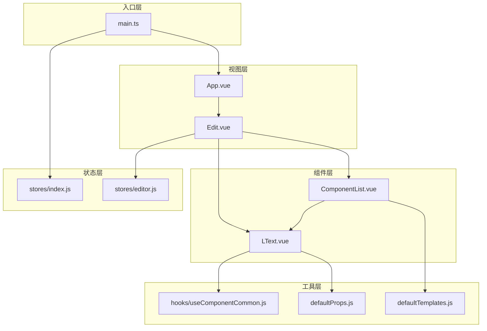
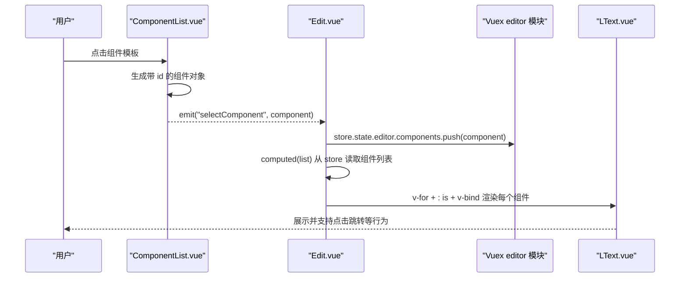
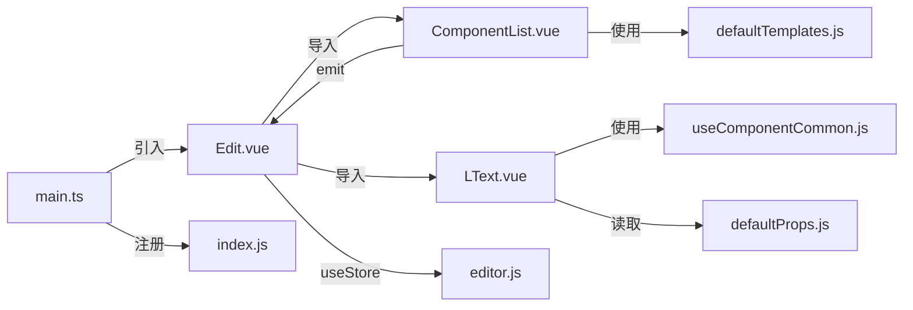

# 编辑器主组件

<cite>
**本文档引用的文件**
- [Edit.vue](file://src/components/Edit.vue)
- [editor.js](file://src/stores/editor.js)
- [index.js](file://src/stores/index.js)
- [LText.vue](file://src/components/LText.vue)
- [ComponentList.vue](file://src/components/ComponentList.vue)
- [useComponentCommon.js](file://src/hooks/useComponentCommon.js)
- [defaultProps.js](file://src/defaultProps.js)
- [defaultTemplates.js](file://src/defaultTemplates.js)
- [main.ts](file://src/main.ts)
</cite>

## 目录
1. [简介](#简介)
2. [项目结构](#项目结构)
3. [核心组件](#核心组件)
4. [架构总览](#架构总览)
5. [详细组件分析](#详细组件分析)
6. [依赖关系分析](#依赖关系分析)
7. [性能考虑](#性能考虑)
8. [故障排除指南](#故障排除指南)
9. [结论](#结论)
10. [附录](#附录)

## 简介
本文件针对 Edit.vue 编辑器主组件进行深入技术文档化，重点覆盖以下方面：
- Ant Design Vue 布局系统在三栏式布局中的应用与响应式设计实现
- 组件的 setup 函数实现：Vuex 状态管理集成、计算属性使用、事件处理器定义
- 动态组件渲染机制：v-for 循环渲染、component 动态组件标签使用、props 传递机制
- 组件间通信方式：父子组件通信、事件传递与状态同步
- 样式设计原理与布局优化策略
- 扩展编辑器功能与自定义组件行为的实践建议

## 项目结构
项目采用基于功能分层的组织方式，核心围绕“编辑器”模块展开：
- 视图层：App.vue、Edit.vue
- 组件层：LText.vue、ComponentList.vue
- 状态层：stores/editor.js（Vuex 模块）、stores/index.js（store 注册）
- 工具层：hooks/useComponentCommon.js、defaultProps.js、defaultTemplates.js
- 入口层：main.ts（Ant Design Vue 集成与 store 注入）

图表来源
- [Edit.vue:1-91](file://src/components/Edit.vue#L1-L91)
- [ComponentList.vue:1-55](file://src/components/ComponentList.vue#L1-L55)
- [LText.vue:1-44](file://src/components/LText.vue#L1-L44)
- [editor.js:1-52](file://src/stores/editor.js#L1-L52)
- [index.js:1-11](file://src/stores/index.js#L1-L11)
- [useComponentCommon.js:1-18](file://src/hooks/useComponentCommon.js#L1-L18)
- [defaultProps.js:1-57](file://src/defaultProps.js#L1-L57)
- [defaultTemplates.js:1-41](file://src/defaultTemplates.js#L1-L41)
- [main.ts:1-9](file://src/main.ts#L1-L9)

章节来源
- [Edit.vue:1-91](file://src/components/Edit.vue#L1-L91)
- [main.ts:1-9](file://src/main.ts#L1-L9)

## 核心组件
本节聚焦 Edit.vue 主组件的核心职责与实现要点：
- 布局：使用 Ant Design Vue 的 a-layout 系列组件构建三栏式布局（左侧组件库、中间画布、右侧属性面板），配合 scoped 样式实现响应式与视觉一致性
- 状态：通过 useStore 访问 Vuex 模块 editor，读取组件列表并驱动动态渲染
- 交互：接收来自 ComponentList 的组件选择事件，将模板转换为可编辑组件并写入 store
- 渲染：基于 v-for 和 component 动态组件标签，将 store 中的组件数组逐个渲染为具体组件实例，同时通过 v-bind 将 props 透传给子组件

章节来源
- [Edit.vue:23-56](file://src/components/Edit.vue#L23-L56)
- [editor.js:1-52](file://src/stores/editor.js#L1-L52)

## 架构总览
Edit.vue 作为编辑器主组件，承担“视图容器 + 状态桥接 + 事件中转”的角色，整体架构如下：

图表来源
- [Edit.vue:39-55](file://src/components/Edit.vue#L39-L55)
- [ComponentList.vue:18-28](file://src/components/ComponentList.vue#L18-L28)
- [editor.js:1-52](file://src/stores/editor.js#L1-L52)
- [LText.vue:13-34](file://src/components/LText.vue#L13-L34)

## 详细组件分析

### Edit.vue：主编辑器容器
- 布局系统与响应式设计
  - 使用 a-layout-header、a-layout-sider、a-layout-content 构建三栏式布局，配合 scoped 样式控制高度与背景色，确保全屏适配与视觉统一
  - 中央画布区域通过居中布局实现视觉平衡，内部容器限定宽高比以保证预览一致性
- setup 函数实现
  - 通过 useStore 获取 store 实例，使用 computed(list) 从 editor 模块读取组件列表，实现响应式数据绑定
  - 定义 selectComponent 处理器：打印调试信息后将新组件追加到 store.state.editor.components，完成组件选择与状态更新
- 动态组件渲染
  - v-for 遍历 list，为每个元素提供唯一 key（item.id）
  - component 动态组件标签根据 item.name 渲染对应组件，v-bind 将 item.props 透传给子组件
- 样式设计与布局优化
  - 顶层容器设置 100vh 高度，确保全屏覆盖
  - 侧边栏与头部采用对比色，提升可读性
  - 中心画布采用相对定位，便于后续元素定位与交互

章节来源
- [Edit.vue:1-91](file://src/components/Edit.vue#L1-L91)
- [editor.js:1-52](file://src/stores/editor.js#L1-L52)

### ComponentList.vue：组件模板列表
- 职责与交互
  - 接收外部传入的模板数组（来自 defaultTemplates.js），逐项渲染为可点击的组件预览
  - 点击时生成带唯一 id 的组件对象（name 为 "l-text"，props 来自模板），并通过 emit("selectComponent") 向父组件传递
- 设计细节
  - 外层 div 包裹模板预览，用于捕获点击事件
  - 通过 v-bind 将模板 props 直接透传给 LText 组件，保持一致的渲染体验

章节来源
- [ComponentList.vue:1-55](file://src/components/ComponentList.vue#L1-L55)
- [defaultTemplates.js:1-41](file://src/defaultTemplates.js#L1-L41)

### LText.vue：文本组件
- Props 设计
  - 通过 defaultProps.js 提供通用默认属性集合（尺寸、边框、阴影、透明度、定位等）与文本专属属性（字体、颜色、对齐等）
  - 使用 transformToComponentProps 将默认值映射为 Vue 组件的 props 定义，确保类型与默认值一致
- 行为与交互
  - 通过 useComponentCommon 钩子提取样式相关 props 并生成 styleProps，同时提供点击处理 toClick
  - 当 actionType 为 "url" 且存在 url 时，点击触发浏览器打开链接
- 渲染逻辑
  - 使用动态标签（tag）渲染不同语义元素（如 h2/p/button），并应用 styleProps 与文本内容

章节来源
- [LText.vue:1-44](file://src/components/LText.vue#L1-L44)
- [defaultProps.js:1-57](file://src/defaultProps.js#L1-L57)
- [useComponentCommon.js:1-18](file://src/hooks/useComponentCommon.js#L1-L18)

### useComponentCommon.js：组件通用钩子
- 功能概述
  - 从传入 props 中挑选指定属性名集合，生成计算属性 styleProps，用于动态样式绑定
  - 提供 toClick 回调，依据 actionType 与 url 判断是否执行外部跳转
- 设计优势
  - 将样式抽取与交互行为解耦，便于复用到多种组件类型
  - 通过 computed 保证样式计算的响应式与高效

章节来源
- [useComponentCommon.js:1-18](file://src/hooks/useComponentCommon.js#L1-L18)

### Vuex 状态模块 editor.js
- 数据结构
  - poster：画布基础信息（宽高、背景、元素集合）
  - components：已添加到画布的组件数组，每项包含 id、name、props
- 计算属性
  - wx：基于 poster.width 的比例计算函数，便于按比例换算坐标或尺寸
- 在 Edit.vue 中的应用
  - 通过 computed(list) 读取 store.state.editor.components，驱动动态渲染
  - selectComponent 将新组件 push 到 store.state.editor.components，实现状态同步

章节来源
- [editor.js:1-52](file://src/stores/editor.js#L1-L52)
- [Edit.vue:39-55](file://src/components/Edit.vue#L39-L55)

### 默认模板与默认属性
- defaultTemplates.js
  - 提供多种文本模板（标题、正文、链接、按钮），包含文本内容、样式与交互属性
- defaultProps.js
  - 定义通用默认属性与文本专属属性，以及样式属性名集合与 props 转换函数
  - 为 LText.vue 的 props 定义提供统一来源，确保组件行为一致

章节来源
- [defaultTemplates.js:1-41](file://src/defaultTemplates.js#L1-L41)
- [defaultProps.js:1-57](file://src/defaultProps.js#L1-L57)

### 入口与依赖注入
- main.ts
  - 引入 Ant Design Vue 样式与插件，注册并注入 Vuex store
  - 使 Edit.vue 及其子组件能够使用 Antd 组件与 Vuex 状态

章节来源
- [main.ts:1-9](file://src/main.ts#L1-L9)

## 依赖关系分析
组件与模块之间的依赖关系如下：

图表来源
- [Edit.vue:23-56](file://src/components/Edit.vue#L23-L56)
- [ComponentList.vue:1-55](file://src/components/ComponentList.vue#L1-L55)
- [LText.vue:1-44](file://src/components/LText.vue#L1-L44)
- [editor.js:1-52](file://src/stores/editor.js#L1-L52)
- [index.js:1-11](file://src/stores/index.js#L1-L11)
- [useComponentCommon.js:1-18](file://src/hooks/useComponentCommon.js#L1-L18)
- [defaultProps.js:1-57](file://src/defaultProps.js#L1-L57)
- [defaultTemplates.js:1-41](file://src/defaultTemplates.js#L1-L41)
- [main.ts:1-9](file://src/main.ts#L1-L9)

章节来源
- [Edit.vue:23-56](file://src/components/Edit.vue#L23-L56)
- [ComponentList.vue:1-55](file://src/components/ComponentList.vue#L1-L55)
- [LText.vue:1-44](file://src/components/LText.vue#L1-L44)
- [editor.js:1-52](file://src/stores/editor.js#L1-L52)
- [index.js:1-11](file://src/stores/index.js#L1-L11)
- [useComponentCommon.js:1-18](file://src/hooks/useComponentCommon.js#L1-L18)
- [defaultProps.js:1-57](file://src/defaultProps.js#L1-L57)
- [defaultTemplates.js:1-41](file://src/defaultTemplates.js#L1-L41)
- [main.ts:1-9](file://src/main.ts#L1-L9)

## 性能考虑
- 动态组件渲染
  - 使用 v-for + :is + v-bind 的组合渲染大量组件时，应确保每个 item.id 唯一且稳定，避免不必要的重渲染
  - 对于复杂组件（如包含大量 DOM 或计算密集型样式的组件），可考虑懒加载或虚拟滚动策略
- 计算属性与响应式
  - computed(list) 仅在 store.state.editor.components 变更时重新计算，减少不必要开销
  - useComponentCommon 中的 styleProps 通过 pick 提取样式属性，避免无关 props 影响响应式更新
- 样式与布局
  - 中心画布采用相对定位与固定宽高比，有助于减少布局抖动
  - 侧边栏与头部使用固定高度，降低布局重排成本

## 故障排除指南
- 组件未显示或渲染异常
  - 检查 store.state.editor.components 是否正确初始化，确认 item.name 与组件注册名称一致
  - 确认 v-bind 传入的 props 结构完整，特别是必填字段（如 text、fontSize 等）
- 点击无反应或链接未打开
  - 检查 LText.vue 的 toClick 逻辑，确保 actionType 为 "url" 且 url 存在
  - 确认 useComponentCommon.js 返回的 toClick 已正确绑定到组件事件
- 布局错位或溢出
  - 检查 Edit.vue 的 scoped 样式是否覆盖了预期的布局规则
  - 确认 Ant Design Vue 样式是否正确引入，避免样式冲突导致布局异常

章节来源
- [Edit.vue:11-14](file://src/components/Edit.vue#L11-L14)
- [LText.vue:22-32](file://src/components/LText.vue#L22-L32)
- [useComponentCommon.js:6-10](file://src/hooks/useComponentCommon.js#L6-L10)

## 结论
Edit.vue 通过 Ant Design Vue 布局系统与 Vuex 状态管理，实现了清晰的三栏式编辑器架构。其动态组件渲染机制结合 v-for 与 component 动态标签，提供了灵活的组件装配能力；通过 props 透传与通用钩子，实现了样式与交互的解耦与复用。整体设计具备良好的扩展性，便于后续新增组件类型与交互行为。

## 附录

### 扩展编辑器功能与自定义组件行为的实践建议
- 新增组件类型
  - 在 defaultProps.js 中定义新组件的默认属性与样式属性名集合
  - 在 defaultTemplates.js 中添加对应的模板项，确保包含必要的交互属性（如 actionType、url）
  - 在 Edit.vue 中确保 store.state.editor.components 的项包含正确的 name 与 props
- 自定义组件行为
  - 在 useComponentCommon.js 中扩展 toClick 逻辑，支持更多 actionType（如跳转到内部路由、打开模态框等）
  - 在 LText.vue 中增加新的 props 类型与校验，确保与 defaultProps.js 保持一致
- 性能优化
  - 对于大型画布场景，考虑对动态组件进行分页或懒加载
  - 使用 computed 缓存样式计算结果，减少重复渲染

### 样式设计原理与布局优化策略
- 布局原则
  - 使用 Ant Design Vue 的布局组件统一风格，确保跨设备一致性
  - 通过 scoped 样式限制作用域，避免全局污染
- 优化策略
  - 固定头部与侧边栏高度，减少布局重排
  - 中心画布采用相对定位与固定宽高比，提升预览稳定性
  - 使用 Flex 布局实现居中与弹性伸缩，增强响应式表现