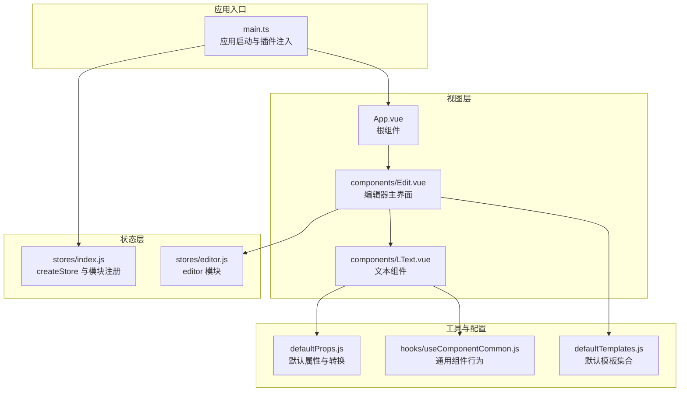
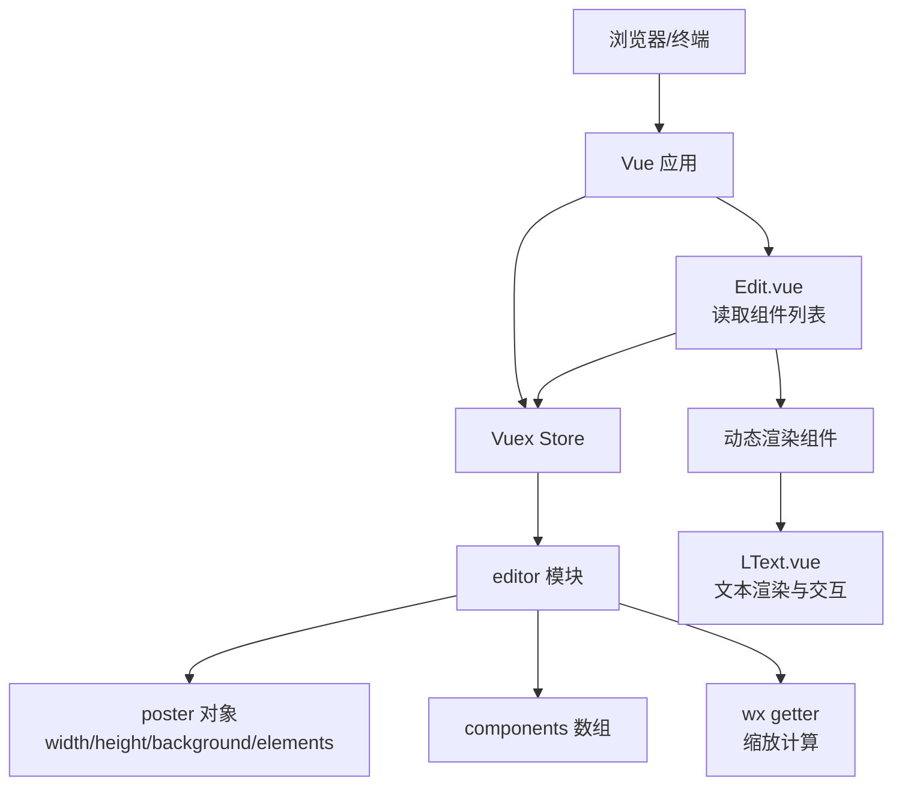
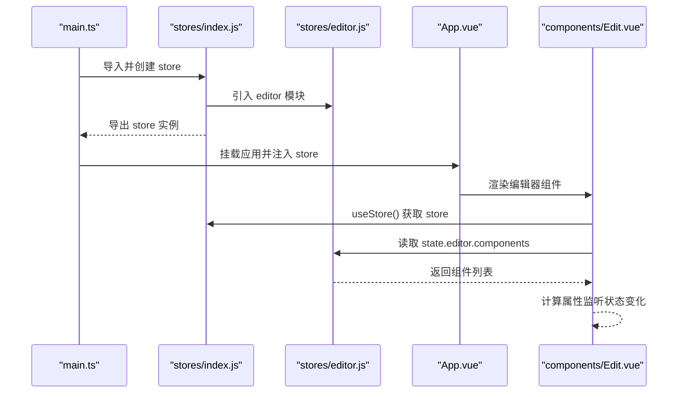
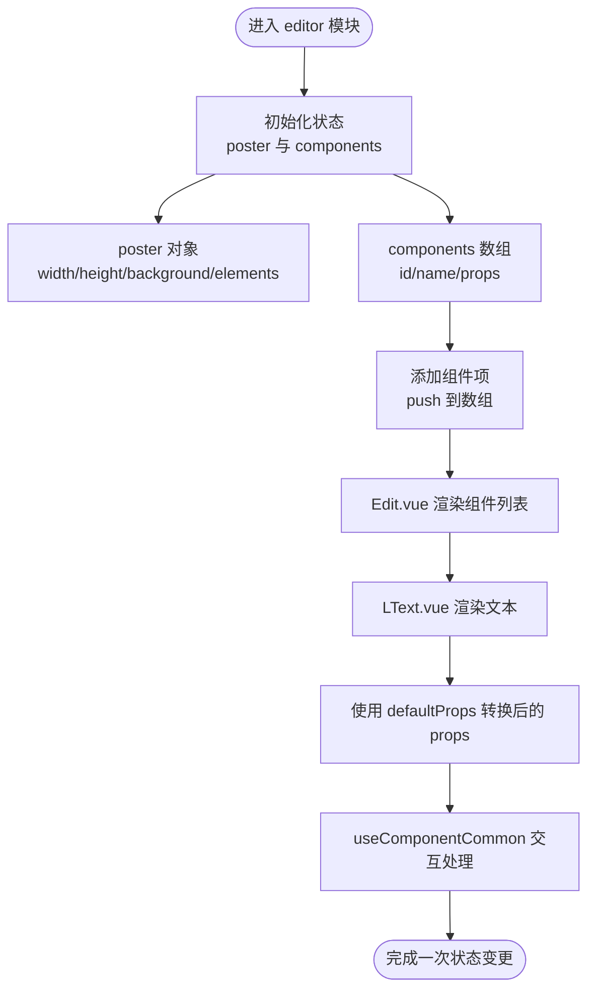
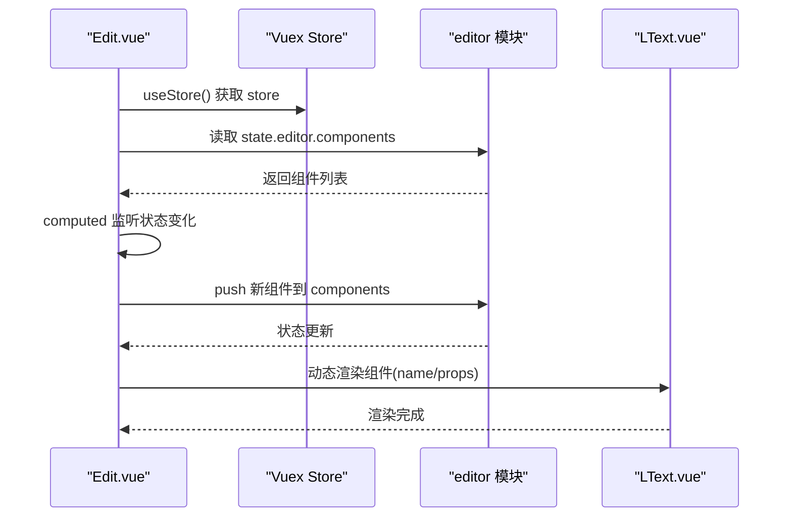
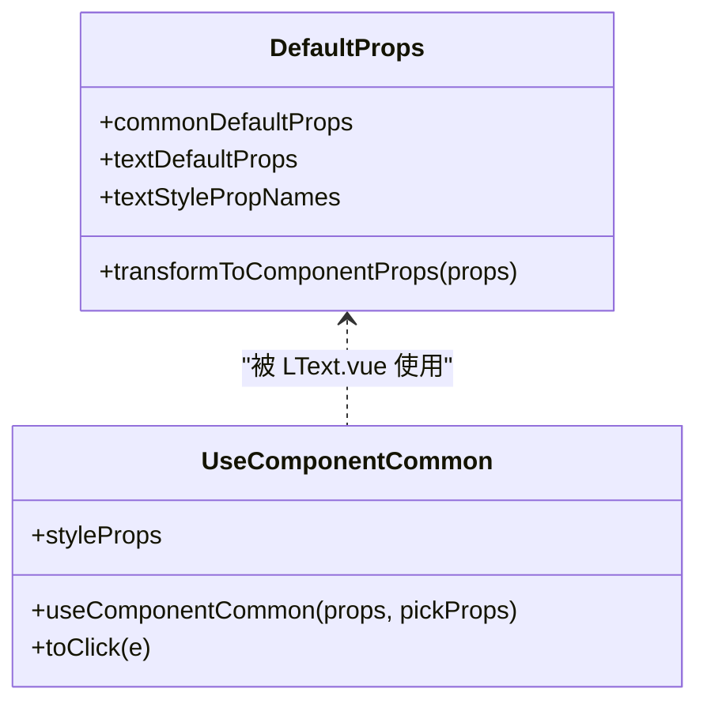
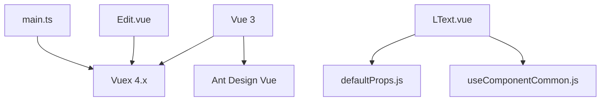

# Vuex 状态架构

<cite>
**本文档引用的文件**
- [src/stores/index.js](file://src/stores/index.js)
- [src/stores/editor.js](file://src/stores/editor.js)
- [src/main.ts](file://src/main.ts)
- [src/App.vue](file://src/App.vue)
- [src/components/Edit.vue](file://src/components/Edit.vue)
- [src/components/LText.vue](file://src/components/LText.vue)
- [src/defaultProps.js](file://src/defaultProps.js)
- [src/defaultTemplates.js](file://src/defaultTemplates.js)
- [src/hooks/useComponentCommon.js](file://src/hooks/useComponentCommon.js)
- [package.json](file://package.json)
</cite>

## 目录
1. [简介](#简介)
2. [项目结构](#项目结构)
3. [核心组件](#核心组件)
4. [架构总览](#架构总览)
5. [详细组件分析](#详细组件分析)
6. [依赖分析](#依赖分析)
7. [性能考虑](#性能考虑)
8. [故障排除指南](#故障排除指南)
9. [结论](#结论)

## 简介
本项目采用 Vuex 4.x 进行状态管理，围绕“海报编辑器”场景构建了简洁而清晰的状态架构。核心目标是通过模块化的状态树组织编辑器数据（如画布尺寸、背景、元素列表等），并通过组件与 store 的解耦交互实现可维护的状态管理方案。当前状态树以 editor 模块为核心，后续可按需扩展更多模块（如 history、selection 等）。

## 项目结构
项目采用基于功能的目录组织方式：
- stores：集中存放 Vuex 相关代码，包含全局 store 配置与模块定义
- components：页面级组件与业务组件，负责 UI 展示与用户交互
- hooks：可复用的组合式逻辑（如通用组件行为）
- 其他资源：默认模板、默认属性、入口文件等

图表来源
- [src/main.ts:1-9](file://src/main.ts#L1-L9)
- [src/stores/index.js:1-11](file://src/stores/index.js#L1-L11)
- [src/stores/editor.js:1-52](file://src/stores/editor.js#L1-L52)
- [src/App.vue:1-24](file://src/App.vue#L1-L24)
- [src/components/Edit.vue:1-91](file://src/components/Edit.vue#L1-L91)
- [src/components/LText.vue:1-44](file://src/components/LText.vue#L1-L44)
- [src/defaultProps.js:1-57](file://src/defaultProps.js#L1-L57)
- [src/defaultTemplates.js:1-41](file://src/defaultTemplates.js#L1-L41)
- [src/hooks/useComponentCommon.js:1-18](file://src/hooks/useComponentCommon.js#L1-L18)

章节来源
- [src/main.ts:1-9](file://src/main.ts#L1-L9)
- [src/stores/index.js:1-11](file://src/stores/index.js#L1-L11)
- [src/stores/editor.js:1-52](file://src/stores/editor.js#L1-L52)
- [src/App.vue:1-24](file://src/App.vue#L1-L24)
- [src/components/Edit.vue:1-91](file://src/components/Edit.vue#L1-L91)
- [src/components/LText.vue:1-44](file://src/components/LText.vue#L1-L44)
- [src/defaultProps.js:1-57](file://src/defaultProps.js#L1-L57)
- [src/defaultTemplates.js:1-41](file://src/defaultTemplates.js#L1-L41)
- [src/hooks/useComponentCommon.js:1-18](file://src/hooks/useComponentCommon.js#L1-L18)

## 核心组件
- 全局 Store 配置：在 stores/index.js 中通过 createStore 创建根 store，并注册 editor 模块，形成单一状态源。
- editor 模块：包含初始画布信息（宽高、背景）与组件元素数组，提供基础 getters（如 wx 缩放计算）。
- 应用入口：main.ts 将 store 注入到 Vue 实例，确保所有组件可访问全局状态。
- 编辑器组件：Edit.vue 通过 useStore 访问 store.state.editor，读取组件列表并支持添加新组件。
- 文本组件：LText.vue 基于 defaultProps 转换后的 props 渲染文本，结合 useComponentCommon 提供点击跳转能力。
- 默认模板与属性：defaultTemplates.js 提供预设模板；defaultProps.js 定义默认属性与样式属性名映射；hooks/useComponentCommon.js 提供通用交互逻辑。

章节来源
- [src/stores/index.js:1-11](file://src/stores/index.js#L1-L11)
- [src/stores/editor.js:1-52](file://src/stores/editor.js#L1-L52)
- [src/main.ts:1-9](file://src/main.ts#L1-L9)
- [src/components/Edit.vue:1-91](file://src/components/Edit.vue#L1-L91)
- [src/components/LText.vue:1-44](file://src/components/LText.vue#L1-L44)
- [src/defaultProps.js:1-57](file://src/defaultProps.js#L1-L57)
- [src/defaultTemplates.js:1-41](file://src/defaultTemplates.js#L1-L41)
- [src/hooks/useComponentCommon.js:1-18](file://src/hooks/useComponentCommon.js#L1-L18)

## 架构总览
本项目采用“单模块 + 组合式 API”的轻量状态架构：
- 单一模块：editor 模块承载编辑器核心状态，避免过度拆分导致复杂度上升。
- 组合式访问：Edit.vue 使用 Composition API 的 useStore 获取状态，保持与 Options API 的兼容性。
- 数据驱动渲染：组件通过计算属性监听 store.state.editor 的变化，实现响应式更新。
- 可扩展性：当前仅注册 editor 模块，后续可通过模块化扩展历史记录、选中元素、主题等子域。

图表来源
- [src/stores/editor.js:1-52](file://src/stores/editor.js#L1-L52)
- [src/components/Edit.vue:1-91](file://src/components/Edit.vue#L1-L91)
- [src/components/LText.vue:1-44](file://src/components/LText.vue#L1-L44)

## 详细组件分析

### Store 配置与模块注册
- createStore 配置：在 stores/index.js 中创建根 store，modules 字段注册 editor 模块，形成全局状态树。
- 模块注册机制：通过对象键值对将 editor 模块挂载到全局命名空间 editor 下，组件可通过 store.state.editor 访问。
- 命名空间使用：当前未启用严格模式或命名空间前缀，直接通过 state.editor 访问；若未来扩展多模块，建议统一命名规范以避免冲突。

图表来源
- [src/main.ts:1-9](file://src/main.ts#L1-L9)
- [src/stores/index.js:1-11](file://src/stores/index.js#L1-L11)
- [src/stores/editor.js:1-52](file://src/stores/editor.js#L1-L52)
- [src/components/Edit.vue:1-91](file://src/components/Edit.vue#L1-L91)

章节来源
- [src/stores/index.js:1-11](file://src/stores/index.js#L1-L11)
- [src/stores/editor.js:1-52](file://src/stores/editor.js#L1-L52)
- [src/main.ts:1-9](file://src/main.ts#L1-L9)

### editor 模块状态设计
- 状态结构：
  - poster：包含画布尺寸、背景色与元素数组
  - components：组件实例数组，每个元素包含 id、name、props 等字段
- 设计原则：
  - 结构扁平：避免深层嵌套，便于快速定位与调试
  - 可序列化：状态可被 JSON 化，利于持久化与调试
  - 可扩展：预留 poster.elements 用于存储更复杂的元素模型
- Getter 使用：提供 wx 计算函数，用于将相对数值转换为绝对像素，便于布局计算

图表来源
- [src/stores/editor.js:1-52](file://src/stores/editor.js#L1-L52)
- [src/components/Edit.vue:1-91](file://src/components/Edit.vue#L1-L91)
- [src/components/LText.vue:1-44](file://src/components/LText.vue#L1-L44)
- [src/defaultProps.js:1-57](file://src/defaultProps.js#L1-L57)
- [src/hooks/useComponentCommon.js:1-18](file://src/hooks/useComponentCommon.js#L1-L18)

章节来源
- [src/stores/editor.js:1-52](file://src/stores/editor.js#L1-L52)
- [src/defaultProps.js:1-57](file://src/defaultProps.js#L1-L57)
- [src/hooks/useComponentCommon.js:1-18](file://src/hooks/useComponentCommon.js#L1-L18)

### 组件与状态的交互流程
- 读取状态：Edit.vue 在 setup 中调用 useStore，通过 computed 监听 store.state.editor.components，实现响应式渲染。
- 写入状态：选择模板后，将模板项 push 到 store.state.editor.components，触发视图更新。
- 组件渲染：中心区域通过 v-for 动态渲染组件，组件名称来自 item.name，属性来自 item.props。

图表来源
- [src/components/Edit.vue:1-91](file://src/components/Edit.vue#L1-L91)
- [src/stores/editor.js:1-52](file://src/stores/editor.js#L1-L52)
- [src/components/LText.vue:1-44](file://src/components/LText.vue#L1-L44)

章节来源
- [src/components/Edit.vue:1-91](file://src/components/Edit.vue#L1-L91)
- [src/stores/editor.js:1-52](file://src/stores/editor.js#L1-L52)
- [src/components/LText.vue:1-44](file://src/components/LText.vue#L1-L44)

### 默认属性与通用交互钩子
- defaultProps.js：定义通用与文本类默认属性，提供样式属性名集合与 props 转换函数，确保组件接收的 props 类型与默认值一致。
- hooks/useComponentCommon.js：封装通用交互逻辑（如点击跳转），通过 pick 提取样式相关 props，减少重复代码。

图表来源
- [src/defaultProps.js:1-57](file://src/defaultProps.js#L1-L57)
- [src/hooks/useComponentCommon.js:1-18](file://src/hooks/useComponentCommon.js#L1-L18)
- [src/components/LText.vue:1-44](file://src/components/LText.vue#L1-L44)

章节来源
- [src/defaultProps.js:1-57](file://src/defaultProps.js#L1-L57)
- [src/hooks/useComponentCommon.js:1-18](file://src/hooks/useComponentCommon.js#L1-L18)
- [src/components/LText.vue:1-44](file://src/components/LText.vue#L1-L44)

## 依赖分析
- 外部依赖：Vuex 4.x、Vue 3、Ant Design Vue、Lodash-es、UUID 等
- 内部依赖：store 由 main.ts 注入到应用；编辑器组件依赖 store 读写状态；文本组件依赖默认属性与通用钩子

图表来源
- [package.json:1-25](file://package.json#L1-L25)
- [src/main.ts:1-9](file://src/main.ts#L1-L9)
- [src/components/Edit.vue:1-91](file://src/components/Edit.vue#L1-L91)
- [src/components/LText.vue:1-44](file://src/components/LText.vue#L1-L44)
- [src/defaultProps.js:1-57](file://src/defaultProps.js#L1-L57)
- [src/hooks/useComponentCommon.js:1-18](file://src/hooks/useComponentCommon.js#L1-L18)

章节来源
- [package.json:1-25](file://package.json#L1-L25)
- [src/main.ts:1-9](file://src/main.ts#L1-L9)
- [src/components/Edit.vue:1-91](file://src/components/Edit.vue#L1-L91)
- [src/components/LText.vue:1-44](file://src/components/LText.vue#L1-L44)

## 性能考虑
- 响应式粒度：当前通过数组 push 触发全量更新，建议在组件数量较多时引入更细粒度的状态更新策略（如按 id 更新特定元素）。
- 计算属性缓存：利用 computed 对 store.state.editor 的访问，避免重复计算。
- 模板优化：动态组件渲染时确保 key 唯一，减少不必要的重渲染。
- 扩展建议：当状态规模增长时，考虑拆分模块（history、selection、theme 等），并在模块间建立清晰的边界与通信协议。

## 故障排除指南
- 状态未更新：确认组件是否通过 useStore 访问 store，并在需要时使用 computed 包裹对 state 的读取。
- 组件渲染异常：检查模板项的 id 与 name 是否正确，以及 props 是否符合预期。
- 交互无效：核对 useComponentCommon 的 actionType 与 url 字段，确保点击事件触发条件满足。
- 模块未生效：检查 stores/index.js 是否正确导入并注册 editor 模块，main.ts 是否正确注入 store。

章节来源
- [src/components/Edit.vue:1-91](file://src/components/Edit.vue#L1-L91)
- [src/stores/index.js:1-11](file://src/stores/index.js#L1-L11)
- [src/stores/editor.js:1-52](file://src/stores/editor.js#L1-L52)
- [src/hooks/useComponentCommon.js:1-18](file://src/hooks/useComponentCommon.js#L1-L18)

## 结论
本项目以 editor 模块为核心，构建了简洁高效的 Vuex 状态架构。通过模块化注册、组合式 API 访问与默认属性/钩子的抽象，实现了良好的可维护性与扩展性。建议在后续迭代中逐步完善模块边界、引入更精细的状态更新策略，并在团队内统一命名与通信规范，以支撑更大规模的编辑器功能演进。