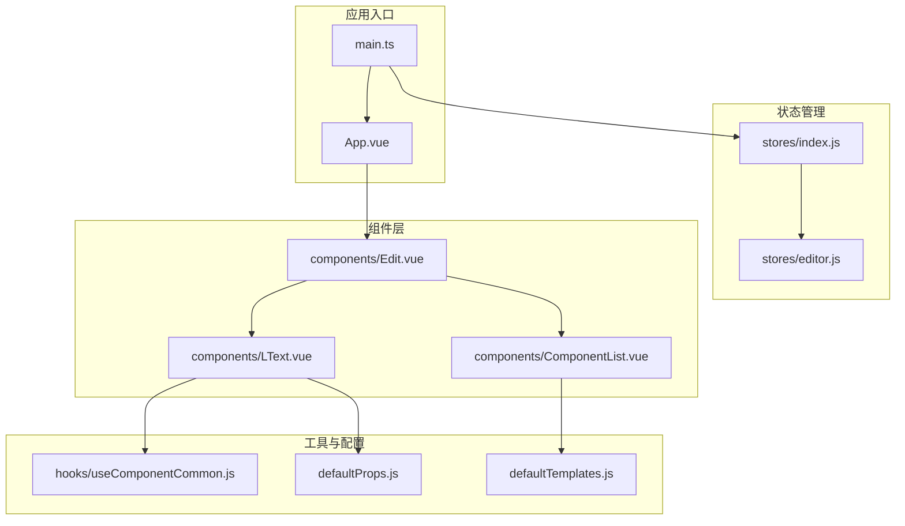
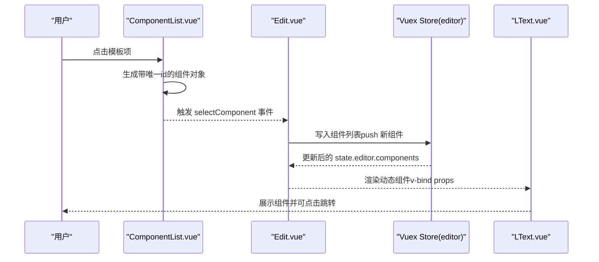
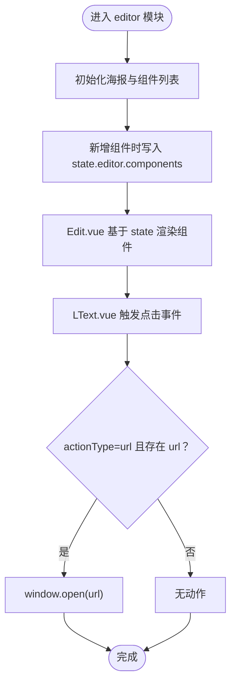
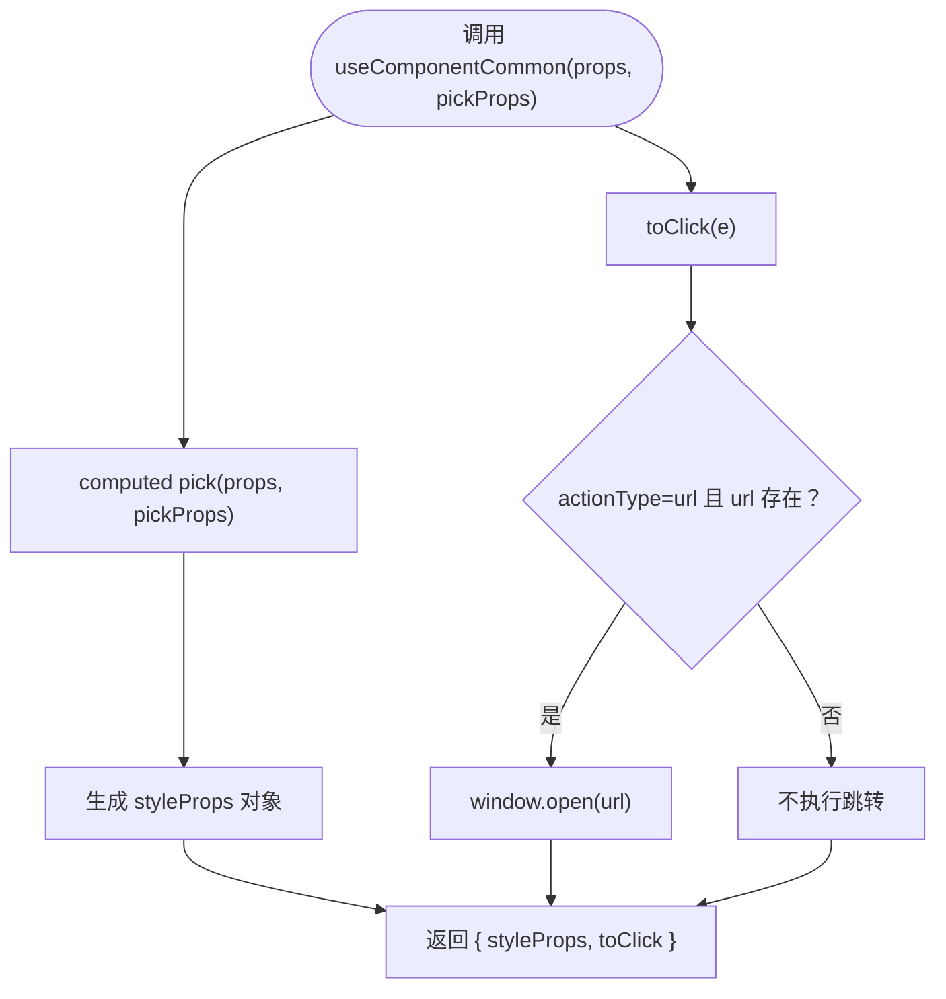
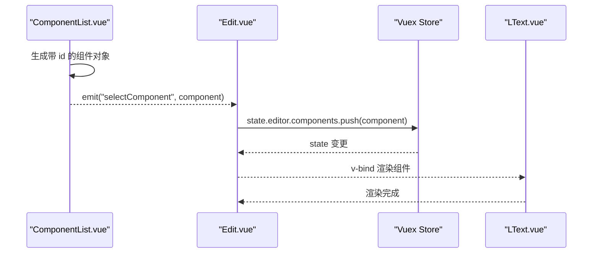
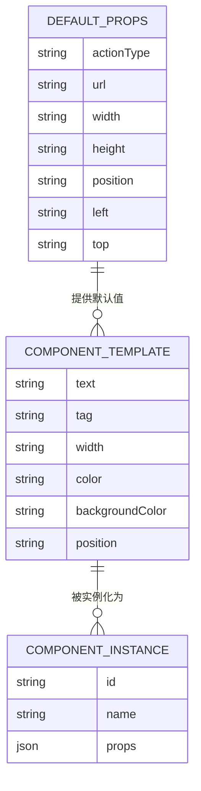
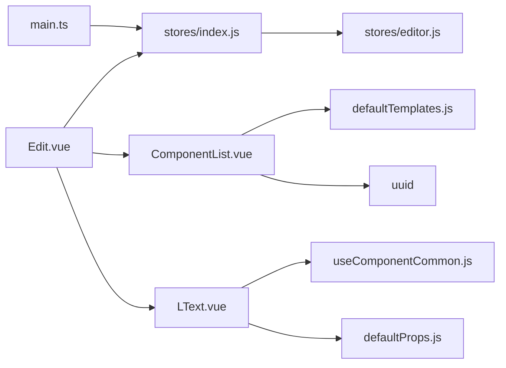

# 状态管理

<cite>
**本文引用的文件**
- [src/stores/editor.js](file://src/stores/editor.js)
- [src/stores/index.js](file://src/stores/index.js)
- [src/hooks/useComponentCommon.js](file://src/hooks/useComponentCommon.js)
- [src/components/Edit.vue](file://src/components/Edit.vue)
- [src/components/LText.vue](file://src/components/LText.vue)
- [src/components/ComponentList.vue](file://src/components/ComponentList.vue)
- [src/defaultProps.js](file://src/defaultProps.js)
- [src/defaultTemplates.js](file://src/defaultTemplates.js)
- [src/App.vue](file://src/App.vue)
- [src/main.ts](file://src/main.ts)
- [package.json](file://package.json)
</cite>

## 目录
1. [简介](#简介)
2. [项目结构](#项目结构)
3. [核心组件](#核心组件)
4. [架构总览](#架构总览)
5. [详细组件分析](#详细组件分析)
6. [依赖关系分析](#依赖关系分析)
7. [性能考量](#性能考量)
8. [故障排查指南](#故障排查指南)
9. [结论](#结论)
10. [附录](#附录)

## 简介
本文件面向 wy_poster 项目的“状态管理系统”，聚焦于 Vuex 在项目中的模块化设计与使用方式，系统性梳理状态树结构、状态更新机制、编辑器模块（editor.js）的实现细节、组件状态管理以及全局状态同步策略；同时解析通用 Hook（useComponentCommon.js）的设计思路与代码复用策略，并总结最佳实践、性能优化技巧与常见问题的解决方案。文中通过多种可视化图表帮助读者理解状态流转与数据流。

## 项目结构
项目采用基于功能的组织方式：状态管理位于 stores 目录，通用逻辑封装在 hooks 目录，业务组件分布在 components 目录，入口文件在根目录。Vuex 作为集中式状态管理库，通过模块化的方式将编辑器相关的状态与行为进行隔离与组合。

图表来源
- [src/main.ts:1-9](file://src/main.ts#L1-L9)
- [src/App.vue:1-24](file://src/App.vue#L1-L24)
- [src/stores/index.js:1-11](file://src/stores/index.js#L1-L11)
- [src/stores/editor.js:1-52](file://src/stores/editor.js#L1-L52)
- [src/components/Edit.vue:1-91](file://src/components/Edit.vue#L1-L91)
- [src/components/ComponentList.vue:1-55](file://src/components/ComponentList.vue#L1-L55)
- [src/components/LText.vue:1-44](file://src/components/LText.vue#L1-L44)
- [src/hooks/useComponentCommon.js:1-18](file://src/hooks/useComponentCommon.js#L1-L18)
- [src/defaultProps.js:1-57](file://src/defaultProps.js#L1-L57)
- [src/defaultTemplates.js:1-41](file://src/defaultTemplates.js#L1-L41)

章节来源
- [src/main.ts:1-9](file://src/main.ts#L1-L9)
- [src/App.vue:1-24](file://src/App.vue#L1-L24)
- [src/stores/index.js:1-11](file://src/stores/index.js#L1-L11)
- [src/stores/editor.js:1-52](file://src/stores/editor.js#L1-L52)

## 核心组件
- 状态仓库（Vuex）
  - 入口：在应用入口中注册并挂载 Vuex store，使全局可访问。
  - 模块：当前仅包含 editor 模块，负责海报画布与组件列表的状态。
- 编辑器模块（editor.js）
  - 状态树：包含海报尺寸、背景色、元素数组，以及组件列表（含 id、名称、props）。
  - 计算属性：提供 wx 缩放计算函数，便于按比例换算宽度。
- 组件层
  - Edit.vue：展示布局与组件渲染区域，从 store 读取组件列表，响应模板选择事件并向 store 写入新组件。
  - ComponentList.vue：展示默认模板列表，点击后生成带唯一 id 的组件对象并通过事件向上抛出。
  - LText.vue：文本组件，使用通用 Hook 提取样式属性并处理点击跳转等交互。
- 通用 Hook（useComponentCommon.js）
  - 功能：从传入的 props 中挑选指定属性生成样式对象；根据 actionType 判断是否打开链接。
  - 复用策略：以参数化方式抽取样式属性名集合，支持不同组件共享同一套样式提取与点击处理逻辑。

章节来源
- [src/stores/index.js:1-11](file://src/stores/index.js#L1-L11)
- [src/stores/editor.js:1-52](file://src/stores/editor.js#L1-L52)
- [src/components/Edit.vue:1-91](file://src/components/Edit.vue#L1-L91)
- [src/components/ComponentList.vue:1-55](file://src/components/ComponentList.vue#L1-L55)
- [src/components/LText.vue:1-44](file://src/components/LText.vue#L1-L44)
- [src/hooks/useComponentCommon.js:1-18](file://src/hooks/useComponentCommon.js#L1-L18)

## 架构总览
整体架构围绕“状态驱动视图”的模式展开：Edit.vue 通过 computed 从 store 读取组件列表，渲染为动态组件；用户在 ComponentList 中选择模板，触发事件将新组件写入 store；LText.vue 使用通用 Hook 将 props 转为内联样式并处理点击事件。Vuex 模块化设计使得编辑器状态与组件行为解耦，便于扩展与维护。

图表来源
- [src/components/ComponentList.vue:17-27](file://src/components/ComponentList.vue#L17-L27)
- [src/components/Edit.vue:42-54](file://src/components/Edit.vue#L42-L54)
- [src/stores/editor.js:46-48](file://src/stores/editor.js#L46-L48)
- [src/components/LText.vue:22-33](file://src/components/LText.vue#L22-L33)

## 详细组件分析

### 编辑器模块（editor.js）分析
- 状态树结构
  - 海报画布：包含宽、高、背景色、元素数组。
  - 组件列表：每项包含唯一 id、组件名称、props（如文本、字号、颜色、位置等）。
- 计算属性（getters）
  - wx(state)(x)：将输入值按海报宽度进行缩放，便于统一换算。
- 设计要点
  - 将“海报”和“组件”两类状态分层存储，有利于后续扩展（如多画布、历史栈、撤销重做等）。
  - 组件 props 采用扁平化键值，便于通用 Hook 抽取样式属性。

图表来源
- [src/stores/editor.js:2-48](file://src/stores/editor.js#L2-L48)
- [src/components/Edit.vue:42-54](file://src/components/Edit.vue#L42-L54)
- [src/components/LText.vue:22-33](file://src/components/LText.vue#L22-L33)

章节来源
- [src/stores/editor.js:1-52](file://src/stores/editor.js#L1-L52)

### 通用 Hook（useComponentCommon.js）分析
- 设计思路
  - 通过 pick 从 props 中筛选样式相关属性，生成 styleProps，减少组件内部样板代码。
  - 统一处理点击跳转逻辑，避免每个组件重复实现相同行为。
- 复用策略
  - 以参数 pickProps 控制属性集，结合 defaultProps 中的样式属性名集合，实现跨组件一致的行为与样式提取。
- 性能与可维护性
  - 使用 computed 包裹 pick 结果，确保只在依赖变化时重新计算，降低不必要的开销。
  - 将交互与样式分离，提升组件职责单一性与可测试性。

图表来源
- [src/hooks/useComponentCommon.js:4-15](file://src/hooks/useComponentCommon.js#L4-L15)
- [src/defaultProps.js:42-47](file://src/defaultProps.js#L42-L47)

章节来源
- [src/hooks/useComponentCommon.js:1-18](file://src/hooks/useComponentCommon.js#L1-L18)
- [src/defaultProps.js:1-57](file://src/defaultProps.js#L1-L57)

### 组件状态管理与全局状态同步
- Edit.vue
  - 读取：通过 computed 从 store.state.editor.components 获取组件列表，实现响应式渲染。
  - 写入：在 selectComponent 中直接 push 新组件到 state.editor.components，触发视图更新。
- ComponentList.vue
  - 生成：为每个模板项生成带唯一 id 的组件对象，避免同名组件冲突。
  - 事件：向上抛出 selectComponent 事件，由父组件统一写入 store。
- LText.vue
  - 使用：接收来自 store 的 props 并通过 useComponentCommon 提取样式与处理点击。
  - 行为：根据 actionType 决定是否打开链接，实现统一交互。

图表来源
- [src/components/ComponentList.vue:17-27](file://src/components/ComponentList.vue#L17-L27)
- [src/components/Edit.vue:42-54](file://src/components/Edit.vue#L42-L54)
- [src/stores/editor.js:46-48](file://src/stores/editor.js#L46-L48)
- [src/components/LText.vue:22-33](file://src/components/LText.vue#L22-L33)

章节来源
- [src/components/Edit.vue:1-91](file://src/components/Edit.vue#L1-L91)
- [src/components/ComponentList.vue:1-55](file://src/components/ComponentList.vue#L1-L55)
- [src/components/LText.vue:1-44](file://src/components/LText.vue#L1-L44)

### 数据模型与默认配置
- 默认属性（defaultProps.js）
  - 定义通用默认属性与文本组件默认属性，导出样式属性名集合与转换函数。
  - transformToComponentProps 将默认值映射为 Vue 组件的 prop 类型与默认值定义。
- 默认模板（defaultTemplates.js）
  - 提供一组文本模板，包含不同标签、样式与交互属性，用于快速生成组件实例。
- 关系映射
  - LText.vue 使用 defaultProps 的样式属性名集合与转换函数，确保 props 类型与默认值一致。
  - ComponentList.vue 从 defaultTemplates 读取模板，结合 uuid 生成唯一 id 后交给 Edit.vue 写入 store。

图表来源
- [src/defaultProps.js:1-57](file://src/defaultProps.js#L1-L57)
- [src/defaultTemplates.js:1-41](file://src/defaultTemplates.js#L1-L41)
- [src/components/LText.vue:11-21](file://src/components/LText.vue#L11-L21)

章节来源
- [src/defaultProps.js:1-57](file://src/defaultProps.js#L1-L57)
- [src/defaultTemplates.js:1-41](file://src/defaultTemplates.js#L1-L41)
- [src/components/LText.vue:1-44](file://src/components/LText.vue#L1-L44)

## 依赖关系分析
- 应用入口依赖
  - main.ts 注册 ant-design-vue 与 Vuex store，使全局具备 UI 组件库与状态管理能力。
- 状态管理依赖
  - stores/index.js 创建 store 并注册 editor 模块；editor.js 定义状态与计算属性。
- 组件依赖
  - Edit.vue 依赖 Vuex 的 useStore 与 computed；LText.vue 依赖 defaultProps 与 useComponentCommon。
  - ComponentList.vue 依赖 uuid 生成唯一 id，并向父组件抛出事件。
- 第三方库
  - lodash-es 提供 pick、mapValues、without 等工具方法；uuid 生成唯一标识；ant-design-vue 提供 UI 组件库。

图表来源
- [src/main.ts:1-9](file://src/main.ts#L1-L9)
- [src/stores/index.js:1-11](file://src/stores/index.js#L1-L11)
- [src/stores/editor.js:1-52](file://src/stores/editor.js#L1-L52)
- [src/components/Edit.vue:24-56](file://src/components/Edit.vue#L24-L56)
- [src/components/LText.vue:1-34](file://src/components/LText.vue#L1-L34)
- [src/components/ComponentList.vue:1-29](file://src/components/ComponentList.vue#L1-L29)
- [src/hooks/useComponentCommon.js:1-18](file://src/hooks/useComponentCommon.js#L1-L18)
- [src/defaultProps.js:1-57](file://src/defaultProps.js#L1-L57)
- [src/defaultTemplates.js:1-41](file://src/defaultTemplates.js#L1-L41)
- [package.json:9-24](file://package.json#L9-L24)

章节来源
- [package.json:9-24](file://package.json#L9-L24)

## 性能考量
- 响应式与计算属性
  - 使用 computed 包裹从 store 读取的数据与从 props 中挑选的样式属性，避免重复计算与不必要的渲染。
- 状态写入策略
  - 当前直接修改 state.editor.components 数组，建议在复杂场景引入 mutation 或使用更细粒度的状态更新策略，以利于调试与追踪变更。
- 渲染优化
  - 为动态组件列表提供稳定 key（如 id），减少 DOM 重建与重排。
- 工具函数选择
  - lodash-es 的 pick/mapValues/without 等函数在小规模数据下开销较低，但在大规模数据或高频更新场景需评估性能影响。
- 事件与副作用
  - 打开链接属于副作用，建议在 Hook 中抽象为可注入的服务，便于测试与替换实现。

## 故障排查指南
- 组件未渲染或渲染异常
  - 检查 Edit.vue 是否正确从 store 读取 state.editor.components，并确认组件 props 与 defaultProps 的类型匹配。
  - 确认 LText.vue 的 props 是否包含必要的样式属性与交互字段。
- 点击无反应
  - 检查 useComponentCommon 的 actionType 与 url 字段是否正确传递至 LText.vue。
  - 确认 LText.vue 的点击事件绑定与 toClick 函数调用链路。
- 模板选择无效
  - 检查 ComponentList.vue 是否正确生成带唯一 id 的组件对象并触发 selectComponent 事件。
  - 确认 Edit.vue 的 selectComponent 回调是否正确写入 store.state.editor.components。
- 状态未更新
  - 确认 main.ts 已正确注册 store，并在 App.vue 下方组件树中生效。
  - 若使用严格模式或开发工具，检查是否有 mutation 未通过规范路径更新状态。

章节来源
- [src/components/Edit.vue:42-54](file://src/components/Edit.vue#L42-L54)
- [src/components/LText.vue:22-33](file://src/components/LText.vue#L22-L33)
- [src/components/ComponentList.vue:17-27](file://src/components/ComponentList.vue#L17-L27)
- [src/main.ts:1-9](file://src/main.ts#L1-L9)

## 结论
本项目采用轻量级 Vuex 模块化方案，将“海报画布”与“组件列表”作为核心状态域，配合通用 Hook 实现组件样式与交互的复用。通过事件驱动与状态写入，实现了模板选择到组件渲染的完整闭环。建议在后续迭代中引入更严格的 mutation 管理、完善的类型定义与单元测试，以进一步提升可维护性与稳定性。

## 附录
- 最佳实践清单
  - 使用 computed 包裹从 store 读取的数据与样式属性，避免重复计算。
  - 为动态组件提供稳定 key，减少不必要的 DOM 更新。
  - 将副作用（如打开链接）抽象为可注入的服务，便于测试与替换。
  - 在复杂场景引入 mutation 与 action，明确状态变更路径。
- 性能优化建议
  - 避免在渲染函数中进行重型计算；将计算逻辑移至 computed 或派生 getter。
  - 对高频更新的 props 进行浅比较或使用冻结对象，减少子组件重渲染。
  - 在模板中尽量使用静态属性，减少 v-bind 的使用频率。
- 常见问题速查
  - props 类型不匹配导致渲染失败：检查 defaultProps 的类型推断与实际传入值。
  - 事件未触发：确认事件名大小写与 emit 调用一致，且父组件已监听。
  - 状态未同步：确认 store 已注册并在根组件上下文中可用。