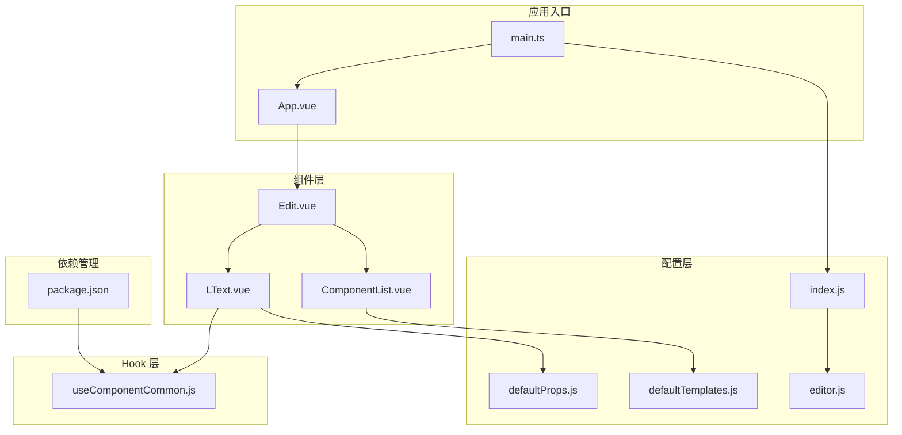
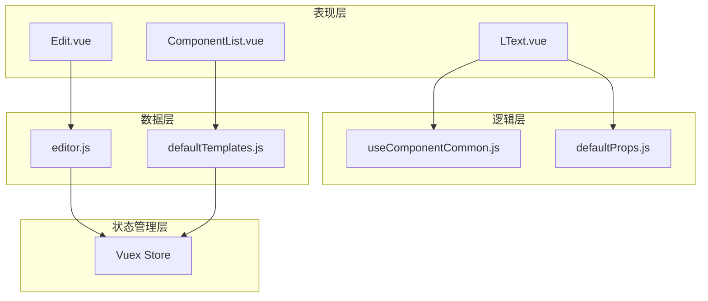
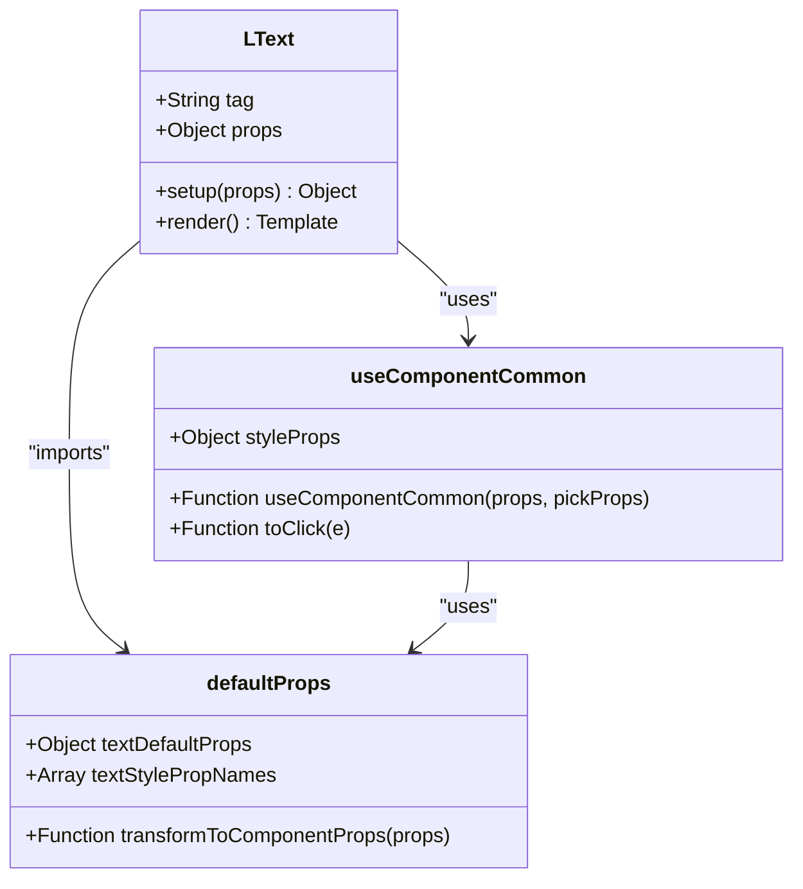
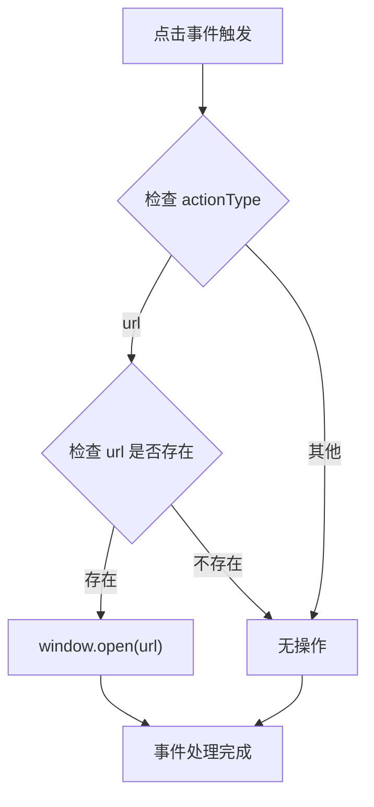
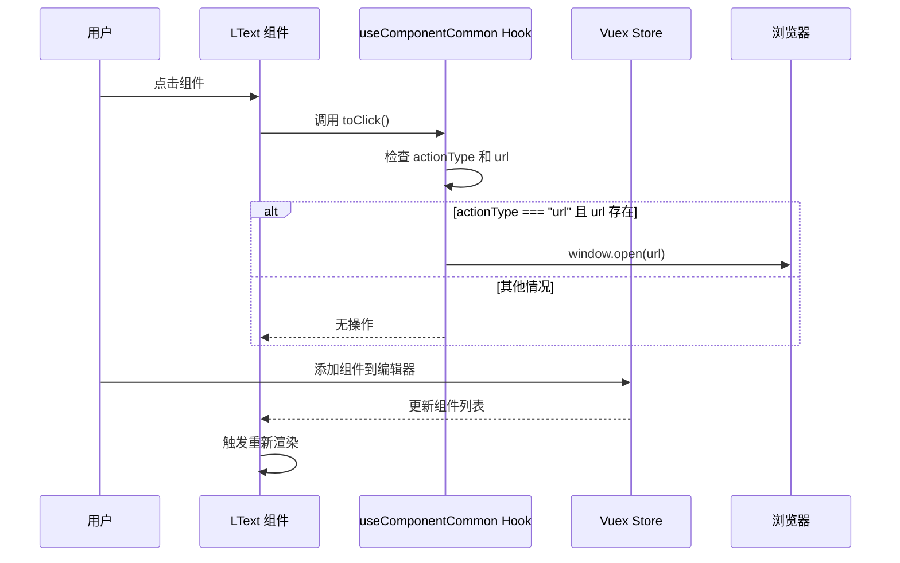
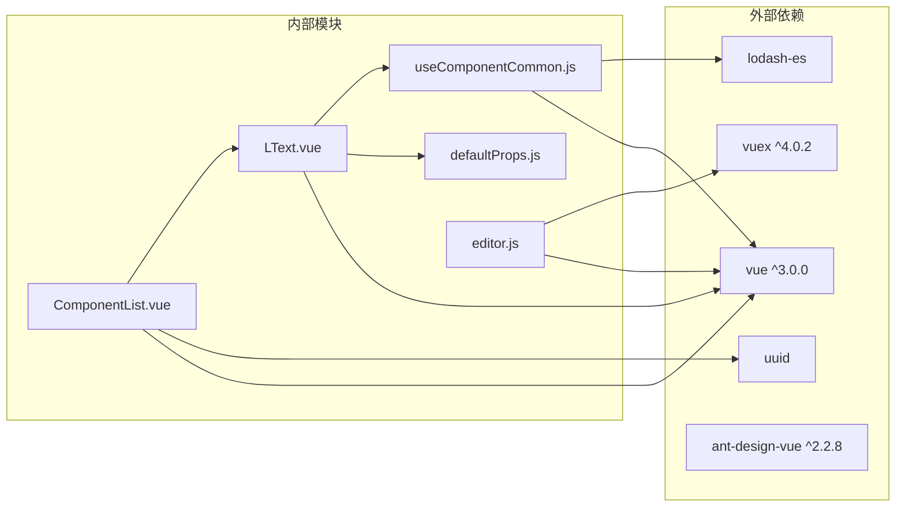

# 组件通用 Hook 系统

<cite>
**本文档引用的文件**
- [useComponentCommon.js](file://src/hooks/useComponentCommon.js)
- [LText.vue](file://src/components/LText.vue)
- [defaultProps.js](file://src/defaultProps.js)
- [ComponentList.vue](file://src/components/ComponentList.vue)
- [Edit.vue](file://src/components/Edit.vue)
- [editor.js](file://src/stores/editor.js)
- [index.js](file://src/stores/index.js)
- [defaultTemplates.js](file://src/defaultTemplates.js)
- [main.ts](file://src/main.ts)
- [App.vue](file://src/App.vue)
- [package.json](file://package.json)
</cite>

## 目录
1. [简介](#简介)
2. [项目结构](#项目结构)
3. [核心组件](#核心组件)
4. [架构概览](#架构概览)
5. [详细组件分析](#详细组件分析)
6. [依赖关系分析](#依赖关系分析)
7. [性能考虑](#性能考虑)
8. [故障排除指南](#故障排除指南)
9. [结论](#结论)
10. [附录](#附录)

## 简介

本项目实现了一个基于 Vue 3 Composition API 的组件通用 Hook 系统，专门用于处理可复用的组件逻辑。该系统的核心是 `useComponentCommon.js` Hook，它提供了统一的样式属性提取和点击事件处理功能，使得不同的组件可以共享相同的基础行为，同时保持各自的特有属性。

该系统采用组合式函数的设计模式，通过参数化的方式实现代码复用，避免了传统继承模式的复杂性，提高了代码的灵活性和可维护性。

## 项目结构

项目采用模块化的组织方式，主要包含以下核心目录和文件：

**图表来源**
- [main.ts:1-8](file://src/main.ts#L1-L8)
- [App.vue:1-23](file://src/App.vue#L1-L23)
- [Edit.vue:1-91](file://src/components/Edit.vue#L1-L91)

**章节来源**
- [package.json:1-25](file://package.json#L1-L25)
- [main.ts:1-8](file://src/main.ts#L1-L8)

## 核心组件

### useComponentCommon Hook 设计

`useComponentCommon.js` 是整个系统的核心，它实现了以下功能：

#### 参数设计
- **props**: 接收组件的所有属性对象
- **pickProps**: 指定需要提取的属性名称数组

#### 返回值结构
- **styleProps**: 计算属性，包含从 props 中提取的样式相关属性
- **toClick**: 处理点击事件的函数，支持根据 actionType 和 url 执行相应操作

#### 实现原理
该 Hook 使用 Vue 的 `computed` 响应式系统来动态提取样式属性，确保当 props 发生变化时，styleProps 会自动更新。点击事件处理逻辑遵循条件判断模式，只有当 actionType 为 "url" 且存在有效 url 时才执行窗口打开操作。

**章节来源**
- [useComponentCommon.js:1-18](file://src/hooks/useComponentCommon.js#L1-L18)

### defaultProps 配置系统

`defaultProps.js` 提供了完整的默认属性配置，包括：

#### 通用属性
- **动作类型**: actionType（空字符串）
- **URL**: url（空字符串）
- **尺寸**: height、width、paddingLeft、paddingRight、paddingTop、paddingBottom
- **边框**: borderStyle、borderColor、borderWidth、borderRadius
- **阴影和透明度**: boxShadow、opacity
- **位置**: position、left、top、right

#### 文本专用属性
- **文本内容**: text（"正文内容"）
- **字体样式**: fontSize、fontFamily、fontWeight、fontStyle、textDecoration、lineHeight、textAlign
- **颜色**: color、backgroundColor

#### 工具函数
- **textStylePropNames**: 通过 `without` 函数排除特定属性后生成的样式属性名数组
- **transformToComponentProps**: 将默认属性转换为 Vue 组件属性定义格式

**章节来源**
- [defaultProps.js:1-57](file://src/defaultProps.js#L1-L57)

## 架构概览

系统采用分层架构设计，各层职责明确：

**图表来源**
- [LText.vue:1-44](file://src/components/LText.vue#L1-L44)
- [useComponentCommon.js:1-18](file://src/hooks/useComponentCommon.js#L1-L18)
- [defaultProps.js:1-57](file://src/defaultProps.js#L1-L57)
- [editor.js:1-52](file://src/stores/editor.js#L1-L52)

## 详细组件分析

### LText 组件分析

LText 组件是通用 Hook 的典型应用实例，展示了如何在实际组件中使用 useComponentCommon Hook。

#### 组件结构

**图表来源**
- [LText.vue:13-34](file://src/components/LText.vue#L13-L34)
- [useComponentCommon.js:4-15](file://src/hooks/useComponentCommon.js#L4-L15)
- [defaultProps.js:49-56](file://src/defaultProps.js#L49-L56)

#### 关键实现细节
1. **属性合并**: LText 组件通过扩展运算符将 defaultProps 合并到组件 props 中
2. **Hook 调用**: 在 setup 函数中调用 useComponentCommon Hook，传入 props 和 textStylePropNames
3. **模板绑定**: 将 styleProps 作为内联样式绑定到组件根元素，toClick 作为点击事件处理器

#### 使用场景
- **文本渲染**: 支持多种 HTML 标签（div、h2、p、button）
- **样式控制**: 通过各种样式属性控制文本外观
- **交互功能**: 支持点击事件和外部链接跳转

**章节来源**
- [LText.vue:1-44](file://src/components/LText.vue#L1-L44)

### 组件通用逻辑提取策略

系统采用了多种策略来提取和复用通用逻辑：

#### 事件处理策略

**图表来源**
- [useComponentCommon.js:6-10](file://src/hooks/useComponentCommon.js#L6-L10)

#### 状态共享策略
- **响应式计算**: 使用 Vue 的 computed 确保样式属性的响应式更新
- **属性选择**: 通过 pickProps 参数精确控制需要提取的属性范围
- **解耦设计**: 将通用逻辑封装在独立的 Hook 中，便于测试和维护

#### 生命周期管理
- **初始化**: 在组件 setup 阶段调用 Hook
- **更新**: 当 props 变化时，computed 属性自动重新计算
- **销毁**: Vue 自动管理内存清理

**章节来源**
- [useComponentCommon.js:4-15](file://src/hooks/useComponentCommon.js#L4-L15)

### 数据流分析

系统中的数据流遵循单向数据流原则：

**图表来源**
- [LText.vue:38-40](file://src/components/LText.vue#L38-L40)
- [useComponentCommon.js:6-10](file://src/hooks/useComponentCommon.js#L6-L10)
- [editor.js:9-44](file://src/stores/editor.js#L9-L44)

**章节来源**
- [LText.vue:37-41](file://src/components/LText.vue#L37-L41)
- [editor.js:1-52](file://src/stores/editor.js#L1-L52)

## 依赖关系分析

系统依赖关系清晰，各模块间耦合度低：

**图表来源**
- [package.json:9-16](file://package.json#L9-L16)
- [useComponentCommon.js:1](file://src/hooks/useComponentCommon.js#L1)
- [LText.vue:8](file://src/components/LText.vue#L8)

### 依赖特点
- **最小依赖**: 仅使用必要的第三方库
- **版本兼容**: Vue 3 和 Vuex 4 的完全兼容
- **工具库**: lodash-es 提供高效的属性操作功能

**章节来源**
- [package.json:1-25](file://package.json#L1-L25)

## 性能考虑

### 响应式优化
- **计算属性缓存**: Vue 的 computed 自动缓存结果，避免重复计算
- **属性选择优化**: 通过 pickProps 精确选择需要的属性，减少不必要的响应式追踪

### 内存管理
- **自动清理**: Vue 3 的响应式系统自动管理内存
- **事件监听**: 组件卸载时自动移除事件监听器

### 渲染性能
- **细粒度更新**: 只有相关的计算属性发生变化时才会触发重新渲染
- **虚拟 DOM 优化**: Vue 3 的编译时优化提升渲染效率

## 故障排除指南

### 常见问题及解决方案

#### Hook 返回值未更新
**问题**: 修改 props 后 styleProps 未更新
**原因**: 可能直接修改了 props 对象而非通过响应式系统
**解决**: 确保通过 Vue 的响应式系统传递和修改 props

#### 点击事件不生效
**问题**: 点击事件没有触发预期行为
**原因**: actionType 或 url 属性设置不正确
**解决**: 检查 actionType 是否为 "url" 且 url 字段是否包含有效 URL

#### 样式属性丢失
**问题**: 组件样式显示异常
**原因**: pickProps 数组中包含了错误的属性名
**解决**: 验证 textStylePropNames 数组是否正确排除了非样式属性

#### 组件渲染问题
**问题**: LText 组件无法正确渲染
**原因**: 组件注册或导入路径错误
**解决**: 检查组件导入路径和注册方式

**章节来源**
- [useComponentCommon.js:4-15](file://src/hooks/useComponentCommon.js#L4-L15)
- [LText.vue:22-33](file://src/components/LText.vue#L22-L33)

## 结论

本组件通用 Hook 系统成功实现了以下目标：

1. **代码复用**: 通过 useComponentCommon Hook 将通用逻辑抽象出来，避免重复代码
2. **灵活扩展**: 支持通过参数化的方式适配不同组件的需求
3. **易于维护**: 清晰的模块划分和职责分离，便于测试和维护
4. **性能优化**: 利用 Vue 3 的响应式系统实现高效的性能表现

该系统为 Vue 3 应用提供了一个优秀的 Hook 设计范例，展示了如何通过组合式函数实现优雅的代码复用和逻辑抽象。

## 附录

### 最佳实践建议

#### Hook 设计原则
- **单一职责**: 每个 Hook 只负责一个特定的功能领域
- **参数化**: 通过参数控制 Hook 的行为，提高灵活性
- **返回值**: 明确返回值结构，便于组件消费
- **类型安全**: 在 TypeScript 项目中为 Hook 添加适当的类型定义

#### 组件集成指南
- **属性传递**: 确保将 Hook 返回的属性正确传递给组件模板
- **事件处理**: 在组件模板中正确绑定 Hook 返回的事件处理器
- **样式应用**: 将 styleProps 作为内联样式应用到组件根元素

#### 扩展开发建议
- **命名规范**: 使用 use 前缀命名 Hook，遵循 Vue 3 的命名约定
- **文档编写**: 为每个 Hook 编写详细的使用文档和示例
- **单元测试**: 为 Hook 编写单元测试，确保功能的正确性
- **错误处理**: 在 Hook 中添加适当的错误处理和边界条件检查