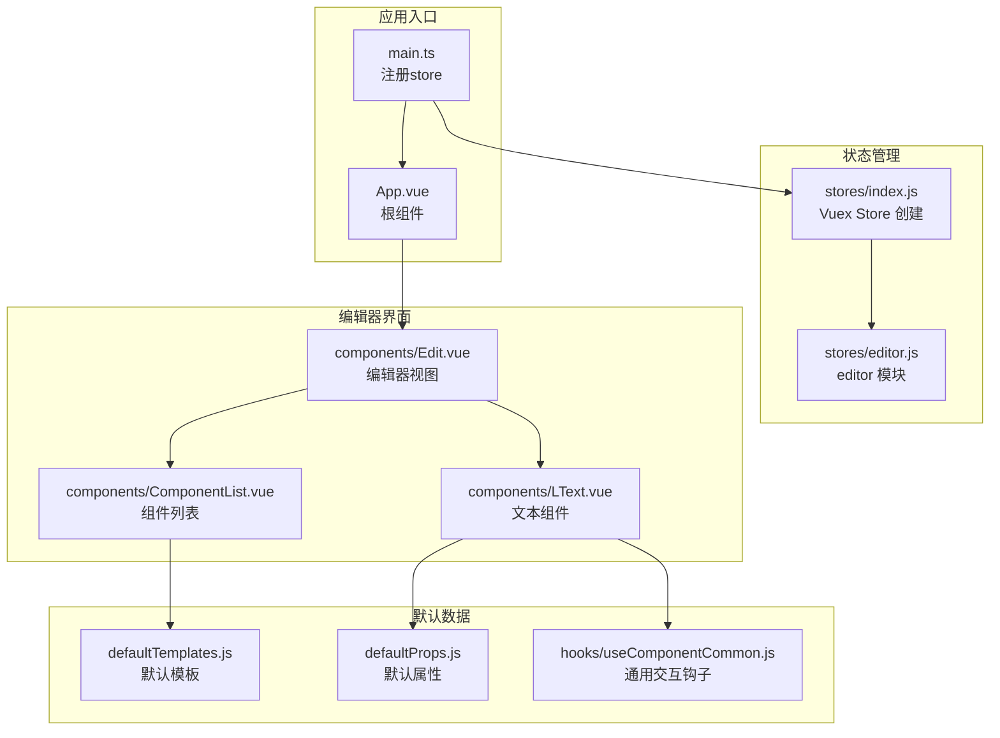
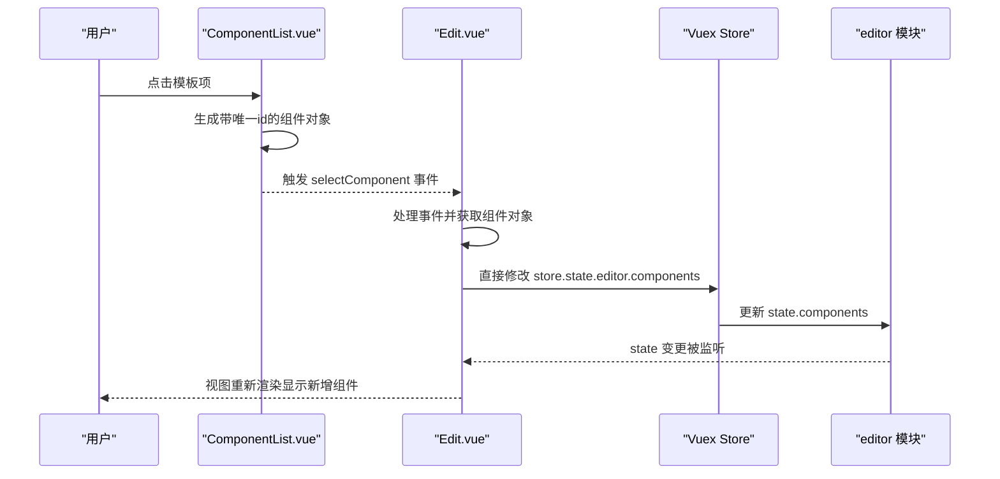
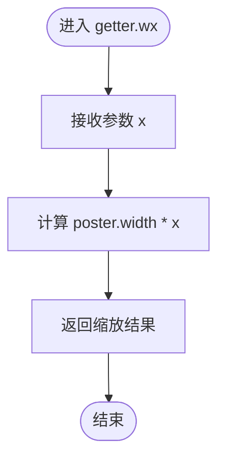
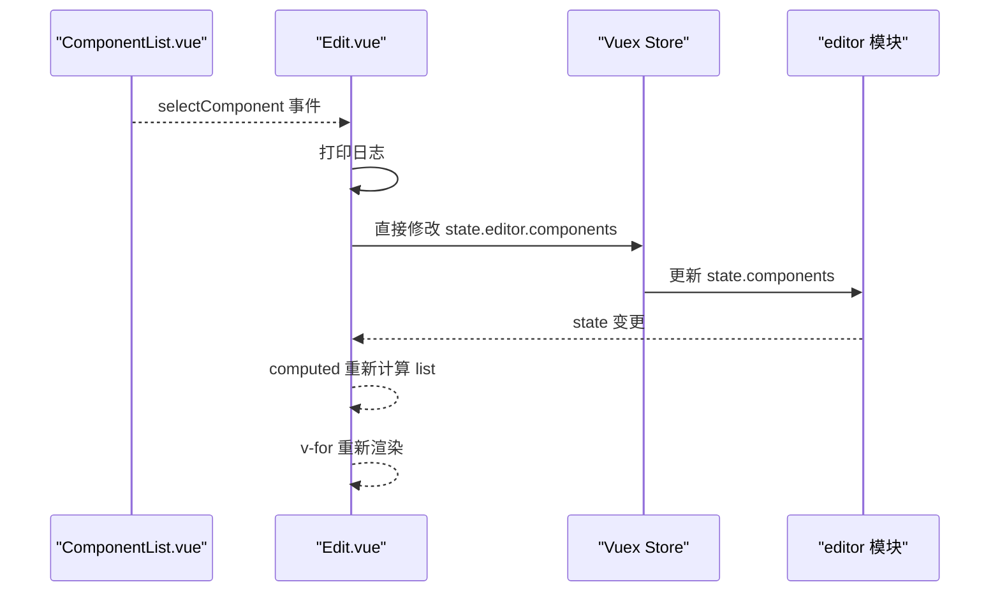
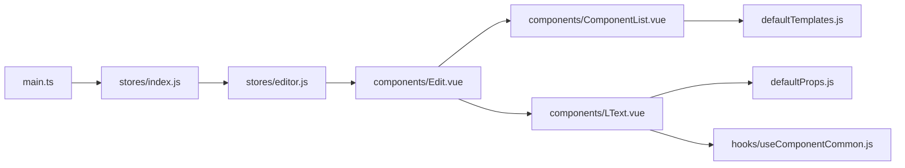

# 编辑器状态模块

<cite>
**本文档引用的文件**
- [editor.js](file://src/stores/editor.js)
- [index.js](file://src/stores/index.js)
- [Edit.vue](file://src/components/Edit.vue)
- [App.vue](file://src/App.vue)
- [ComponentList.vue](file://src/components/ComponentList.vue)
- [LText.vue](file://src/components/LText.vue)
- [defaultTemplates.js](file://src/defaultTemplates.js)
- [defaultProps.js](file://src/defaultProps.js)
- [useComponentCommon.js](file://src/hooks/useComponentCommon.js)
- [main.ts](file://src/main.ts)
</cite>

## 目录
1. [简介](#简介)
2. [项目结构](#项目结构)
3. [核心组件](#核心组件)
4. [架构总览](#架构总览)
5. [详细组件分析](#详细组件分析)
6. [依赖关系分析](#依赖关系分析)
7. [性能考虑](#性能考虑)
8. [故障排除指南](#故障排除指南)
9. [结论](#结论)

## 简介
本文件聚焦于编辑器状态模块的综合文档，重点分析 src/stores/editor.js 模块的完整实现，涵盖 state、mutations、actions 和 getters 的设计与职责边界。同时，结合 Edit.vue 组件与默认模板系统，深入解释海报状态管理的核心逻辑：海报对象的结构定义、组件数组的管理机制以及状态更新的触发条件。文档还阐述 mutations 的原子性操作设计、actions 的异步处理模式（当前实现为同步）、以及 getters 的计算属性实现方式。最后，通过状态流转图和数据变更示例，展示从用户操作到状态更新的完整流程。

## 项目结构
编辑器状态模块位于 src/stores/editor.js，采用 Vuex 模块化设计，通过 src/stores/index.js 注册为全局 store。编辑器界面由 Edit.vue 负责渲染，组件列表来自 defaultTemplates.js，具体组件如 LText.vue 由 Edit.vue 动态渲染。main.ts 将 store 注入到 Vue 应用中。

图表来源
- [main.ts:1-9](file://src/main.ts#L1-L9)
- [index.js:1-11](file://src/stores/index.js#L1-L11)
- [editor.js:1-52](file://src/stores/editor.js#L1-L52)
- [Edit.vue:1-91](file://src/components/Edit.vue#L1-L91)
- [ComponentList.vue:1-55](file://src/components/ComponentList.vue#L1-L55)
- [LText.vue:1-44](file://src/components/LText.vue#L1-L44)
- [defaultTemplates.js:1-41](file://src/defaultTemplates.js#L1-L41)
- [defaultProps.js:1-57](file://src/defaultProps.js#L1-L57)
- [useComponentCommon.js:1-18](file://src/hooks/useComponentCommon.js#L1-L18)

章节来源
- [main.ts:1-9](file://src/main.ts#L1-L9)
- [index.js:1-11](file://src/stores/index.js#L1-L11)
- [editor.js:1-52](file://src/stores/editor.js#L1-L52)
- [Edit.vue:1-91](file://src/components/Edit.vue#L1-L91)
- [ComponentList.vue:1-55](file://src/components/ComponentList.vue#L1-L55)
- [LText.vue:1-44](file://src/components/LText.vue#L1-L44)
- [defaultTemplates.js:1-41](file://src/defaultTemplates.js#L1-L41)
- [defaultProps.js:1-57](file://src/defaultProps.js#L1-L57)
- [useComponentCommon.js:1-18](file://src/hooks/useComponentCommon.js#L1-L18)

## 核心组件
- editor 模块（src/stores/editor.js）
  - state：定义海报对象 poster（包含宽高、背景色、元素数组）和组件数组 components（初始包含多个 LText 组件实例）
  - getters：提供 wx 计算函数，用于将传入的数值按 poster.width 进行缩放
  - mutations/actions：当前未实现，仅保留占位结构
- Edit.vue（src/components/Edit.vue）
  - 使用 computed 读取 store.state.editor.components
  - 在 selectComponent 中直接向 store.state.editor.components 推入新组件项
- ComponentList.vue（src/components/ComponentList.vue）
  - 接收模板列表，点击时生成带唯一 id 的组件对象并向上抛出事件
- 默认模板与组件
  - defaultTemplates.js 提供多种文本模板
  - LText.vue 基于 defaultProps.js 的默认属性进行渲染，并通过 useComponentCommon.js 提供点击跳转等交互

章节来源
- [editor.js:1-52](file://src/stores/editor.js#L1-L52)
- [Edit.vue:39-56](file://src/components/Edit.vue#L39-L56)
- [ComponentList.vue:17-28](file://src/components/ComponentList.vue#L17-L28)
- [defaultTemplates.js:1-41](file://src/defaultTemplates.js#L1-L41)
- [LText.vue:11-34](file://src/components/LText.vue#L11-L34)
- [defaultProps.js:27-57](file://src/defaultProps.js#L27-L57)
- [useComponentCommon.js:4-15](file://src/hooks/useComponentCommon.js#L4-L15)

## 架构总览
编辑器状态模块采用“单模块多状态”的设计：
- poster 对象作为画布元信息载体，包含尺寸与背景等基础属性
- components 数组承载所有可渲染的组件实例，每个实例包含 id、name、props 等字段
- Edit.vue 通过 computed 监听组件数组变化，实现响应式渲染
- ComponentList.vue 作为模板选择器，负责生成标准化的组件对象并触发事件

图表来源
- [ComponentList.vue:17-28](file://src/components/ComponentList.vue#L17-L28)
- [Edit.vue:42-56](file://src/components/Edit.vue#L42-L56)
- [editor.js:2-45](file://src/stores/editor.js#L2-L45)

## 详细组件分析

### editor 模块状态设计
- poster 结构
  - 字段：width、height、background、elements
  - 用途：描述画布尺寸、背景色及元素集合
- components 数组
  - 初始包含多个 LText 实例，每个实例包含 id、name、props
  - props 示例：text、fontSize、top、color、actionType、url 等
- getters.wx
  - 输入参数：x（数值）
  - 返回值：基于 poster.width 的缩放结果
  - 作用：将相对单位转换为绝对像素值，便于布局计算

图表来源
- [editor.js:46-48](file://src/stores/editor.js#L46-L48)

章节来源
- [editor.js:2-49](file://src/stores/editor.js#L2-L49)

### Edit.vue 组件与状态联动
- 数据绑定
  - list = computed(() => store.state.editor.components)
  - v-for 渲染 components 数组中的每个组件实例
- 事件处理
  - selectComponent(item)：打印日志后直接 push 新组件到 store.state.editor.components
  - 此处存在直接修改 state 的风险，建议改为通过 mutation 或 action 进行规范化更新

图表来源
- [Edit.vue:42-56](file://src/components/Edit.vue#L42-L56)
- [editor.js:2-45](file://src/stores/editor.js#L2-L45)

章节来源
- [Edit.vue:39-56](file://src/components/Edit.vue#L39-L56)

### ComponentList.vue 模板选择器
- 接收模板数组作为 props
- 点击模板项时生成带唯一 id 的组件对象（name 统一为 "l-text"），并触发 selectComponent 事件
- 该组件负责将模板数据标准化为可注入 store 的组件实例

章节来源
- [ComponentList.vue:17-28](file://src/components/ComponentList.vue#L17-L28)

### LText.vue 组件与默认属性
- 基于 defaultProps.js 的 textDefaultProps 生成组件 props 定义
- 通过 useComponentCommon.js 提取样式相关 props 并提供点击行为（当 actionType 为 url 且存在 url 时打开链接）

章节来源
- [LText.vue:11-34](file://src/components/LText.vue#L11-L34)
- [defaultProps.js:27-57](file://src/defaultProps.js#L27-L57)
- [useComponentCommon.js:4-15](file://src/hooks/useComponentCommon.js#L4-L15)

### 默认模板系统
- defaultTemplates.js 提供多种文本模板（标题、正文、链接、按钮等），包含基础样式与定位属性
- ComponentList.vue 将模板映射为组件实例，交由 Edit.vue 注入到 state 中

章节来源
- [defaultTemplates.js:1-41](file://src/defaultTemplates.js#L1-L41)
- [ComponentList.vue:17-28](file://src/components/ComponentList.vue#L17-L28)

## 依赖关系分析
- main.ts 依赖 src/stores/index.js 创建并注入 Vuex Store
- src/stores/index.js 依赖 src/stores/editor.js 注册 editor 模块
- Edit.vue 依赖 useStore 读取 editor 模块的状态
- ComponentList.vue 依赖 defaultTemplates.js 提供模板数据
- LText.vue 依赖 defaultProps.js 与 useComponentCommon.js 提供默认属性与交互

图表来源
- [main.ts:1-9](file://src/main.ts#L1-L9)
- [index.js:1-11](file://src/stores/index.js#L1-L11)
- [editor.js:1-52](file://src/stores/editor.js#L1-L52)
- [Edit.vue:23-56](file://src/components/Edit.vue#L23-L56)
- [ComponentList.vue:1-29](file://src/components/ComponentList.vue#L1-L29)
- [LText.vue:1-34](file://src/components/LText.vue#L1-L34)
- [defaultProps.js:1-57](file://src/defaultProps.js#L1-L57)
- [useComponentCommon.js:1-18](file://src/hooks/useComponentCommon.js#L1-L18)

章节来源
- [main.ts:1-9](file://src/main.ts#L1-L9)
- [index.js:1-11](file://src/stores/index.js#L1-L11)
- [editor.js:1-52](file://src/stores/editor.js#L1-L52)
- [Edit.vue:23-56](file://src/components/Edit.vue#L23-L56)
- [ComponentList.vue:1-29](file://src/components/ComponentList.vue#L1-L29)
- [LText.vue:1-34](file://src/components/LText.vue#L1-L34)
- [defaultProps.js:1-57](file://src/defaultProps.js#L1-L57)
- [useComponentCommon.js:1-18](file://src/hooks/useComponentCommon.js#L1-L18)

## 性能考虑
- 直接修改 state 的风险
  - Edit.vue 中直接 push 到 store.state.editor.components 可能绕过响应式追踪，导致难以调试的状态变更路径
  - 建议通过 mutation 或 action 进行规范化更新，确保变更可追踪、可测试
- 计算属性优化
  - Edit.vue 使用 computed 监听 components 数组，避免不必要的重渲染
  - getters.wx 为纯函数计算，开销极低
- 组件渲染
  - v-for 通过 key（id）进行高效 diff，建议保持 id 唯一性以提升渲染性能

## 故障排除指南
- 症状：点击模板无反应或组件未出现在画布上
  - 检查 Edit.vue 是否正确接收并处理 selectComponent 事件
  - 确认 store.state.editor.components 是否被 push 成功
- 症状：组件样式异常或点击无效
  - 检查 LText.vue 的 props 是否正确继承 defaultProps.js 的默认值
  - 确认 useComponentCommon.js 是否正确提取样式属性并绑定点击事件
- 症状：布局比例不正确
  - 使用 getters.wx 将相对单位转换为绝对像素值，确保布局一致性

章节来源
- [Edit.vue:42-56](file://src/components/Edit.vue#L42-L56)
- [LText.vue:22-34](file://src/components/LText.vue#L22-L34)
- [defaultProps.js:27-57](file://src/defaultProps.js#L27-L57)
- [useComponentCommon.js:4-15](file://src/hooks/useComponentCommon.js#L4-L15)
- [editor.js:46-48](file://src/stores/editor.js#L46-L48)

## 结论
编辑器状态模块目前实现了基础的海报画布与组件数组管理，通过 Vuex 单模块设计简化了状态结构。state.poster 提供画布元信息，state.components 承载可渲染组件实例；getter.wx 为布局计算提供辅助。Edit.vue 通过 computed 与事件驱动完成组件注入，但存在直接修改 state 的实践风险。建议后续补充 mutations 与 actions，规范状态变更路径，增强可维护性与可观测性。同时，可扩展 poster.elements 以支持更丰富的元素管理与序列化能力。