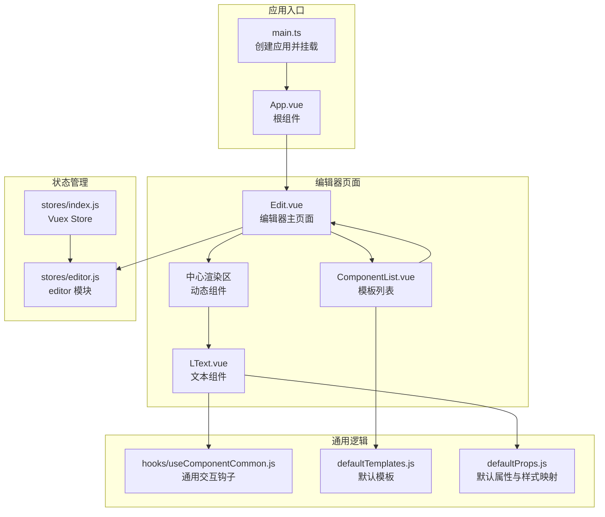
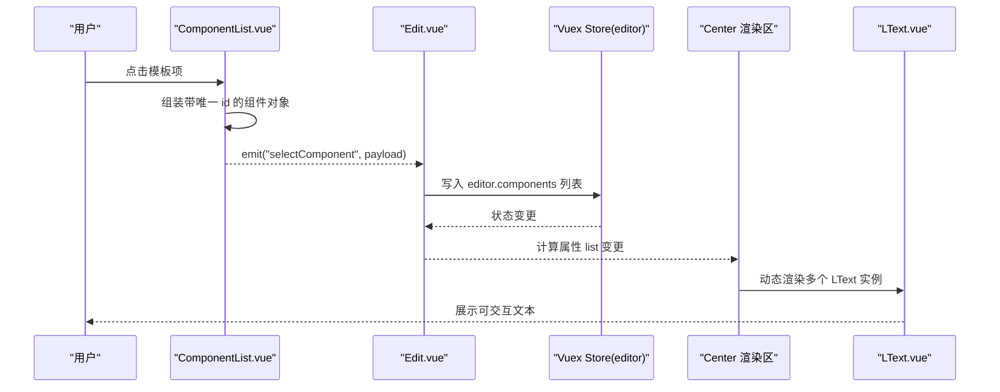
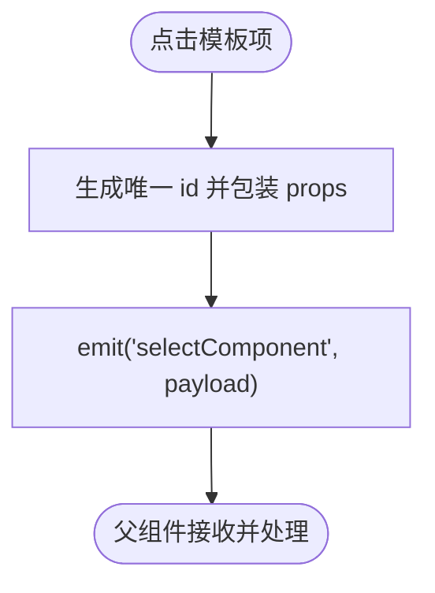
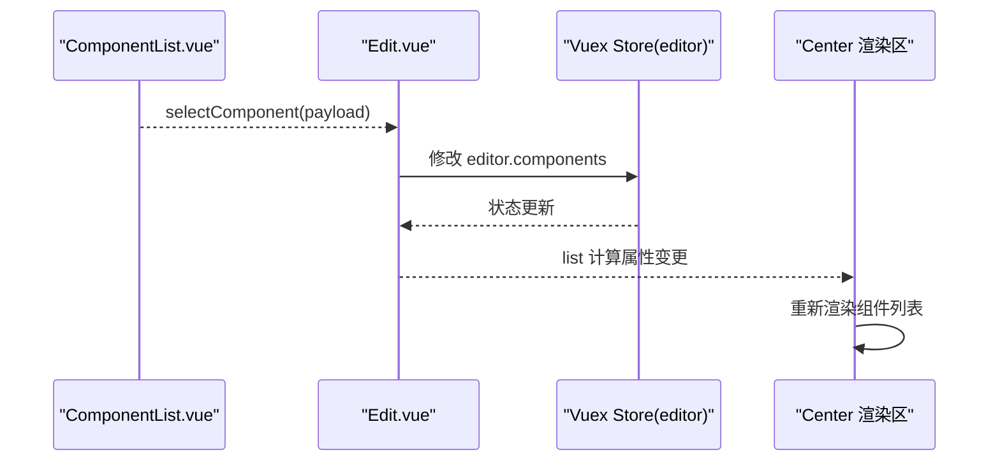
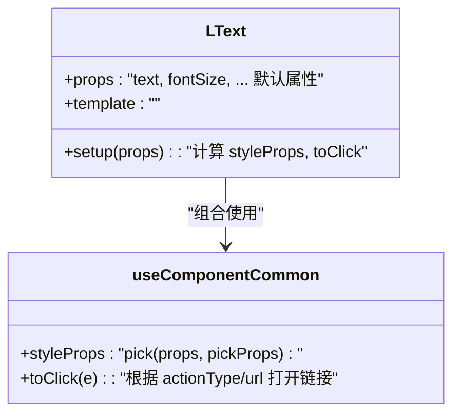
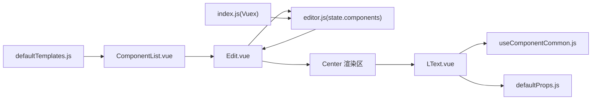

# 用户交互与事件处理

<cite>
**本文引用的文件**
- [App.vue](file://src/App.vue)
- [Edit.vue](file://src/components/Edit.vue)
- [ComponentList.vue](file://src/components/ComponentList.vue)
- [LText.vue](file://src/components/LText.vue)
- [useComponentCommon.js](file://src/hooks/useComponentCommon.js)
- [defaultProps.js](file://src/defaultProps.js)
- [defaultTemplates.js](file://src/defaultTemplates.js)
- [editor.js](file://src/stores/editor.js)
- [index.js](file://src/stores/index.js)
- [main.ts](file://src/main.ts)
</cite>

## 目录
1. [简介](#简介)
2. [项目结构](#项目结构)
3. [核心组件](#核心组件)
4. [架构总览](#架构总览)
5. [详细组件分析](#详细组件分析)
6. [依赖关系分析](#依赖关系分析)
7. [性能考虑](#性能考虑)
8. [故障排查指南](#故障排查指南)
9. [结论](#结论)
10. [附录](#附录)

## 简介
本文件聚焦 wy_poster 项目中的“用户交互与事件处理”主题，系统梳理从用户点击到状态更新再到界面渲染的完整生命周期；深入解析组件间事件通信机制（尤其是 selectComponent 事件的触发与处理流程）；总结事件处理最佳实践、性能优化策略与错误处理机制；并提供可操作的调试技巧与用户体验优化建议，帮助开发者理解与扩展交互功能。

## 项目结构
项目采用基于组件的组织方式，核心交互围绕编辑器页面展开：顶部为标题栏，左右两侧为工具面板与预览区域，中间为动态组件渲染区。事件流自左侧面板的模板项点击开始，通过子向父事件传递，最终写入全局状态并驱动视图更新。

图表来源
- [main.ts:1-9](file://src/main.ts#L1-L9)
- [App.vue:1-24](file://src/App.vue#L1-L24)
- [Edit.vue:1-91](file://src/components/Edit.vue#L1-L91)
- [ComponentList.vue:1-55](file://src/components/ComponentList.vue#L1-L55)
- [LText.vue:1-44](file://src/components/LText.vue#L1-L44)
- [index.js:1-11](file://src/stores/index.js#L1-L11)
- [editor.js:1-52](file://src/stores/editor.js#L1-L52)
- [useComponentCommon.js:1-18](file://src/hooks/useComponentCommon.js#L1-L18)
- [defaultTemplates.js:1-41](file://src/defaultTemplates.js#L1-L41)
- [defaultProps.js:1-57](file://src/defaultProps.js#L1-L57)

章节来源
- [main.ts:1-9](file://src/main.ts#L1-L9)
- [App.vue:1-24](file://src/App.vue#L1-L24)
- [Edit.vue:1-91](file://src/components/Edit.vue#L1-L91)
- [ComponentList.vue:1-55](file://src/components/ComponentList.vue#L1-L55)
- [LText.vue:1-44](file://src/components/LText.vue#L1-L44)
- [index.js:1-11](file://src/stores/index.js#L1-L11)
- [editor.js:1-52](file://src/stores/editor.js#L1-L52)
- [useComponentCommon.js:1-18](file://src/hooks/useComponentCommon.js#L1-L18)
- [defaultTemplates.js:1-41](file://src/defaultTemplates.js#L1-L41)
- [defaultProps.js:1-57](file://src/defaultProps.js#L1-L57)

## 核心组件
- 编辑器主页面：负责聚合左侧模板列表、中间动态渲染区与全局状态联动。
- 模板列表：展示默认模板，处理点击事件并向父组件广播 selectComponent 事件。
- 文本组件：封装通用交互逻辑（如点击跳转），并按需绑定样式属性。
- 通用交互钩子：抽取点击行为与样式计算，复用到各组件。
- 状态模块：集中维护画布尺寸、背景、元素集合等状态，供编辑器读取与更新。

章节来源
- [Edit.vue:30-56](file://src/components/Edit.vue#L30-L56)
- [ComponentList.vue:6-29](file://src/components/ComponentList.vue#L6-L29)
- [LText.vue:13-34](file://src/components/LText.vue#L13-L34)
- [useComponentCommon.js:4-15](file://src/hooks/useComponentCommon.js#L4-L15)
- [editor.js:1-52](file://src/stores/editor.js#L1-L52)

## 架构总览
整体采用“组件事件向上冒泡 + 全局状态驱动”的模式：
- 左侧模板项点击 -> 触发子组件 emit -> 父组件接收并写入全局状态 -> 计算属性响应式更新 -> 动态组件重新渲染。

图表来源
- [ComponentList.vue:17-24](file://src/components/ComponentList.vue#L17-L24)
- [Edit.vue:44-49](file://src/components/Edit.vue#L44-L49)
- [editor.js:9-44](file://src/stores/editor.js#L9-L44)
- [Edit.vue:42](file://src/components/Edit.vue#L42)

## 详细组件分析

### 组件 A：模板列表（ComponentList.vue）
- 职责：展示默认模板，处理点击事件，组装带唯一 id 的组件对象并通过事件向上抛出。
- 关键点：
  - 使用 emits 声明事件名，确保父子通信契约清晰。
  - 在点击时生成唯一 id 并将模板 props 包装为组件实例传给父组件。
  - 通过 v-for 遍历模板数组，每个条目绑定 click 事件。

图表来源
- [ComponentList.vue:17-24](file://src/components/ComponentList.vue#L17-L24)

章节来源
- [ComponentList.vue:6-29](file://src/components/ComponentList.vue#L6-L29)
- [ComponentList.vue:32-43](file://src/components/ComponentList.vue#L32-L43)

### 组件 B：编辑器主页面（Edit.vue）
- 职责：接收模板选择事件，写入全局状态，驱动动态渲染区更新。
- 关键点：
  - 通过 useStore 获取 Vuex 实例，使用计算属性读取 editor.components。
  - 定义 selectComponent 处理函数，将模板项追加到组件列表中。
  - 动态渲染区使用 v-for 遍历组件列表，以组件 name 作为动态标签进行渲染。

图表来源
- [Edit.vue:39-55](file://src/components/Edit.vue#L39-L55)
- [Edit.vue:42](file://src/components/Edit.vue#L42)
- [Edit.vue:44-49](file://src/components/Edit.vue#L44-L49)

章节来源
- [Edit.vue:30-56](file://src/components/Edit.vue#L30-L56)
- [Edit.vue:11-18](file://src/components/Edit.vue#L11-L18)

### 组件 C：文本组件（LText.vue）
- 职责：承载文本渲染与通用交互逻辑，按需绑定样式属性。
- 关键点：
  - 通过 useComponentCommon 注入样式计算与点击处理。
  - 使用动态标签（tag）支持多种 HTML 元素。
  - 通过 defaultProps 将默认值转换为组件 props 的类型与默认值定义。

图表来源
- [LText.vue:13-34](file://src/components/LText.vue#L13-L34)
- [useComponentCommon.js:4-15](file://src/hooks/useComponentCommon.js#L4-L15)

章节来源
- [LText.vue:13-34](file://src/components/LText.vue#L13-L34)
- [defaultProps.js:49-56](file://src/defaultProps.js#L49-L56)

### 通用交互钩子（useComponentCommon.js）
- 职责：抽取组件通用交互能力，统一处理点击跳转与样式属性提取。
- 关键点：
  - 使用 pick 从 props 中筛选样式相关字段，避免将非样式属性混入内联样式。
  - toClick 根据 actionType 与 url 判断是否打开外部链接。

章节来源
- [useComponentCommon.js:4-15](file://src/hooks/useComponentCommon.js#L4-L15)

### 默认模板与默认属性（defaultTemplates.js, defaultProps.js）
- 职责：提供可直接使用的模板数据与组件默认属性定义。
- 关键点：
  - defaultTemplates 提供多类文本模板（标题、正文、链接、按钮）。
  - defaultProps 定义通用与文本类默认属性及样式字段名集合，transformToComponentProps 将默认值映射为组件 props 的类型与默认值描述。

章节来源
- [defaultTemplates.js:1-41](file://src/defaultTemplates.js#L1-L41)
- [defaultProps.js:27-47](file://src/defaultProps.js#L27-L47)
- [defaultProps.js:49-56](file://src/defaultProps.js#L49-L56)

### 状态模块（editor.js, index.js）
- 职责：集中管理编辑器状态，包括画布尺寸、背景与组件列表。
- 关键点：
  - index.js 创建 Vuex Store 并注册 editor 模块。
  - editor.js 定义 state、getters，其中 state.components 即为动态渲染的核心数据源。

章节来源
- [index.js:1-11](file://src/stores/index.js#L1-L11)
- [editor.js:1-52](file://src/stores/editor.js#L1-L52)

## 依赖关系分析
- 组件依赖：Edit.vue 依赖 ComponentList.vue 与 LText.vue；LText.vue 依赖 useComponentCommon.js 与 defaultProps.js。
- 状态依赖：Edit.vue 通过 useStore 读取 editor 模块状态；editor 模块由 index.js 注册。
- 数据流向：模板数据来自 defaultTemplates.js，经 ComponentList.vue 包装后进入 Vuex，再由 Edit.vue 计算属性驱动渲染。

图表来源
- [defaultTemplates.js:1-41](file://src/defaultTemplates.js#L1-L41)
- [ComponentList.vue:17-24](file://src/components/ComponentList.vue#L17-L24)
- [Edit.vue:42](file://src/components/Edit.vue#L42)
- [editor.js:9-44](file://src/stores/editor.js#L9-L44)
- [index.js:1-11](file://src/stores/index.js#L1-L11)
- [LText.vue:24-27](file://src/components/LText.vue#L24-L27)
- [useComponentCommon.js:4-15](file://src/hooks/useComponentCommon.js#L4-L15)
- [defaultProps.js:49-56](file://src/defaultProps.js#L49-L56)

章节来源
- [Edit.vue:24-55](file://src/components/Edit.vue#L24-L55)
- [ComponentList.vue:17-24](file://src/components/ComponentList.vue#L17-L24)
- [LText.vue:24-27](file://src/components/LText.vue#L24-L27)
- [index.js:1-11](file://src/stores/index.js#L1-L11)
- [editor.js:1-52](file://src/stores/editor.js#L1-L52)

## 性能考虑
- 响应式更新粒度
  - 当前通过修改数组引用（直接 push）触发响应式更新，简单直接但可能引发全量重渲染。建议在需要时使用更细粒度的状态更新策略或使用不可变数据结构以减少不必要的重渲染。
- 渲染优化
  - 动态组件渲染区使用 v-for + key（组件 id）进行渲染，有助于稳定 DOM 结构与局部更新。若组件数量较多，可考虑虚拟滚动或分页加载。
- 事件处理
  - 子组件仅在点击时 emit 事件，父组件集中处理状态写入，避免在子组件中做复杂状态变更，降低耦合度。
- 样式计算
  - 使用 computed 从 props 中挑选样式字段，避免每次渲染都重复计算，提升渲染效率。
- 状态访问
  - 通过计算属性读取 store.state.editor.components，确保响应式订阅最小化，避免在模板中直接深层访问 store。

章节来源
- [Edit.vue:42](file://src/components/Edit.vue#L42)
- [Edit.vue:44-49](file://src/components/Edit.vue#L44-L49)
- [useComponentCommon.js:4-15](file://src/hooks/useComponentCommon.js#L4-L15)

## 故障排查指南
- 事件未触发
  - 检查子组件是否正确声明 emits 并调用 emit；确认父组件是否监听对应事件名。
  - 参考路径：[ComponentList.vue:17-24](file://src/components/ComponentList.vue#L17-L24)
- 状态未更新
  - 确认父组件是否正确写入 store.state.editor.components；检查 store 是否已注册。
  - 参考路径：[Edit.vue:44-49](file://src/components/Edit.vue#L44-L49)，[index.js:1-11](file://src/stores/index.js#L1-L11)
- 组件不显示
  - 检查动态渲染区的 v-bind 与 :is 绑定是否正确；确认组件 name 与 props 是否匹配。
  - 参考路径：[Edit.vue:12-14](file://src/components/Edit.vue#L12-L14)，[LText.vue:38-40](file://src/components/LText.vue#L38-L40)
- 点击无反应
  - 检查 LText.vue 的 @click 绑定与 useComponentCommon 的 toClick 实现；确认 actionType 与 url 条件满足。
  - 参考路径：[LText.vue:38](file://src/components/LText.vue#L38)，[useComponentCommon.js:6-10](file://src/hooks/useComponentCommon.js#L6-L10)
- 样式异常
  - 检查 defaultProps 中样式字段是否被 pick 正确提取；确认样式属性拼接是否合理。
  - 参考路径：[defaultProps.js:42-47](file://src/defaultProps.js#L42-L47)，[useComponentCommon.js:5](file://src/hooks/useComponentCommon.js#L5)

## 结论
本项目通过“子组件事件 + 父组件状态写入 + 计算属性驱动渲染”的模式，实现了简洁高效的用户交互链路。selectComponent 事件作为关键纽带，串联了模板选择、状态更新与动态渲染。建议在后续迭代中关注渲染性能与状态更新粒度，进一步提升交互体验与可维护性。

## 附录

### 事件处理最佳实践
- 明确事件契约：子组件通过 emits 声明事件名，父组件严格监听，避免命名歧义。
- 最小化状态写入：在父组件集中处理状态变更，避免在子组件中直接修改全局状态。
- 合理使用计算属性：将派生数据放入计算属性，减少模板中的复杂表达式。
- 保持 props 纯净：通过钩子或工具函数处理交互逻辑，避免将交互逻辑散落在组件模板中。

### 用户操作反馈设计原则
- 即时反馈：点击后立即有视觉或状态变化提示。
- 可撤销性：对于破坏性操作提供撤销或恢复机制。
- 一致性：同一类操作在不同组件中保持一致的交互与反馈。

### 调试技巧
- 使用浏览器控制台观察事件日志：在关键节点打印 payload 与状态快照。
- 分步验证：先验证事件是否到达父组件，再验证状态是否写入，最后验证渲染是否更新。
- 使用 Vue DevTools：查看组件树、状态变更与响应式数据流。