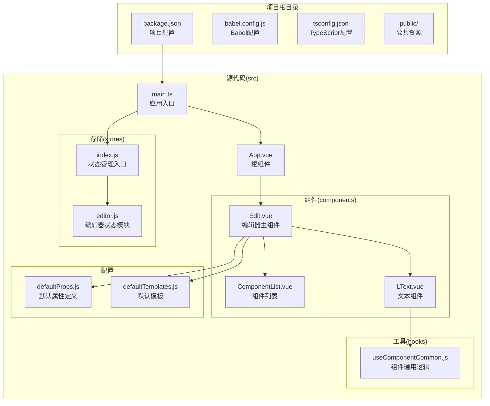
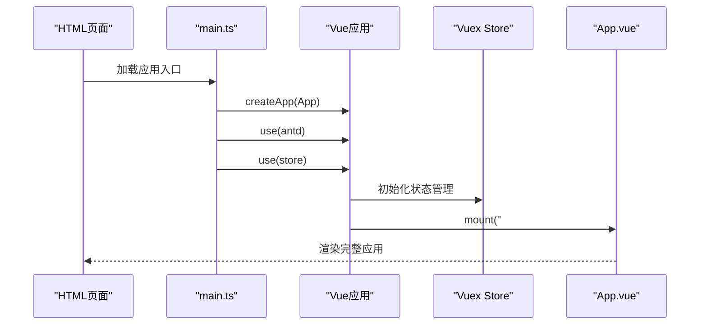
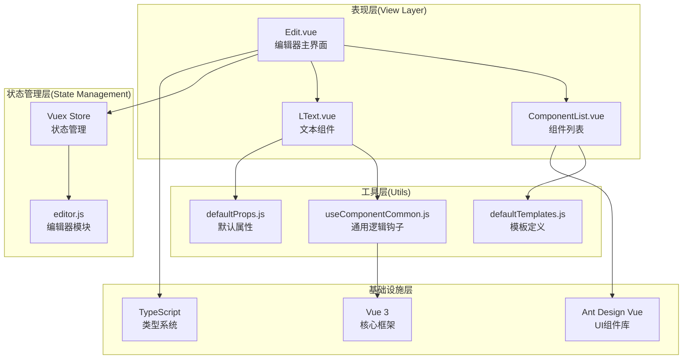
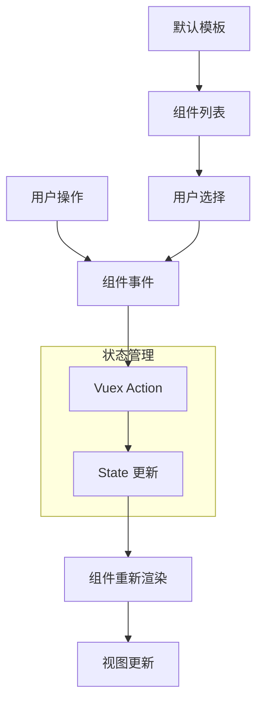
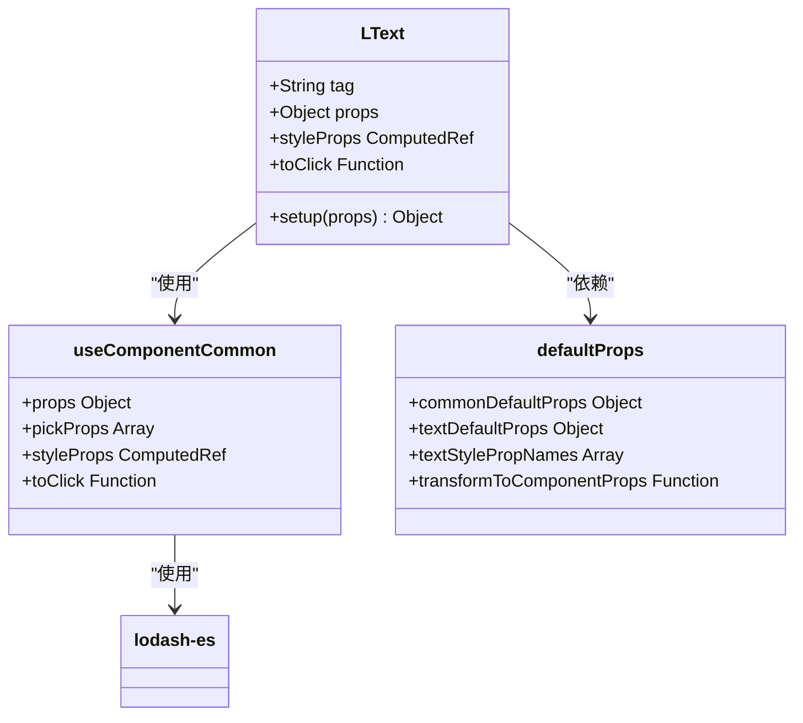
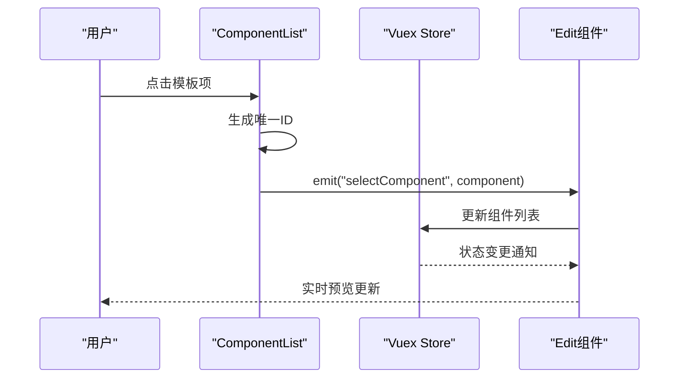
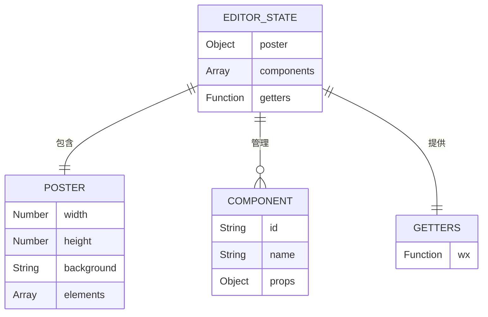

# 项目概述

<cite>
**本文档引用的文件**
- [package.json](file://package.json)
- [main.ts](file://src/main.ts)
- [App.vue](file://src/App.vue)
- [index.js](file://src/stores/index.js)
- [editor.js](file://src/stores/editor.js)
- [Edit.vue](file://src/components/Edit.vue)
- [ComponentList.vue](file://src/components/ComponentList.vue)
- [LText.vue](file://src/components/LText.vue)
- [defaultProps.js](file://src/defaultProps.js)
- [defaultTemplates.js](file://src/defaultTemplates.js)
- [useComponentCommon.js](file://src/hooks/useComponentCommon.js)
- [babel.config.js](file://babel.config.js)
- [tsconfig.json](file://tsconfig.json)
- [index.html](file://public/index.html)
</cite>

## 目录
1. [项目简介](#项目简介)
2. [项目结构](#项目结构)
3. [核心组件](#核心组件)
4. [架构总览](#架构总览)
5. [详细组件分析](#详细组件分析)
6. [依赖关系分析](#依赖关系分析)
7. [性能考虑](#性能考虑)
8. [故障排除指南](#故障排除指南)
9. [结论](#结论)

## 项目简介

wy_poster 是一个基于 Vue 3 的可视化海报编辑器，专注于提供直观的拖拽式组件操作和实时预览体验。该项目采用现代化前端技术栈，结合 Vue 3 的 Composition API 和 Vuex 状态管理，构建了一个功能完整的海报设计工具。

### 核心目标与特性

**可视化编辑体验**
- 支持拖拽式组件操作，用户可以通过点击模板快速添加元素
- 实时预览功能，所见即所得的设计体验
- 响应式布局设计，适配不同屏幕尺寸

**组件化架构**
- 基于 Vue 3 组件系统，实现高度可复用的 UI 组件
- 支持多种文本组件变体，包括普通文本、链接、按钮等
- 统一的样式属性管理系统，简化组件配置

**现代技术栈**
- Vue 3 + TypeScript 提供类型安全和现代化开发体验
- Ant Design Vue 提供丰富的 UI 组件库
- Vuex 状态管理确保数据流的一致性

### 设计理念与用户体验

项目采用"简单易用"的设计理念，通过直观的界面布局和简洁的操作流程，让用户能够快速上手海报制作。编辑器采用三栏布局设计，左侧为组件列表，中间为预览区域，右侧为属性面板，符合用户的操作习惯。

## 项目结构

项目采用典型的 Vue CLI 项目结构，按照功能模块进行组织：



**图表来源**
- [main.ts:1-9](file://src/main.ts#L1-L9)
- [App.vue:1-24](file://src/App.vue#L1-L24)
- [Edit.vue:1-91](file://src/components/Edit.vue#L1-L91)

**章节来源**
- [package.json:1-25](file://package.json#L1-L25)
- [tsconfig.json:1-40](file://tsconfig.json#L1-L40)

## 核心组件

### 应用入口与初始化

应用通过 main.ts 文件启动，配置了 Vue 3 应用实例、Ant Design Vue 插件和 Vuex 状态管理：



**图表来源**
- [main.ts:1-9](file://src/main.ts#L1-L9)
- [App.vue:1-24](file://src/App.vue#L1-L24)

### 编辑器主组件

Edit.vue 作为编辑器的核心组件，负责协调整个编辑流程：

- **布局管理**: 采用 Ant Design Vue 的 Layout 组件实现三栏布局
- **组件渲染**: 动态渲染编辑器中的所有组件
- **状态绑定**: 通过 Vuex 获取当前组件列表状态
- **事件处理**: 处理组件选择和添加逻辑

**章节来源**
- [Edit.vue:1-91](file://src/components/Edit.vue#L1-L91)
- [index.js:1-11](file://src/stores/index.js#L1-L11)

## 架构总览

项目采用分层架构设计，清晰分离关注点：



**图表来源**
- [Edit.vue:23-56](file://src/components/Edit.vue#L23-L56)
- [ComponentList.vue:1-55](file://src/components/ComponentList.vue#L1-L55)
- [LText.vue:1-44](file://src/components/LText.vue#L1-L44)

### 数据流架构

项目采用单向数据流模式，确保状态管理的可预测性：



**图表来源**
- [editor.js:1-52](file://src/stores/editor.js#L1-L52)
- [Edit.vue:44-49](file://src/components/Edit.vue#L44-L49)

## 详细组件分析

### 文本组件系统

LText.vue 实现了统一的文本组件基础架构：



**图表来源**
- [LText.vue:11-34](file://src/components/LText.vue#L11-L34)
- [useComponentCommon.js:4-15](file://src/hooks/useComponentCommon.js#L4-L15)
- [defaultProps.js:1-57](file://src/defaultProps.js#L1-L57)

#### 组件属性系统

组件采用统一的属性定义机制：

- **默认属性**: 定义了文本组件的基础属性集合
- **样式属性**: 通过 `textStylePropNames` 过滤出样式相关属性
- **转换函数**: `transformToComponentProps` 将默认值转换为 Vue 组件的 prop 定义

**章节来源**
- [LText.vue:1-44](file://src/components/LText.vue#L1-L44)
- [defaultProps.js:27-57](file://src/defaultProps.js#L27-L57)

### 组件列表管理

ComponentList.vue 负责组件模板的选择和管理：



**图表来源**
- [ComponentList.vue:18-28](file://src/components/ComponentList.vue#L18-L28)
- [Edit.vue:44-54](file://src/components/Edit.vue#L44-L54)

#### 模板系统

项目提供了丰富的默认模板，涵盖常见的海报元素：

- **标题模板**: 大字号、粗体的标题样式
- **正文模板**: 标准段落文本样式  
- **链接模板**: 带下划线的可点击链接
- **按钮模板**: 具备背景色和边框的交互按钮

**章节来源**
- [defaultTemplates.js:1-41](file://src/defaultTemplates.js#L1-L41)

### 状态管理架构

Vuex 状态管理实现了集中式的组件状态控制：



**图表来源**
- [editor.js:1-52](file://src/stores/editor.js#L1-L52)

#### 状态结构设计

状态管理采用了层次化的数据结构：

- **海报配置**: 包含画布尺寸、背景等全局设置
- **组件列表**: 存储所有已添加的组件及其属性
- **计算属性**: 提供便捷的状态访问方法

**章节来源**
- [editor.js:2-49](file://src/stores/editor.js#L2-L49)

## 依赖关系分析

项目的技术依赖关系体现了现代化前端开发的最佳实践：

```mermaid
graph TB
subgraph "运行时依赖"
A[vue@^3.0.0<br/>核心框架]
B[vuex@^4.0.2<br/>状态管理]
C[ant-design-vue@^2.2.8<br/>UI组件库]
D[lodash-es@^4.17.23<br/>工具函数库]
E[uuid@^8.3.2<br/>唯一标识生成]
end
subgraph "开发依赖"
F["@vue/cli-service<br/>构建工具"]
G["@vue/cli-plugin-babel<br/>Babel支持"]
H["@vue/cli-plugin-typescript<br/>TypeScript支持"]
I["typescript@~4.3.5<br/>类型系统"]
end
subgraph "核心功能"
J[Composition API<br/>响应式系统]
K[TypeScript<br/>类型安全]
L[Ant Design<br/>UI设计系统]
end
A --> J
B --> J
C --> L
D --> J
E --> J
F --> G
F --> H
H --> I
```

**图表来源**
- [package.json:9-23](file://package.json#L9-L23)

### 技术选型优势

**Vue 3 + TypeScript 组合**
- 提供更好的类型推断和编译时错误检测
- Composition API 改善了逻辑复用和代码组织
- 更好的 Tree-shaking 支持，减小包体积

**Ant Design Vue 集成**
- 提供一致的 UI 设计语言和交互规范
- 丰富的组件生态，减少重复造轮子
- 良好的国际化支持

**现代化构建工具链**
- Vue CLI 提供开箱即用的开发体验
- Babel 确保兼容性
- TypeScript 编译器提供类型检查

**章节来源**
- [package.json:1-25](file://package.json#L1-L25)
- [babel.config.js:1-6](file://babel.config.js#L1-L6)
- [tsconfig.json:1-40](file://tsconfig.json#L1-L40)

## 性能考虑

### 代码分割与懒加载

项目采用按需加载策略，通过动态导入实现代码分割：

- 组件按需导入，避免一次性加载所有组件
- 路由级别的代码分割（如果后续扩展路由）
- 第三方库的 Tree-shaking 优化

### 状态管理优化

- 使用 `computed` 属性缓存计算结果
- 避免不必要的状态更新
- 合理的数据结构设计，减少深度嵌套

### UI 性能优化

- 使用 `v-show` 和 `v-if` 合理控制元素显示
- 避免在模板中执行复杂计算
- 合理使用 `key` 属性优化列表渲染

## 故障排除指南

### 常见问题诊断

**组件不显示或渲染异常**
- 检查组件名称大小写是否正确
- 确认组件已在父组件中注册
- 验证 props 类型定义是否匹配

**状态更新不生效**
- 确认使用的是响应式数据
- 检查是否正确调用了 Vuex mutations
- 验证组件是否正确订阅了状态变化

**样式问题**
- 检查 scoped 样式的作用域
- 确认 Ant Design Vue 样式文件已正确引入
- 验证 CSS 变量和主题配置

### 开发环境调试

**浏览器开发者工具**
- 使用 Vue DevTools 调试组件状态
- 检查网络面板确认资源加载
- 查看控制台错误信息

**TypeScript 类型检查**
- 利用 IDE 的类型提示功能
- 检查 tsconfig 配置是否正确
- 确认类型声明文件存在

**章节来源**
- [main.ts:6](file://src/main.ts#L6)
- [App.vue:19-23](file://src/App.vue#L19-L23)

## 结论

wy_poster 海报编辑器项目展现了现代前端开发的优秀实践，通过合理的架构设计和现代化技术栈的运用，构建了一个功能完整、易于扩展的可视化编辑工具。

### 项目优势

**技术先进性**
- 采用 Vue 3 最新特性，提供优秀的开发体验
- TypeScript 类型系统确保代码质量
- Ant Design Vue 提供专业的 UI 解决方案

**架构合理性**
- 清晰的分层架构，职责分离明确
- 统一的状态管理模式，便于维护
- 组件化设计，提高代码复用性

**用户体验**
- 直观的拖拽式操作界面
- 实时预览功能，提升创作效率
- 响应式设计，适配多设备使用

### 学习价值

对于初学者而言，该项目提供了：
- Vue 3 + TypeScript 的最佳实践案例
- 现代前端工程化的完整示例
- 组件化开发和状态管理的实际应用

对于有经验的开发者而言，该项目展示了：
- 复杂前端应用的架构设计思路
- 现代前端工具链的集成方案
- 可视化编辑器的技术实现要点

项目具有良好的扩展性，可以在此基础上添加更多组件类型、导出功能和协作特性，是一个值得深入研究和二次开发的优质项目。